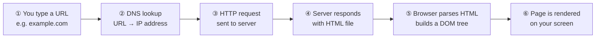
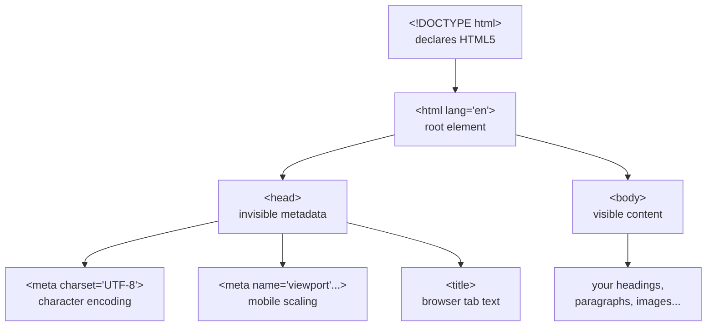

# M01 HTML Foundations


**Topics covered:** HTML document skeleton · Headings & paragraphs · Text formatting · `<button>` · HTML comments · Chrome DevTools intro

---

## The Why?

Every website you have ever visited — whether it is a news article, a social media feed, or an online store — is ultimately a collection of files living on a computer somewhere in the world. When you open a browser and type a URL, you are asking a remote computer to send you those files. Your browser reads them and draws what you see on screen.

The most fundamental of those files is an **HTML file**. HTML tells the browser *what the content is*: this is a heading, this is a paragraph, this is an image, this is a button. Without HTML, the browser would receive raw, unformatted text with no idea how to display it.

By the end of this module you will be able to:
- Explain what HTML is and why browsers need it
- Write a valid HTML5 document from scratch
- Use common text elements to structure and format content

---

## How the Web Works

Before writing a single line of HTML, it helps to understand the journey a webpage takes from a server to your screen.



Three technologies divide the work of every webpage:

| Technology | Role | Analogy |
|------------|------|---------|
| **HTML** | Structure and content | The skeleton of a building |
| **CSS** | Visual presentation | The paint, furniture, and décor |
| **JavaScript** | Behavior and interactivity | The electrical and plumbing systems |

This course focuses on HTML (Modules 1–4) and CSS (Modules 5–14). JavaScript appears occasionally in examples but proficiency is not required.

---

## Core Concepts

### The HTML Document Skeleton

Every HTML file follows a standard structure. Open `standard_example.html` to see it in context.

```html
<!DOCTYPE html>
<html lang="en">
  <head>
    <meta charset="UTF-8">
    <meta name="viewport" content="width=device-width, initial-scale=1.0">
    <title>Page Title</title>
  </head>
  <body>
    <!-- Your visible content goes here -->
  </body>
</html>
```



**What each part does:**

- `<!DOCTYPE html>` — tells the browser this is modern **HTML5** (not older HTML 4 or XHTML)
- `lang="en"` — tells search engines and screen readers which language your page is written in
- `<head>` — **not visible on the page**; holds metadata about the document
- `charset="UTF-8"` — allows your page to display any character in any language (including emoji 🎉)
- `<meta name="viewport">` — prevents mobile browsers from zooming out to a fake desktop width
- `<body>` — everything inside here is what your visitors actually see

### Element Tags

HTML content is wrapped in **tags**. Most elements use an opening tag and a closing tag:

```
<tagname>Content goes here</tagname>
   ↑                            ↑
 Opening tag               Closing tag
```

Some elements are **self-closing** — they do not wrap content, so they need no closing tag. You will meet `<br>`, ``, and `<input>` later.

### Headings: `<h1>` through `<h6>`

Headings create a content hierarchy, like a document outline. Browsers render them progressively smaller from `<h1>` to `<h6>`.

```html
<h1>Main Page Title</h1>
<h2>Major Section</h2>
<h3>Subsection</h3>
<h4>Sub-subsection</h4>
```

> **Rule:** Use only **one `<h1>`** per page. Never skip levels (e.g., jumping from `<h2>` directly to `<h4>`) — search engines and screen readers depend on this hierarchy to understand your content.

### Paragraphs: `<p>`

The `<p>` tag wraps a block of text. Browsers automatically add space above and below each paragraph — no extra blank lines needed in your HTML.

```html
<p>This is the first paragraph. It can contain many sentences.</p>
<p>This is the second paragraph. It starts on a new line automatically.</p>
```

### Line Break: `<br>`

Forces text onto a new line *within the same paragraph*. Use it sparingly — when content truly belongs in the same paragraph but should appear on separate lines (addresses, poetry, lyrics).

```html
<p>
  "Two roads diverged in a yellow wood,<br>
  And sorry I could not travel both"<br>
  — Robert Frost
</p>
```

### Text Emphasis

| Element | Visual | When to use |
|---------|--------|-------------|
| `<b>` | **Bold** | Visual styling only (no special meaning) |
| `<strong>` | **Bold** | Content that is genuinely important |
| `<i>` | *Italic* | Titles, foreign words, technical terms, thoughts |
| `<em>` | *Italic* | Spoken stress emphasis ("Do *not* press that button") |

```html
<p>Always <strong>save your work</strong> before closing the editor.</p>
<p>The word <i>schadenfreude</i> comes from German.</p>
<p>I said <em>do not</em> close that tab.</p>
```

> **`<b>` vs `<strong>`:** They look identical by default, but they carry different *meaning*. `<strong>` signals importance to search engines and screen readers. Prefer `<strong>` when the content actually matters; use `<b>` only for purely visual styling.

### Superscript and Subscript

```html
<!-- Exponents in math -->
<p>E = mc<sup>2</sup></p>

<!-- Chemical formulas -->
<p>Water is H<sub>2</sub>O. Carbon dioxide is CO<sub>2</sub>.</p>

<!-- Footnote markers -->
<p>This claim needs a citation.<sup>1</sup></p>
```

### Button: `<button>`

Creates a clickable button element. At this stage it will not do anything when clicked (that requires JavaScript), but it is an important building block of any user interface.

```html
<button type="button">Subscribe</button>
<button type="button">Learn More</button>
```

### HTML Comments

Comments are notes written for developers. The browser completely ignores them when rendering the page.

```html
<!-- This is a single-line comment -->

<!--
  This is a multi-line comment.
  Useful for longer explanations.
-->

<!-- TODO: Add the contact section here -->
```

Good uses: leaving reminders for yourself, marking incomplete sections, explaining non-obvious decisions.

---

## Going Further

<details>
<summary>📖 A brief history of HTML</summary>

HTML was invented by **Tim Berners-Lee** at CERN in 1991 — the same person who invented the World Wide Web. The very first version had only 18 elements. HTML5, the current standard (finalized in 2014), introduced major elements like `<video>`, `<canvas>`, `<section>`, and `<article>` that transformed the modern web.

The HTML standard is maintained today by the **WHATWG** (Web Hypertext Application Technology Working Group), a collaboration of browser vendors (Apple, Google, Mozilla, and Microsoft). You can read the live specification at [html.spec.whatwg.org](https://html.spec.whatwg.org/) — though it is extremely technical and not recommended as introductory reading.

</details>

<details>
<summary>🤖 Using AI to write and fix HTML</summary>

AI tools like Gemini, ChatGPT, and Claude are excellent at generating HTML boilerplate. Here are prompts that work well:

- *"Write a valid HTML5 document with the standard skeleton for a bakery homepage."*
- *"This HTML has a broken structure — can you identify and fix the problem?"*
- *"Convert this plain text into a properly structured HTML document with appropriate heading levels."*

**The rule:** Always read the AI output and be able to explain every line. AI occasionally generates outdated patterns — for example, using the removed `<center>` or `<font>` tags, or forgetting the `viewport` meta tag. Your ability to spot and fix these errors is exactly what this course develops.

</details>

<details>
<summary>⚡ Editor shortcuts that save time</summary>

If you are using VS Code or WebStorm, type `!` and press `Tab`. The editor expands it into a full HTML5 document skeleton automatically. This is called an **Emmet abbreviation**. Other useful Emmet patterns:

| Type this | Then press Tab | Result |
|-----------|---------------|--------|
| `!` | Tab | Full HTML5 skeleton |
| `h1` | Tab | `<h1></h1>` |
| `p*3` | Tab | Three `<p></p>` tags |
| `ul>li*4` | Tab | A `<ul>` with four `<li>` children |

</details>

<details>
<summary>🔍 What is the DOM?</summary>

When a browser reads your HTML file, it does not display the raw text directly. Instead, it builds a **DOM** (Document Object Model) — a tree of objects in memory representing every element on your page.

This distinction matters because JavaScript and CSS both interact with the DOM, not the raw HTML text. When you open Chrome DevTools and see the Elements panel, you are looking at a live view of the DOM — and you can edit it in real time to experiment with changes.

</details>

---

## Guided Practice

**Scenario:** You are helping a friend set up an online presence for their small bakery, "The Morning Roast." They have all their content ready — your job is to turn it into a properly structured HTML page.

See `bakery_example.html` in this folder for the finished result.

---

### Step 1: Create the file

In the `M01HTMLFoundations` folder, create a new file named `bakery.html`. Type (do not copy-paste) the document skeleton:

```html
<!DOCTYPE html>
<html lang="en">
  <head>
    <meta charset="UTF-8">
    <meta name="viewport" content="width=device-width, initial-scale=1.0">
    <title>The Morning Roast Bakery</title>
  </head>
  <body>
    <!-- content goes here -->
  </body>
</html>
```

Open the file in Chrome (right-click → Open with → Chrome). You should see a blank page with "The Morning Roast Bakery" in the browser tab.

---

### Step 2: Add the heading and intro

Inside `<body>`, replace the comment and add:

```html
<h1>The Morning Roast</h1>
<p>
  <i>Fresh from the oven since 2018.</i><br>
  A neighbourhood bakery in the heart of the city.
</p>
```

Refresh the browser. Notice how `<h1>` creates a large, bold title automatically — you wrote zero CSS to achieve that.

---

### Step 3: Add a menu section

```html
<h2>Today's Menu</h2>

<h3>Breads</h3>
<p>
  Our <strong>signature sourdough</strong> uses a starter that has been fed
  daily since the bakery opened. Each loaf takes <em>48 hours</em> to make.
</p>

<h3>Pastries</h3>
<p>
  Try our croissants — rated <b>4.9 / 5</b> on local review sites three
  years running. Gluten-free options available.<sup>*</sup>
</p>

<h3>Drinks</h3>
<p>
  We roast our own single-origin beans. The signature blend is a 60/40
  mix of Arabica and Robusta — roughly 80 mg of caffeine per 250 ml
  serving (about 8 oz). That works out to roughly 0.32 mg per ml,
  or 3.2×10<sup>-1</sup> mg/ml if you prefer scientific notation.
</p>
```

---

### Step 4: Add opening hours

```html
<h2>Our Hours</h2>
<p>
  Monday – Friday: 7:00 AM – 6:00 PM<br>
  Saturday: 8:00 AM – 4:00 PM<br>
  Sunday: <strong>Closed</strong>
</p>
<p>
  Find us at 42 Baker Street.<br>
  Phone: (555) 012-3456
</p>
```

---

### Step 5: Add a button and a footnote

```html
<button type="button">Join Our Mailing List</button>

<!-- Footnote for the asterisk in the menu section -->
<p>
  <sup>*</sup> Gluten-free items are baked in a shared kitchen.
  Not suitable for celiac disease.
</p>
```

---

### Step 6: Inspect with DevTools

Open Chrome DevTools (`F12`) and go to the **Elements** tab. Expand the `<body>` tree and verify your structure matches what you wrote. Check the **Console** tab — a valid HTML page should show no red error messages.

Try hovering over different elements in the Elements panel. Chrome highlights the corresponding area on the page. This is your most important debugging tool for the rest of this course.

---

### Step 7: Ask AI to beautify your page

Your bakery page is now structurally correct — but visually plain. This is intentional: HTML defines *content*, not appearance. However, this is a great moment to experience AI-assisted development firsthand.

Open [Gemini](https://gemini.google.com/) (or any AI tool you prefer), paste your entire `bakery.html` content, and send this prompt:

> *"Here is my HTML page. Please add a `<style>` block inside `<head>` to make it look modern and visually appealing. Improve the typography, colors, spacing, and overall layout. Keep all existing HTML content and structure intact — only add CSS."*

Copy the AI's output into a new file named `bakery_styled.html` and open it in Chrome. Compare it side-by-side with your original `bakery.html`.

**What to observe:**
- The AI added a `<style>` block inside `<head>` — this is CSS, which you will learn in detail from Module 5 onward
- Every heading, paragraph, and button you wrote is still there — CSS only changes *how elements look*, never *what they are*
- The AI may produce outdated or incorrect CSS — try to spot anything that looks unusual (e.g., deprecated `<font>` tags, missing units like `px`)

This is the core loop of AI-assisted web development: **you own the structure and logic, AI accelerates the visual polish.**

---

## Checkpoints

* [ ] **Game Character Bio**  
  Build a single HTML page that acts as a "character profile" for a fictional video game character. The page must include:
  - An `<h1>` for the character's name and an `<h2>` for their class or role (e.g., "Shadowblade — Rogue Assassin")
  - At least two `<p>` tags describing their backstory and abilities
  - At least one `<strong>` or `<em>` used in a way that makes semantic sense — not just for visual decoration
  - At least one `<sup>` or `<sub>` that fits naturally (e.g., a stat like "Attack Power: 9.8×10<sup>3</sup>", or a chemical formula for a potion)
  - An HTML comment marking where you plan to add an image in a future module
  - A `<button>` with a label appropriate to the theme (e.g., "Select Character", "View Full Stats")

* [ ] **Fix the Broken Page**  
  Ask an AI tool (Gemini, Claude, or ChatGPT) to generate an HTML page about a topic you enjoy, then deliberately ask it to introduce **three common HTML mistakes**:
  1. A missing closing tag
  2. A heading hierarchy that skips a level (e.g., `<h1>` followed directly by `<h4>`)
  3. A missing `charset` meta tag
  
  Your task: open the broken HTML in Chrome, use DevTools to identify each problem, and fix them manually. Once fixed, confirm the Console shows no errors and the heading structure looks correct in the Elements panel.
