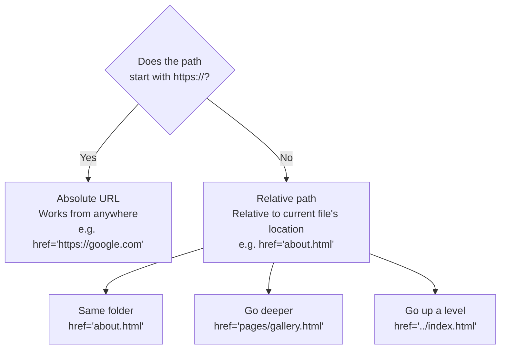

# M02 Links, Images & Media


**Topics covered:** HTML attributes · `<a>` hyperlinks · Relative vs absolute paths · `` images · `<figure>` captions · `<iframe>` embedding · Image formats

---

## The Why?

In M01 you built a text-only page — structurally correct but isolated. Real websites are interconnected: pages link to other pages, photographs appear alongside text, and video players are embedded inline. Three questions drive this module:

1. How does HTML reference files or URLs that are *outside* the current document?
2. How do you let users navigate between pages?
3. How do you embed images and videos?

The answer to all three: **attributes** — extra instructions attached to an element's opening tag.

---

## Core Concepts

### HTML Attributes

Attributes provide additional information to an element. They always live in the **opening tag** and follow a `name="value"` pattern:

```html
<tagname attribute="value">Content</tagname>
```

Different elements require different attributes:
- `<a>` needs `href` to know *where* to link
- `` needs `src` to know *which* image to display
- Both need other attributes for accessibility and security

### Hyperlinks: `<a>`

The `<a>` (anchor) element creates a clickable link. Its most important attribute is `href` (Hypertext Reference).

```html
<!-- External website — full URL required -->
<a href="https://www.google.com">Go to Google</a>

<!-- Another page in the same folder -->
<a href="about.html">About Us</a>

<!-- Jump to a section on the current page -->
<a href="#contact">Skip to Contact</a>
```

#### Relative vs Absolute Paths

This single concept causes more "it worked on my machine but not on the server" bugs than anything else in HTML. Study this carefully.

```
project/
├── index.html          ← imagine you are here
├── about.html
├── pages/
│   └── gallery.html
└── images/
    └── hero.jpg
```

| You are in | You want to reach | Path to write | Why |
|------------|-------------------|---------------|-----|
| `index.html` | `about.html` | `href="about.html"` | Same folder — no prefix |
| `index.html` | `pages/gallery.html` | `href="pages/gallery.html"` | Enter `pages/` subfolder |
| `index.html` | `images/hero.jpg` | `src="images/hero.jpg"` | Enter `images/` subfolder |
| `pages/gallery.html` | `index.html` | `href="../index.html"` | `../` goes **up** one level |
| Anywhere | Any external site | `href="https://..."` | Absolute — always works |



#### Opening links in a new tab

```html
<a href="https://www.nasa.gov" target="_blank" rel="noopener noreferrer">
  Visit NASA
</a>
```

`target="_blank"` opens in a new tab. Always pair it with `rel="noopener noreferrer"` on external links — this prevents the opened page from gaining access to your page via JavaScript, which is a known security vulnerability.

#### Anchor links (jump within a page)

Add an `id` to any element, then link to it with `#id`:

```html
<!-- The destination anchor -->
<h2 id="contact">Contact Us</h2>

<!-- The link that jumps to it -->
<a href="#contact">Jump to Contact section</a>
```

Anchor links work across pages too: `href="about.html#team"` jumps directly to `id="team"` on `about.html`.

---

### Images: ``

`` is self-closing — it has no content to wrap, so there is no closing tag. The two required attributes are `src` and `alt`.

```html

```

- **`src`** — the path or URL of the image file
- **`alt`** — text description read by screen readers and displayed when the image fails to load. **Always fill this in.**

Set explicit dimensions to prevent layout shift as images load:

```html

```

#### Image file formats at a glance

| Format | Best for | Trade-off |
|--------|----------|-----------|
| **JPEG / JPG** | Photographs | Small file, slight quality loss (lossy) |
| **PNG** | Screenshots, logos, transparency | Lossless quality, larger files |
| **WebP** | Everything | Smaller than JPEG/PNG, excellent quality — the modern default |
| **SVG** | Icons, logos, illustrations | Scales perfectly at any size (vector) |
| **AVIF** | Photographs | Even smaller than WebP, browser support growing |

For this course, `.jpg`, `.png`, and `.webp` are all fine.

#### Semantic image wrapping: `<figure>` and `<figcaption>`

When an image belongs with a caption, group them in `<figure>`:

```html
<figure>
  
  <figcaption>Shibuya Crossing, Tokyo — the busiest pedestrian intersection on Earth.</figcaption>
</figure>
```

`<figure>` is semantic — it tells the browser and search engines that the image and caption belong together as one unit.

---

### Embedded Content: `<iframe>`

`<iframe>` (Inline Frame) embeds another web document — a video player, map, or any URL — directly inside your page.

**To embed a YouTube video:**
1. Open the video on YouTube
2. Click **Share** → **Embed**
3. Copy the generated `<iframe>` code and paste it into your HTML

The generated code looks like this:

```html
<iframe
  width="560"
  height="315"
  src="https://www.youtube.com/embed/VIDEO_ID"
  title="YouTube video player"
  allowfullscreen>
</iframe>
```

> **Never type the embed URL manually.** YouTube's embed URL (`/embed/VIDEO_ID`) is different from the regular watch URL (`/watch?v=VIDEO_ID`). Always use the Share → Embed button.

---

## Going Further

<details>
<summary>🌐 Anatomy of a URL</summary>

Every URL can be broken into named parts:

```
https://www.example.com/blog/post?id=42#comments
  ↑           ↑             ↑        ↑      ↑
Protocol    Domain          Path    Query  Fragment
```

- **Protocol** (`https://`) — defines how data is transferred. HTTPS means the connection is encrypted; HTTP is plain text. Always prefer HTTPS.
- **Domain** (`www.example.com`) — the human-readable address of the server.
- **Path** (`/blog/post`) — the specific resource on that server.
- **Query** (`?id=42`) — extra parameters sent to the server (common in search or filtering).
- **Fragment** (`#comments`) — jumps to `id="comments"` on the page. The browser handles this locally — it is never sent to the server.

</details>

<details>
<summary>🖼 Why alt text matters beyond accessibility</summary>

The `alt` attribute serves three purposes:

1. **Accessibility** — screen readers read it aloud for visually impaired users. Without `alt`, a screen reader says something useless like "image."
2. **Broken image fallback** — displayed when the image fails to load (broken path, slow connection, or the user has images disabled).
3. **Search engine indexing** — search engines cannot "see" images; they read `alt` text to understand what an image shows. Descriptive alt text directly improves your search ranking.

**Bad:** `alt="image"` or `alt="photo1.jpg"`  
**Good:** `alt="A barista pouring latte art into a white ceramic cup"`

For purely decorative images (a visual divider, background texture), use `alt=""` — this tells screen readers to skip the image entirely rather than announce something meaningless.

</details>

<details>
<summary>📦 What is a CDN?</summary>

A **CDN** (Content Delivery Network) is a global network of servers that host static files — images, videos, fonts, CSS libraries. Instead of serving everything from one location, a CDN copies files to dozens of servers worldwide and delivers each file from whichever server is closest to the visitor.

You will use CDN links in Module 14 (Bootstrap) to load the framework's CSS without downloading or hosting it yourself. The same principle is at work when you embed a YouTube video — YouTube's CDN delivers video data from the nearest server to your visitor.

</details>

<details>
<summary>🔒 The security reason behind rel="noopener noreferrer"</summary>

When you open a link with `target="_blank"`, the newly opened page receives a reference to your page via `window.opener`. A malicious site could exploit this to redirect your original tab to a phishing page while the user is reading the new one.

`rel="noopener"` severs this connection. `rel="noreferrer"` additionally prevents the destination site from seeing which page the visitor came from. Both are harmless to legitimate sites and are considered a required best practice whenever you use `target="_blank"` on external links.

</details>

---

## Guided Practice

**Scenario:** You are building a two-page portfolio site for **"Arclight Studio"** — a fictional documentary photography practice. The home page presents the photographer and their work; the series page shows a project in depth with an embedded video.

See `index_example.html` and `destination_example.html` in this folder for the finished result.

---

### Step 1: Set up the file structure

Inside `M02LinksAndMedia`, create two files:

```
M02LinksAndMedia/
├── index.html        ← portfolio homepage (you create)
└── destination.html  ← series detail page (you create)
```

Both files need the full M01 document skeleton (`<!DOCTYPE html>`, `<head>` with `<meta charset>` and `<meta viewport>`, `<title>`, `<body>`).

---

### Step 2: Build the homepage

Add to `index.html`:

```html
<h1>Arclight Studio</h1>
<p><i>Documentary and portrait photography. Vancouver, BC.</i></p>

<!-- Same-page anchor links -->
<p>
  <a href="#work">Work</a> ·
  <a href="#about">About</a> ·
  <a href="#contact">Contact</a>
</p>

<!-- External image via URL -->


<h2 id="work">Featured Project</h2>

<figure>
  
  <figcaption>
    From <em>Coastal Lives</em> — a 34-photograph documentary series.
    County Clare, Ireland, 2025.
  </figcaption>
</figure>

<p>A three-week residency documenting the fishing villages of County Clare.</p>
<p><a href="destination.html">View the full series →</a></p>

<h2 id="about">About</h2>
<p>
  Arclight Studio is the practice of Jordan Vasquez, a
  <a href="https://en.wikipedia.org/wiki/Documentary_photography"
     target="_blank" rel="noopener noreferrer">documentary photographer</a>
  based in Vancouver.
</p>

<h2 id="contact">Contact</h2>
<p><a href="mailto:studio@arclightstudio.ca">studio@arclightstudio.ca</a></p>
<p>
  Follow on
  <a href="https://www.instagram.com" target="_blank" rel="noopener noreferrer">Instagram</a>
  or
  <a href="https://www.behance.net" target="_blank" rel="noopener noreferrer">Behance</a>.
</p>
```

Open `index.html` in Chrome. Click the navigation links — the page should scroll to each `id`. Confirm the hero image loads from picsum.

---

### Step 3: Build the series page

Add to `destination.html`:

```html
<p><a href="index.html">← Back to portfolio</a></p>

<h1>Coastal Lives</h1>
<p><i>County Clare, Ireland · Spring 2025 · 34 photographs</i></p>

<figure>
  
  <figcaption>The harbour at Liscannor before dawn. The fleet leaves by 5 AM.</figcaption>
</figure>

<h2>About the Series</h2>
<p>
  The original plan was three days. Three days became three weeks.
  What started as documentation of a harbour became something else —
  <strong>a portrait of a way of life the rest of the world had stopped noticing.</strong>
</p>

<figure>
  
  <figcaption>Seamus, 71. He has worked the same stretch of water for forty-three years.</figcaption>
</figure>
```

Click "View the full series →" on the homepage. It should load `destination.html`. Click "← Back to portfolio" — you should return to `index.html`.

---

### Step 4: Embed a YouTube video

In `destination.html`, add below the last paragraph:

```html
<h2>Behind the Lens</h2>
<p>A short documentary on the making of <em>Coastal Lives</em>:</p>
```

Then go to YouTube, find any video, click **Share → Embed**, and paste the generated `<iframe>` code below the paragraph.

---

### Step 5: Add an external link

In `destination.html`, add after the iframe:

```html
<p>
  <a
    href="https://www.nationalgeographic.com/photography"
    target="_blank"
    rel="noopener noreferrer"
  >Published in National Geographic →</a>
</p>
```

Confirm it opens in a new tab. Note that `rel="noopener noreferrer"` is always required alongside `target="_blank"` on external links.

---

### Step 6: Intentionally break a path

In `index.html`, change the hero image `src` to a path that does not exist:

```html

```

Reload Chrome. The broken image icon and the `alt` text appear. Open DevTools → **Network** tab → filter by **Img** — the failed request appears in red. This is how you diagnose broken assets. Restore the correct URL.

---

### Step 7: Ask AI to style the page

Paste your `index.html` into Gemini and prompt:

> *"Here is my photography portfolio homepage. Add a `<style>` block to give it a clean, editorial look — dark header, full-width hero image, clean sans-serif typography, and generous white space. Keep all existing HTML content and structure intact."*

Save the result as `index_styled.html` and compare it with your original.

---

## Checkpoints

* [ ] **Two-Page Personal Site**  
  Build:
  - `index.html` — your name, a short bio, a photo (real or any placeholder), and a link to `projects.html`
  - `projects.html` — at least two project entries, each with a placeholder image and a link back to `index.html`

  Requirements: all internal links and image paths must be **relative**, every `` must have a descriptive `alt` attribute, at least one external link must use `target="_blank"` + `rel="noopener noreferrer"`, and at least one image must be wrapped in `<figure>` / `<figcaption>`.

* [ ] **Broken Link Hunt**  
  Ask an AI to generate a two-page site with **at least four intentionally broken references** — mix broken image paths, broken internal links, and one broken iframe `src`. Open both pages in Chrome, use the DevTools **Network** tab to identify every broken resource (they show up as red 404 errors), and fix them all. Reload to confirm the Network tab shows no errors.
