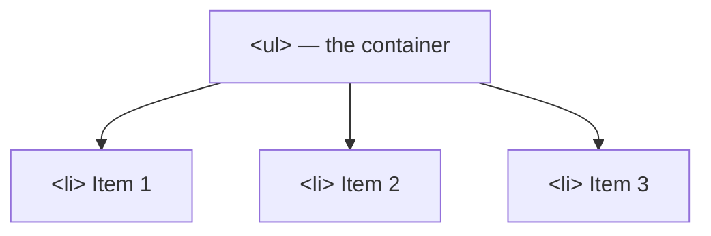
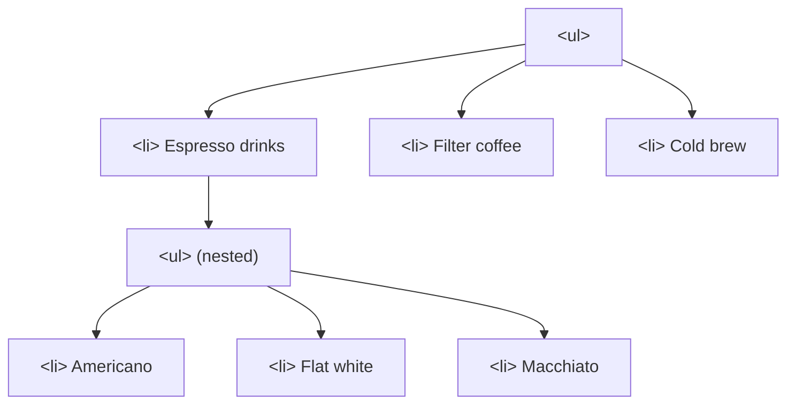
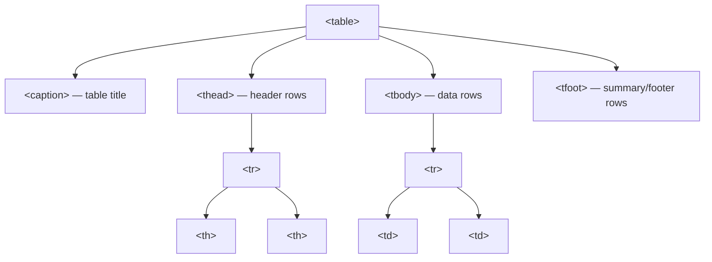

# M03 Lists & Tables


**Topics covered:** Unordered & ordered lists · Nested lists · Definition lists · Table structure · `<thead>` / `<tbody>` / `<tfoot>` · `colspan` & `rowspan`

---

## The Why?

You now know how to write text, link pages together, and embed images. But not all content is prose.

Imagine a recipe where every ingredient is buried in a paragraph, or a flight schedule where departure times are written as a single run-on sentence. Both are technically readable — and both are awful to use.

HTML has dedicated elements for two types of structured data:
- **Lists** — for any group of related items, whether order matters or not
- **Tables** — for data that has a clear relationship between rows *and* columns simultaneously

By the end of this module you will be able to:
- Build unordered, ordered, and definition lists
- Nest lists inside other lists
- Construct a complete table with proper semantic structure
- Span cells across multiple columns or rows

---

## Core Concepts

### Nested Elements

Lists and tables both require **nested elements** — elements placed inside other elements. Every list or table follows the same mental model: a **parent container** wraps a set of **child items**.



This parent–child relationship is a pattern you will see repeatedly in HTML. Getting comfortable with it here pays dividends in every module that follows.

---

### Unordered Lists: `<ul>` and `<li>`

Use when **order does not matter** — a shopping list, a set of features, a list of links.

```html
<ul>
  <li>Sourdough bread</li>
  <li>Olive oil</li>
  <li>Sea salt</li>
</ul>
```

Browsers render `<ul>` with bullet points by default. The visual style can be changed with CSS later.

---

### Ordered Lists: `<ol>` and `<li>`

Use when **sequence matters** — installation steps, a recipe, a ranked list.

```html
<ol>
  <li>Preheat the oven to 220 °C.</li>
  <li>Score the dough surface with a sharp knife.</li>
  <li>Bake for 30 minutes until the crust is deep golden brown.</li>
</ol>
```

Browsers automatically number `<ol>` items starting at 1. The `start` attribute lets you begin at any number: `<ol start="5">`.

---

### Nested Lists

Any `<li>` can contain another list. Indent the inner list inside its parent `<li>` — do not place it between `<li>` tags.

```html
<ul>
  <li>Espresso drinks
    <ul>
      <li>Americano</li>
      <li>Flat white</li>
      <li>Macchiato</li>
    </ul>
  </li>
  <li>Filter coffee</li>
  <li>Cold brew</li>
</ul>
```



You can mix `<ul>` and `<ol>` — an ordered step can contain an unordered list of sub-items.

---

### Definition Lists: `<dl>`, `<dt>`, `<dd>`

For **term–description pairs** — glossaries, FAQs, product specifications, award categories.

- `<dl>` (Description List) — the container
- `<dt>` (Description Term) — the term or label
- `<dd>` (Description Details) — the explanation or value

```html
<dl>
  <dt>Arabica</dt>
  <dd>Smooth, slightly acidic. Grown at high altitude. Most coffee shops use this.</dd>

  <dt>Robusta</dt>
  <dd>Bold, bitter, high caffeine. Used in espresso blends and instant coffee.</dd>

  <dt>Liberica</dt>
  <dd>Rare, smoky, woody flavour. Less than 2% of world production.</dd>
</dl>
```

One `<dt>` can have multiple `<dd>` entries, and multiple `<dt>` tags can share the same `<dd>`.

---

### Tables

A table displays data with a meaningful relationship between **both** its rows and columns. Think: schedules, pricing tiers, comparison charts, league standings.

#### Basic building blocks

| Tag | Role |
|-----|------|
| `<table>` | The outer container for the entire table |
| `<tr>` | Table Row — one horizontal row |
| `<th>` | Table Header cell — bold and centred by default |
| `<td>` | Table Data cell — standard content cell |

```html
<table>
  <tr>
    <th>Film</th>
    <th>Director</th>
    <th>Duration</th>
  </tr>
  <tr>
    <td>Dune: Part Two</td>
    <td>Denis Villeneuve</td>
    <td>166 min</td>
  </tr>
</table>
```

> Without CSS, tables have no visible borders by default. The data is still aligned in a grid — you just cannot see the cell dividers until you add `border` styles.

#### Semantic table structure

Real-world tables add `<thead>`, `<tbody>`, `<tfoot>`, and `<caption>` for semantics, accessibility, and correct browser behaviour (e.g. `<tfoot>` prints at the bottom of every page when a long table spans multiple printed pages).

```html
<table>
  <caption>Weekend Screening Schedule</caption>

  <thead>
    <tr>
      <th>Time</th>
      <th>Screen 1</th>
      <th>Screen 2</th>
    </tr>
  </thead>

  <tbody>
    <tr>
      <td>10:00</td>
      <td>Film A</td>
      <td>Film B</td>
    </tr>
  </tbody>

  <tfoot>
    <tr>
      <td colspan="3">All screenings include subtitles.</td>
    </tr>
  </tfoot>
</table>
```



#### Spanning cells: `colspan` and `rowspan`

`colspan` makes one cell stretch across multiple **columns**. `rowspan` stretches across multiple **rows**.

```html
<!-- colspan: one cell covers 3 columns -->
<tr>
  <td colspan="3">Opening Ceremony — all screens dark</td>
</tr>

<!-- rowspan: one cell covers 2 rows -->
<tr>
  <td rowspan="2">Venue A</td>
  <td>Film X (90 min)</td>
</tr>
<tr>
  <!-- no first <td> here — it is covered by the rowspan above -->
  <td>Film Y (105 min)</td>
</tr>
```

The key rule for `rowspan`: when a cell spans row 1 and row 2, row 2 must have **one fewer `<td>`** to account for the spanned cell.

---

## Going Further

<details>
<summary>📋 Tables vs CSS Grid — when to use which</summary>

A common beginner mistake is using `<table>` for page layout (e.g. putting a sidebar and main content side-by-side in a two-column table). This was standard practice in the late 1990s and is now strongly discouraged.

**Use `<table>` when:** the data has an inherent row–column relationship and the columns represent the same kind of information across every row. A schedule, a price comparison, a sports standings table.

**Use CSS Grid or Flexbox when:** you are controlling the *visual position* of page sections or UI components. Grid and Flexbox are specifically designed for layout; tables are designed for data.

The rule of thumb: if removing the table's `<th>` headers would make the data meaningless, it belongs in a `<table>`. If the headers are just labels you added to justify using a table, reach for Grid instead.

</details>

<details>
<summary>♿ Table accessibility: the scope attribute</summary>

Screen readers need to know whether a `<th>` is a column header or a row header. The `scope` attribute makes this explicit:

```html
<th scope="col">Film</th>   <!-- header for an entire column -->
<th scope="row">Monday</th> <!-- header for an entire row -->
```

For complex tables with merged cells, `scope` is essential. For simple single-header tables, modern screen readers infer it correctly — but adding `scope` is a good habit that costs nothing.

</details>

<details>
<summary>🔗 Lists in navigation menus</summary>

Navigation bars are almost always built from `<ul>` and `<li>`. This might look unusual at first, but it makes semantic sense: a nav menu *is* an unordered list of links — the order does not inherently matter.

```html
<nav>
  <ul>
    <li><a href="/">Home</a></li>
    <li><a href="/about">About</a></li>
    <li><a href="/contact">Contact</a></li>
  </ul>
</nav>
```

CSS removes the bullets and lines the items up horizontally — which you will do in M07 and M10. The HTML structure stays the same.

</details>

<details>
<summary>🤖 Getting AI to generate tables</summary>

Tables are one of the best use cases for AI assistance — the HTML is repetitive and error-prone to type by hand. Try prompts like:

- *"Generate an HTML table of the top 5 programming languages in 2025 with columns for name, primary use case, and typical salary range."*
- *"Convert this CSV data into an HTML table with `<thead>`, `<tbody>`, and `<caption>`."*

Always review AI-generated tables for: correct `colspan`/`rowspan` counts, matching `<th>` count to `<td>` count in each row, and missing `scope` attributes on headers.

</details>

---

## Guided Practice

**Scenario:** You are building the official programme page for **"Sunset Reel"** — a fictional independent film festival. The page needs a venue list, a daily schedule with merged cells, and a glossary of award categories.

See `festival_example.html` in this folder for the finished result.

---

### Step 1: Create the file

In `M03ListsAndTables`, create `festival.html` with the standard document skeleton. Set the title to `Sunset Reel — Programme`.

---

### Step 2: Add the venue list (unordered + nested)

```html
<h1>Sunset Reel Film Festival</h1>
<p><i>Independent cinema, three days, one city.</i></p>

<h2>Venues</h2>
<ul>
  <li>The Grand Pavilion
    <ul>
      <li>Main Screen — 450 seats</li>
      <li>Studio Screen — 120 seats</li>
    </ul>
  </li>
  <li>The Warehouse Cinema — 200 seats</li>
  <li>The Rooftop Garden — 80 seats (weather permitting)</li>
</ul>
```

---

### Step 3: Add the programme order (ordered list)

```html
<h2>Daily Programme Order</h2>
<ol>
  <li>Morning shorts block (60 min)</li>
  <li>Feature film screening</li>
  <li>Director Q&amp;A session</li>
  <li>Lunch break</li>
  <li>Afternoon feature + panel discussion</li>
  <li>Evening gala screening</li>
</ol>
```

> **Note:** The `&amp;` is an HTML **entity** — a special code for characters that HTML would otherwise misread. `&` becomes `&amp;`, `<` becomes `&lt;`, `>` becomes `&gt;`. You will encounter these occasionally when content contains symbols that have meaning in HTML.

---

### Step 4: Add the award categories (definition list)

```html
<h2>Award Categories</h2>
<dl>
  <dt>Best Feature Film</dt>
  <dd>Awarded to the most outstanding film of 90 minutes or longer.</dd>

  <dt>Best Short Film</dt>
  <dd>Awarded to films under 40 minutes. Animated and live-action eligible.</dd>

  <dt>Audience Choice</dt>
  <dd>Voted by festival attendees via ballot at each screening.</dd>

  <dt>Best Emerging Director</dt>
  <dd>Open to directors releasing their first or second feature.</dd>
</dl>
```

---

### Step 5: Build the screening schedule table

This is the centrepiece. Build the full table with semantic structure and spanning cells:

```html
<h2>Saturday Screening Schedule</h2>
<table>
  <caption>All times are local. Doors open 15 minutes before each screening.</caption>

  <thead>
    <tr>
      <th scope="col">Time</th>
      <th scope="col">Main Screen</th>
      <th scope="col">Studio Screen</th>
      <th scope="col">Rooftop Garden</th>
    </tr>
  </thead>

  <tbody>
    <tr>
      <td>10:00</td>
      <td>Shorts Block A (60 min)</td>
      <td>Shorts Block B (60 min)</td>
      <td>—</td>
    </tr>
    <tr>
      <td>12:00</td>
      <!-- colspan: Opening Ceremony takes all three screens -->
      <td colspan="3"><strong>Opening Ceremony</strong> — all screens</td>
    </tr>
    <tr>
      <td>14:00</td>
      <td>The Salt Flats (112 min)</td>
      <td>Ordinary Machines (88 min)</td>
      <!-- rowspan: Rooftop screening runs from 14:00 through 16:30 -->
      <td rowspan="2">Open-air shorts marathon (3 hrs)</td>
    </tr>
    <tr>
      <td>16:30</td>
      <td>Director Q&amp;A — The Salt Flats</td>
      <td>Panel: Documentary Ethics</td>
      <!-- no <td> here — covered by the rowspan above -->
    </tr>
    <tr>
      <td>19:00</td>
      <td colspan="3"><strong>Gala Screening:</strong> Between the Lines (World Premiere)</td>
    </tr>
  </tbody>

  <tfoot>
    <tr>
      <td colspan="4">All screenings include English subtitles. Programme subject to change.</td>
    </tr>
  </tfoot>
</table>
```

---

### Step 6: Inspect the table in DevTools

Open `festival.html` in Chrome and press `F12`. In the **Elements** tab, hover over the `<td colspan="3">` cell for the Opening Ceremony row. Chrome highlights the cell and its neighbouring cells in the rendered page. Expand the `<table>` tree and confirm the row with `rowspan="2"` has one fewer `<td>` in the following row.

---

### Step 7: Ask AI to style the page

Paste your `festival.html` into Gemini and prompt:

> *"Here is a film festival programme page. Add a `<style>` block to make it look like a professional event website — dark header, readable typography, a styled table with alternating row colours, and clear visual separation between sections. Keep all HTML content intact."*

Save the result as `festival_styled.html` and compare.

---

## Checkpoints

* [ ] **Café Menu Page**  
  Build an HTML page for a fictional café. The page must contain:
  - An **unordered list** of allergen warnings (e.g. nuts, dairy, gluten)
  - An **ordered list** of the barista's recommended drink-building steps (e.g. how to make a pour-over)
  - A **definition list** for at least four coffee terms (e.g. *Bloom*, *Extraction*, *TDS*, *Channelling*)
  - A **table** showing the full drinks menu with columns for drink name, size options, price, and whether it is available iced. Use `<thead>`, `<tbody>`, `<caption>`, and at least one `colspan` (e.g. a "Seasonal Specials" row that spans all columns).

* [ ] **Sports League Standings**  
  Build a league standings table for a fictional sports league (any sport you like — football, e-sports, chess, anything). Requirements:
  - At least 8 teams in the `<tbody>`
  - Columns: Position, Team, Played, Won, Drawn, Lost, GF, GA, GD, Points
  - Use `<th scope="col">` on every column header and `<th scope="row">` on every team name cell
  - A `<tfoot>` row noting the last update date, spanning all columns with `colspan`
  - At least one `rowspan` — for example, group teams in the same "zone" (promotion, playoff, relegation) by merging a label cell across multiple rows in an extra first column
  - No CSS required — focus entirely on correct table structure
