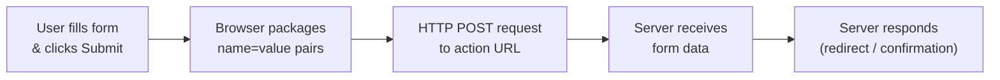
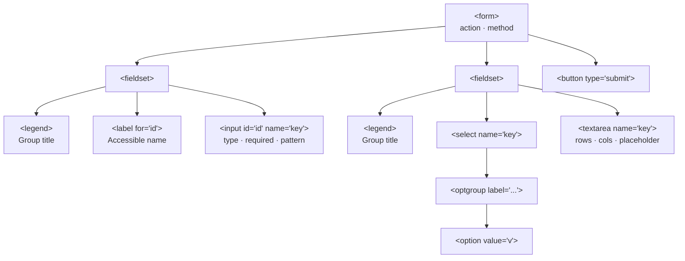

# M04 Forms


**Topics covered:** `<form>` · `<input>` types · `<label>` · `name` attribute · `<fieldset>` / `<legend>` · Radio buttons & checkboxes · `<select>` / `<optgroup>` · `<textarea>` · `<button>` · HTML5 built-in validation

---

## The Why?

Every page you have built so far flows in one direction: content leaves the server, arrives in the browser, and the user reads it. Forms reverse that flow. They are the primary mechanism by which users send data *back* to a website — logging in, searching, checking out, signing up, leaving a review.

You have filled in forms hundreds of times: a login box, a checkout address field, a job application, a search bar. Every single one started as HTML. While processing submitted data requires a back-end server or JavaScript (beyond this course), the visual interface — the text boxes, dropdowns, and buttons the user interacts with — is pure HTML.

By the end of this module you will be able to:
- Build a fully structured HTML form with multiple input types
- Group related fields accessibly using `<fieldset>` and `<legend>`
- Link labels to inputs so clicking a label focuses the correct field
- Understand why the `name` attribute is essential for every input
- Apply HTML5 built-in validation to catch errors before submission

---

## Core Concepts

### The Form Container: `<form>`

The `<form>` element wraps all input controls. On its own it changes nothing visually, but it tells the browser that everything inside belongs to one submission unit.

```html
<form action="/register" method="POST">
  <!-- inputs go here -->
</form>
```

Two key attributes:
- **`action`** — the URL the form data is sent to when submitted. Without it, the browser submits back to the current page's URL.
- **`method`** — how the data travels. `GET` appends it to the URL (visible, bookmarkable — use for searches). `POST` sends it in the request body (invisible — use for logins, registrations, anything that changes data).



---

### Single-Line Inputs: `<input>`

`<input>` is self-closing — no content to wrap, no closing tag. Its entire behaviour is controlled by the `type` attribute.

| Type | What it renders |
|------|-----------------|
| `text` | Standard single-line text field |
| `email` | Text field — browser validates email format on submit |
| `password` | Text field — typed characters are hidden |
| `number` | Numeric field with up/down arrows; supports `min`, `max`, `step` |
| `tel` | Phone number — shows numeric keypad on mobile |
| `date` | Calendar date picker |
| `url` | Text field — browser validates URL format on submit |
| `search` | Search-style text field (with a built-in clear button) |
| `range` | Draggable slider between `min` and `max` |
| `color` | Colour picker popup |
| `file` | Opens an OS file dialog for uploads |
| `checkbox` | Tick box — allows multiple selections |
| `radio` | Circular toggle — one selection per named group |

```html
<input type="email" id="email" name="email" required placeholder="you@example.com">
```

---

### Describing Inputs: `<label>`

A `<label>` names an input field. Link the two by matching the label's `for` attribute to the input's `id`:

```html
<label for="alias">In-Game Alias</label>
<input type="text" id="alias" name="alias">
```

Two benefits:
1. **Accessibility** — screen readers announce the label text when the input receives focus.
2. **Usability** — clicking the label text moves keyboard focus to the linked input. This is critical for small targets like radio buttons and checkboxes.

---

### The `name` Attribute

Every `<input>`, `<select>`, and `<textarea>` must have a `name` attribute. When a form is submitted, the browser builds a list of `name=value` pairs from every named field and sends them to the server. Fields without `name` are silently ignored.

```html
<!-- This value WILL be sent — has name="username" -->
<input type="text" id="username" name="username">

<!-- This value will NOT be sent — name is missing -->
<input type="text" id="username">
```

---

### Grouping Fields: `<fieldset>` and `<legend>`

`<fieldset>` visually and semantically groups related inputs. `<legend>` gives the group a title and must be its first child.

```html
<fieldset>
  <legend>Contact Details</legend>

  <label for="name">Full Name</label>
  <input type="text" id="name" name="full_name" required>
</fieldset>
```

Browsers draw a border around `<fieldset>` by default. Screen readers announce the `<legend>` text before reading each input inside — a significant accessibility improvement for longer forms.

---

### Radio Buttons and Checkboxes

**Radio buttons** let the user pick exactly one option from a group. All radios in a group share the same `name` — this is what makes them mutually exclusive.

```html
<fieldset>
  <legend>Platform</legend>

  <input type="radio" id="pc" name="platform" value="pc" checked>
  <label for="pc">PC</label>

  <input type="radio" id="console" name="platform" value="console">
  <label for="console">Console</label>

  <input type="radio" id="mobile" name="platform" value="mobile">
  <label for="mobile">Mobile</label>
</fieldset>
```

- Same `name` = one group where only one can be selected
- `value` = what gets sent when this option is chosen
- `checked` = which option is pre-selected by default

**Checkboxes** allow multiple selections. Each can share a `name` (multiple values sent) or use different names (each sent independently):

```html
<input type="checkbox" id="sat" name="availability" value="saturday">
<label for="sat">Saturday</label>

<input type="checkbox" id="sun" name="availability" value="sunday">
<label for="sun">Sunday</label>
```

---

### Dropdown Menus: `<select>`, `<option>`, `<optgroup>`

`<select>` creates a dropdown. `<option>` provides the choices. `<optgroup>` organises options under labelled headings.

```html
<label for="game">Game Title</label>
<select id="game" name="game" required>
  <option value="">Select a game</option>
  <optgroup label="First-Person Shooter">
    <option value="valorant">Valorant</option>
    <option value="cs2">Counter-Strike 2</option>
  </optgroup>
  <optgroup label="Real-Time Strategy">
    <option value="sc2">StarCraft II</option>
    <option value="aoe4">Age of Empires IV</option>
  </optgroup>
</select>
```

The empty first `<option value="">` acts as a prompt — it prevents the dropdown from defaulting to the first real choice, and combining it with `required` on the `<select>` forces the user to make a deliberate selection.

---

### Multi-Line Text: `<textarea>`

For longer free-text input — comments, bios, descriptions. Unlike `<input>`, `<textarea>` uses both an opening and closing tag. Set an initial size with `rows` and `cols` (CSS can override later).

```html
<label for="bio">Player Bio</label><br>
<textarea id="bio" name="bio" rows="4" cols="50"
          placeholder="Tell us about your competitive history..."></textarea>
```

---

### Buttons: `<button>`

Three `type` values with distinct behaviour:

| Type | Behaviour |
|------|-----------|
| `submit` | Submits the form (default when `type` is omitted inside `<form>`) |
| `reset` | Resets all fields to their initial values |
| `button` | Does nothing on its own — used with JavaScript for custom actions |

```html
<button type="submit">Submit Registration</button>
<button type="reset">Clear Form</button>
```

`<button>` is more flexible than `<input type="submit">` because its content can include HTML — icons, styled text, images.

---

### HTML5 Built-in Validation

Before a form is submitted, the browser automatically checks constraints you declare as attributes. No JavaScript required.

| Attribute | What it enforces |
|-----------|-----------------|
| `required` | Field must not be empty |
| `min` / `max` | Numeric or date value must be within the given range |
| `minlength` / `maxlength` | Text length must be within the given range |
| `pattern` | Value must match a regular expression |
| `type="email"` | Value must contain `@` and a domain |
| `type="url"` | Value must be a valid URL format |

```html
<!-- Must be 3–20 characters -->
<input type="text" name="alias" minlength="3" maxlength="20" required>

<!-- Must match Discord tag format: Username#0000 -->
<input type="text" name="discord"
       pattern=".{2,32}#[0-9]{4}"
       title="Format: Username#0000">

<!-- Number between 0 and 20 -->
<input type="number" name="years" min="0" max="20">
```

`title` pairs with `pattern` to show a tooltip explaining the expected format when validation fails.



---

## Going Further

<details>
<summary>📡 GET vs POST — how form data travels</summary>

When a form submits, the browser turns every `name=value` pair into a query string. The `method` attribute decides where that string goes.

**GET** appends it to the URL:
```
https://example.com/search?query=valorant&rank=diamond
```
- Visible in the browser address bar
- Can be bookmarked and shared
- Never use for passwords, personal data, or anything sensitive
- Subject to maximum URL length (~2,000 characters, browser-dependent)

**POST** sends data in the HTTP request body:
- Not visible in the URL
- No practical size limit
- Required for passwords, file uploads, and any operation that creates or modifies data

Rule of thumb: GET for *reading* (searches, filters, pagination), POST for *writing* (logins, signups, orders, form submissions that change something).

</details>

<details>
<summary>🔡 The `pattern` attribute and regular expressions</summary>

The `pattern` attribute accepts a **regular expression** — a compact syntax for describing text patterns. The browser validates the field value against it before submitting.

```html
<!-- Lowercase letters and hyphens only, 2–30 chars -->
<input type="text" name="slug"
       pattern="[a-z\-]{2,30}"
       title="Lowercase letters and hyphens only, 2–30 characters">

<!-- 8+ characters including at least one digit -->
<input type="password" name="password"
       pattern="(?=.*\d).{8,}"
       title="At least 8 characters, including one number">
```

Regular expressions are powerful but become complex quickly. AI tools handle them well:

*"Write an HTML `pattern` attribute that validates a UK postcode."*  
*"Write a `pattern` for a Twitter/X handle — starts with @, 1–15 alphanumeric characters or underscores."*

Always pair `pattern` with a descriptive `title` so users know what format is expected.

</details>

<details>
<summary>♿ Form accessibility beyond `<label>`</summary>

`<label>` + `<fieldset>` / `<legend>` cover the baseline, but complex forms benefit from two additional techniques:

**`aria-describedby`** — links an input to supplementary hint text:

```html
<label for="alias">In-Game Alias</label>
<input type="text" id="alias" name="alias" aria-describedby="alias-hint">
<span id="alias-hint">3–20 characters. Letters, numbers, and underscores only.</span>
```

Screen readers read the label first, then the hint text after a short pause.

**`autocomplete`** — tells the browser (and password managers) what kind of data a field holds:

```html
<input type="text"     name="full_name" autocomplete="name">
<input type="email"    name="email"     autocomplete="email">
<input type="tel"      name="phone"     autocomplete="tel">
<input type="password" name="password"  autocomplete="new-password">
```

This dramatically speeds up form completion for returning users and is especially valuable on mobile keyboards.

</details>

<details>
<summary>🤖 Using AI to generate forms</summary>

Forms are highly repetitive HTML — an ideal candidate for AI generation. Effective prompts:

- *"Generate an HTML registration form for a coding bootcamp. Include: name, email, experience level (dropdown: beginner/intermediate/advanced), preferred language (checkboxes: Python/JavaScript/Rust), and a textarea for motivation. Use `<fieldset>` to group sections and add HTML5 validation."*

- *"Here is my form HTML. Add `aria-describedby` hints to every field and `autocomplete` attributes to all personal information fields."*

- *"Convert this JSON schema into an HTML form with appropriate input types, labels, and validation attributes."*

**Review checklist for AI-generated forms:**
- Every `<input>`, `<select>`, and `<textarea>` has a `name` attribute
- Every input has a linked `<label>` (matching `for` and `id`)
- Radio buttons in the same group share the same `name`
- The empty placeholder `<option value="">` is present at the top of each `<select>`
- Validation attributes match the actual field requirements

</details>

---

## Guided Practice

**Scenario:** You are building the registration page for **StarForge Open** — a fictional online gaming tournament. Players need to provide their details, choose their game and platform, describe their experience, and confirm their weekend availability.

See `tournament_example.html` in this folder for the finished result.

---

### Step 1: Create the file

In `M04Forms`, create `tournament.html` with the standard document skeleton. Set the title to `StarForge Open — Registration`.

Add the page header inside `<body>`:

```html
<h1>StarForge Open</h1>
<p><i>Season 4 — Online Qualifier Registration</i></p>
```

---

### Step 2: Add the form container and player information

Below the header, open a `<form>` element with `action="/register"` and `method="POST"`. All remaining steps go inside this element.

Add the first fieldset:

```html
<fieldset>
  <legend>Player Information</legend>

  <label for="fullName">Full Name</label>
  <input type="text" id="fullName" name="full_name" required
         placeholder="e.g. Alex Rivera"><br><br>

  <label for="alias">In-Game Alias</label>
  <input type="text" id="alias" name="alias" required
         minlength="3" maxlength="20" placeholder="e.g. ShadowPulse"><br><br>

  <label for="email">Email Address</label>
  <input type="email" id="email" name="email" required
         placeholder="you@example.com"><br><br>

  <label for="discord">Discord Tag</label>
  <input type="text" id="discord" name="discord" required
         pattern=".{2,32}#[0-9]{4}" title="Format: Username#0000"
         placeholder="Username#0000"><br><br>

  <label for="dob">Date of Birth</label>
  <input type="date" id="dob" name="dob" required>
</fieldset>
```

---

### Step 3: Add tournament details

```html
<fieldset>
  <legend>Tournament Details</legend>

  <label for="game">Game Title</label>
  <select id="game" name="game" required>
    <option value="">Select a game</option>
    <optgroup label="First-Person Shooter">
      <option value="valorant">Valorant</option>
      <option value="cs2">Counter-Strike 2</option>
      <option value="overwatch2">Overwatch 2</option>
    </optgroup>
    <optgroup label="Real-Time Strategy">
      <option value="sc2">StarCraft II</option>
      <option value="aoe4">Age of Empires IV</option>
    </optgroup>
    <optgroup label="Fighting">
      <option value="sf6">Street Fighter 6</option>
      <option value="tekken8">Tekken 8</option>
    </optgroup>
  </select><br><br>

  <fieldset>
    <legend>Platform</legend>

    <input type="radio" id="pc" name="platform" value="pc" checked>
    <label for="pc">PC</label>

    <input type="radio" id="console" name="platform" value="console">
    <label for="console">Console</label>

    <input type="radio" id="mobile" name="platform" value="mobile">
    <label for="mobile">Mobile</label>
  </fieldset>
  <br>

  <label for="team">Team Name <em>(optional)</em></label>
  <input type="text" id="team" name="team_name"
         placeholder="Leave blank if registering solo">
</fieldset>
```

> **Try this:** All three Platform radio buttons share `name="platform"`. Change one to `name="platform2"` and reload — that radio now belongs to a separate group and can be selected independently. Change it back.

---

### Step 4: Add experience

```html
<fieldset>
  <legend>Experience</legend>

  <label for="rank">Current Rank / Tier</label>
  <select id="rank" name="rank">
    <option value="unranked">Unranked</option>
    <option value="bronze">Bronze</option>
    <option value="silver">Silver</option>
    <option value="gold">Gold</option>
    <option value="platinum">Platinum</option>
    <option value="diamond">Diamond</option>
    <option value="master">Master</option>
    <option value="grandmaster">Grandmaster</option>
  </select><br><br>

  <label for="years">Years Playing Competitively</label>
  <input type="number" id="years" name="years_competitive"
         min="0" max="20" value="1"><br><br>

  <label for="achievements">Notable Achievements</label><br>
  <textarea id="achievements" name="achievements" rows="4" cols="50"
            placeholder="e.g. Top 500, regional finalist, online league champion..."></textarea>
</fieldset>
```

---

### Step 5: Add availability and the submit section

```html
<fieldset>
  <legend>Weekend Availability</legend>
  <p>Select all time slots you are available for matches:</p>

  <input type="checkbox" id="sat-am" name="availability" value="sat-am">
  <label for="sat-am">Saturday Morning (09:00–13:00)</label><br>

  <input type="checkbox" id="sat-pm" name="availability" value="sat-pm">
  <label for="sat-pm">Saturday Afternoon (14:00–18:00)</label><br>

  <input type="checkbox" id="sun-am" name="availability" value="sun-am">
  <label for="sun-am">Sunday Morning (09:00–13:00)</label><br>

  <input type="checkbox" id="sun-pm" name="availability" value="sun-pm">
  <label for="sun-pm">Sunday Afternoon (14:00–18:00)</label>
</fieldset>

<fieldset>
  <legend>Confirmation</legend>

  <input type="checkbox" id="terms" name="terms" required>
  <label for="terms">I agree to the tournament rules and code of conduct (required)</label><br><br>

  <input type="checkbox" id="newsletter" name="newsletter" value="yes">
  <label for="newsletter">Subscribe to StarForge news and future events</label><br><br>

  <button type="submit">Submit Registration</button>
  <button type="reset">Clear Form</button>
</fieldset>
```

Close the `</form>` tag after the Confirmation fieldset.

---

### Step 6: Test HTML5 validation

Open `tournament.html` in Chrome. Try each of the following:

1. Click **Submit Registration** without entering anything — the browser highlights the first required field and blocks submission.
2. Type `AB` in **In-Game Alias** (less than the `minlength="3"`) and try submitting — the browser flags the short value.
3. Type `noatsign` in **Discord Tag** — the `pattern` constraint triggers and displays the text from the `title` attribute.
4. Click the radio buttons under **Platform** — only one can be active at a time because all three share `name="platform"`.
5. Click **Clear Form** — every field reverts to its original default value.

---

### Step 7: Ask AI to style the page

Paste your `tournament.html` into Gemini and prompt:

> *"Here is a game tournament registration form. Add a `<style>` block to give it a dark esports theme — dark background, neon accent colour, clear fieldset styling, hover effects on buttons, and consistent input spacing. Keep all HTML content intact."*

Save the result as `tournament_styled.html` and compare it with the plain version.

---

## Checkpoints

* [ ] **Music Festival Volunteer Application**  
  Build a volunteer signup form for a fictional music festival. The form must include:
  - A **Personal Details** fieldset: full name, email, phone number (`tel`), and age (`number` with `min="16"`)
  - A **Skills** fieldset: at least five checkboxes for volunteer roles (e.g. Stage Crew, First Aid, Merchandise, Security, Photography)
  - A **Preference** fieldset: two radio groups — preferred shift (Morning / Afternoon / Evening) and preferred work area (Indoors / Outdoors / Either)
  - A `<select>` with `<optgroup>` for how the volunteer heard about the opportunity (e.g. Social Media: Instagram, TikTok; Word of Mouth: Friend, Family; Press: Website, Newsletter)
  - A `<textarea>` for relevant experience
  - A `required` checkbox agreeing to a volunteer code of conduct
  - Submit and Reset buttons
  - Every `<input>` must have a correctly linked `<label>`

* [ ] **Gym Membership Signup**  
  Build a gym membership registration form. Requirements:
  - Membership type: three radio buttons (Monthly / Annual / Student), one pre-selected with `checked`
  - Personal details fieldset: name (`required`, `minlength="2"`), email, date of birth (`date`), phone (`tel`)
  - Fitness goals: a `<select>` with `<optgroup>` by category (Strength: Powerlifting, Bodybuilding; Cardio: Running, Cycling; Flexibility: Yoga, Pilates)
  - A `range` input (`min="1"` `max="7"`) labelled "Planned sessions per week"
  - A health declaration fieldset: at least three checkboxes (e.g. Heart condition, Diabetes, None of the above)
  - A `<textarea>` for injuries or notes for the trainer
  - At least three `required` fields, one `minlength` / `maxlength` constraint, and the email field using `type="email"`
  - A submit button labelled "Join Now" and a Reset button
