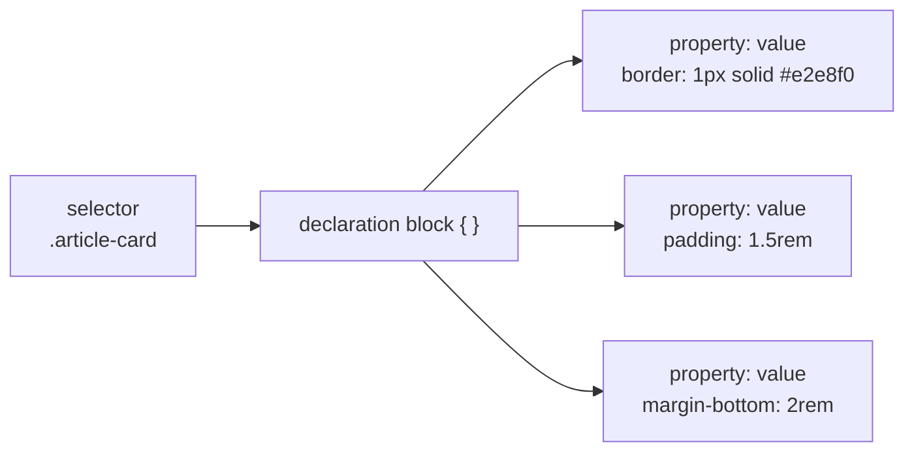
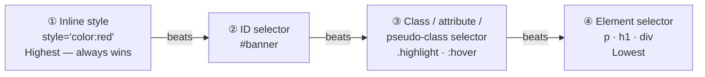

# M05 CSS Basics


**Topics covered:** CSS syntax · `<style>` tag · element / class / ID selectors · descendant selector · grouping · universal selector · pseudo-classes · the cascade · specificity

---

## The Why?

Every page you have built so far looks like a wall of text — plain black content on a white background. HTML describes *what* the content is. It has almost nothing to say about *how* it looks. That job belongs to **CSS** (Cascading Style Sheets).

Consider the inline `style` attribute you may have seen before: `<p style="color: red;">`. It works, but imagine a page with 50 paragraphs. You would have to paste that attribute on every single `<p>` tag. Change your mind about the colour? Edit it 50 times. This approach breaks down immediately in any real project.

CSS solves this by separating *presentation* from *content*. Write one rule — target all 50 paragraphs in a single declaration. Update the colour once; it changes everywhere. This is the principle behind the phrase **separation of concerns**: HTML owns the structure, CSS owns the appearance.

By the end of this module you will be able to:
- Write valid CSS rules and understand the syntax
- Target HTML elements using element, class, and ID selectors
- Use descendant, grouping, universal, and pseudo-class selectors
- Explain what the cascade is and predict which rule wins a conflict
- Understand specificity and why it matters

---

## Core Concepts

### How CSS Connects to HTML

There are three ways to add CSS to an HTML page:

**1. Inline `style` attribute — avoid for anything non-trivial**

```html
<p style="color: red;">Text</p>
```

Only appropriate for one-off overrides. Hard to maintain and overrides the cascade in ways that are difficult to undo.

**2. `<style>` block in `<head>` — used throughout this course**

```html
<head>
  <style>
    p {
      color: #374151;
      line-height: 1.7;
    }
  </style>
</head>
```

**3. External stylesheet — the production standard**

```html
<head>
  <link rel="stylesheet" href="style.css">
</head>
```

The CSS lives in a separate `.css` file. One stylesheet can be shared across hundreds of pages — change it once and every page updates. This course uses `<style>` blocks for simplicity, but the rules you write are identical either way.

---

### CSS Rule Anatomy

Every CSS rule has two parts: a **selector** that targets elements, and a **declaration block** that lists the styles to apply.

```css
selector {
  property: value;
  property: value;
}
```



**Terminology:**
- **Selector** — which elements to target
- **Property** — what aspect to change (`color`, `font-size`, `background-color`)
- **Value** — the setting to apply (`red`, `24px`, `#f8fafc`)
- **Declaration** — one `property: value` pair, ending with a semicolon
- **Declaration block** — all the declarations wrapped in `{ }`

**CSS comments** use `/* */`:

```css
/* This styles all paragraphs */
p {
  color: #374151; /* dark grey */
}
```

---

### Element Selector

Targets **every instance** of a tag. The simplest selector — just write the tag name.

```css
p {
  font-family: system-ui, sans-serif;
  line-height: 1.7;
}

h2 {
  color: #1e3a8a;
}
```

Use element selectors to establish global defaults — all `<p>` tags share the same base font, all `<h2>` tags share a colour. Individual exceptions are handled with class or ID selectors.

---

### Class Selector: `.classname`

Targets **any element** that carries a specific `class` attribute. Use a period `.` before the class name in CSS.

```html
<p class="intro">Welcome to Pulse Magazine.</p>
<p>This is a normal paragraph.</p>
<h3 class="intro">Also styled as intro.</h3>
```

```css
.intro {
  font-size: 1.2rem;
  font-weight: bold;
  color: #0f172a;
}
```

A single element can carry multiple classes — just separate them with a space:

```html
<span class="genre-tag featured">Album Review</span>
```

```css
.genre-tag  { background-color: #f1f5f9; padding: 0.25rem 0.5rem; }
.featured   { background-color: #dbeafe; color: #1d4ed8; }
```

Both sets of styles apply simultaneously.

---

### ID Selector: `#id`

Targets **one specific element** by its `id` attribute. Use `#` before the ID name in CSS. An ID value must be unique on the page — no two elements should share the same `id`.

```html
<header id="site-header">
  <h1>Pulse</h1>
</header>
```

```css
#site-header {
  background-color: #0f172a;
  color: white;
  text-align: center;
}
```

Use ID selectors for unique, one-off elements: a site header, a hero banner, a main navigation bar. For anything repeated, use a class.

---

### Descendant Selector

Targets elements **inside** a specific ancestor. Write the ancestor first, then a space, then the target.

```css
/* Only <a> tags inside <nav> — not <a> tags elsewhere */
nav a {
  color: #475569;
  text-decoration: none;
}

/* Only <p> tags inside .article-card */
.article-card p {
  font-size: 0.95rem;
}
```

Descendant selectors let you style elements differently depending on where they appear in the page — the same `<a>` tag can look different inside a navigation versus inside a paragraph.

---

### Grouping Selector: `,`

Apply the same styles to multiple selectors at once using a comma.

```css
/* h1, h2, and h3 all get the same font */
h1, h2, h3 {
  font-family: Georgia, serif;
}

/* Two different classes get the same border */
.article-card, .sidebar-card {
  border: 1px solid #e2e8f0;
  border-radius: 8px;
}
```

---

### Universal Selector: `*`

Matches **every element** on the page. Often used in CSS resets.

```css
/* Remove default margin and padding from everything */
* {
  margin: 0;
  padding: 0;
  box-sizing: border-box;
}
```

The `box-sizing: border-box` line on every element is one of the most common patterns in modern CSS — you will use it in M08 Box Model.

---

### Pseudo-class Selectors

A pseudo-class targets an element based on its **state** or **position**, not just its tag, class, or ID. Write a colon `:` after the selector.

**Interaction states:**

```css
/* Change colour when the user hovers */
nav a:hover {
  color: #2563eb;
}

/* Style a button when it is clicked/active */
button:active {
  background-color: #1d4ed8;
}
```

**Structural pseudo-classes:**

```css
/* First <li> inside any list */
li:first-child { font-weight: bold; }

/* Last <li> inside any list */
li:last-child  { border-bottom: none; }

/* Every even-numbered row in a table */
tr:nth-child(even) { background-color: #f8fafc; }

/* Third element */
.card:nth-child(3) { border-color: #6366f1; }
```

---

### The Cascade

CSS stands for *Cascading* Style Sheets. The cascade is the algorithm the browser uses to decide which rule applies when multiple rules target the same element.

**Rule 1 — Specificity.** More specific selectors beat less specific ones (see next section).

**Rule 2 — Source order.** When specificity is equal, the rule that appears **later** in the stylesheet wins.

```css
p {
  color: blue;   /* written first */
}

p {
  color: green;  /* written second — this wins */
}
```

This means the order you write rules matters. Global defaults go first; overrides go later.

---

### Specificity

Specificity is a score the browser assigns to each selector. The selector with the **higher score** wins the conflict.



**Practical examples:**

```css
p              { color: black; }   /* Element — lowest specificity */
.intro         { color: blue;  }   /* Class — beats element */
#hero          { color: green; }   /* ID — beats class */
```

```html
<!-- Which colour wins? -->
<p id="hero" class="intro">Text</p>
```

Answer: **green** — the ID selector has the highest specificity.

**`!important`** — overrides all specificity rules:

```css
p { color: red !important; }
```

Treat `!important` as a last resort. It breaks the natural cascade and makes debugging painful. If you need it often, the real problem is a specificity design issue, not a missing `!important`.

---

## Going Further

<details>
<summary>📄 External stylesheets and the `<link>` tag</summary>

In production, CSS never lives in a `<style>` block — it lives in one or more separate `.css` files. This allows the same styles to be shared across every page of a site.

**File structure:**
```
project/
├── index.html
├── about.html
└── style.css       ← one CSS file for both pages
```

**HTML — link the stylesheet in `<head>`:**
```html
<link rel="stylesheet" href="style.css">
```

**Why this matters:**
- The browser caches `style.css` after the first request — subsequent pages load faster because the CSS is already stored locally
- One change to `style.css` updates every page simultaneously
- Keeps HTML files clean and readable

The path in `href` follows the same relative vs absolute rules you learned in M02.

</details>

<details>
<summary>🧮 Specificity — the 0,0,0 calculation</summary>

Specificity can be calculated as three numbers: `(ID, Class, Element)`.

| Selector | Score |
|----------|-------|
| `p` | 0, 0, 1 |
| `.intro` | 0, 1, 0 |
| `p.intro` | 0, 1, 1 |
| `#hero` | 1, 0, 0 |
| `#hero p` | 1, 0, 1 |
| `#hero .intro p` | 1, 1, 1 |

Compare left to right: a single `1` in the ID column beats any number of class or element points. `#hero` (1,0,0) always beats `.intro.highlight.active` (0,3,0).

Practical implication: avoid styling everything with IDs. An ID-heavy stylesheet is difficult to override without reaching for `!important`.

</details>

<details>
<summary>🎨 CSS custom properties (variables)</summary>

CSS custom properties let you store values in named variables and reuse them throughout your stylesheet. They are declared with a `--` prefix, typically on `:root` to make them globally available.

```css
:root {
  --color-primary:   #2563eb;
  --color-surface:   #f8fafc;
  --font-body:       system-ui, sans-serif;
  --spacing-section: 3rem;
}

h1, h2 {
  color: var(--color-primary);
}

.card {
  background-color: var(--color-surface);
  padding: var(--spacing-section);
  font-family: var(--font-body);
}
```

Update `--color-primary` in one place and every heading and border that uses it changes instantly. This is the CSS equivalent of a design token system — it is why CSS variables are now a standard feature of professional stylesheets.

</details>

<details>
<summary>🤖 Using AI to write CSS selectors</summary>

Selectors are one of the most natural things to ask AI for. Useful prompts:

- *"Write CSS to target all `<a>` tags inside `.nav-menu`, but only when hovered."*
- *"How do I select every odd-numbered `.card` element?"*
- *"My `.title` class is not applying to my `<h2>`. Here is my HTML and CSS — what is overriding it?"*

**Debugging specificity with AI:**  
Paste both the conflicting HTML and the conflicting CSS rules. Ask: *"Which of these CSS rules will win, and why?"* AI is excellent at explaining specificity conflicts.

**Caution:** AI occasionally generates overly specific selectors (`div > ul > li > a`) when a simple class selector would do. If the generated CSS looks complicated, ask it to simplify.

</details>

---

## Guided Practice

**Scenario:** You are building the homepage for **Pulse** — a fictional music magazine. The page has a masthead, a navigation bar, three article cards, and a featured article that needs to stand out from the rest.

See `pulse_example.html` in this folder for the finished result.

---

### Step 1: Create the file

In `M05CSSBasics`, create `pulse.html` with the standard document skeleton. Set the title to `Pulse — Music Magazine`. Add an empty `<style>` block inside `<head>` — all CSS for this exercise goes there.

---

### Step 2: Add the HTML structure

Inside `<body>`, add:

```html
<header id="site-header">
  <h1>Pulse</h1>
  <p>Your weekly guide to music worth hearing.</p>
</header>

<nav>
  <a href="#">Reviews</a>
  <a href="#">Charts</a>
  <a href="#">Artists</a>
  <a href="#">Interviews</a>
</nav>

<main>

  <article id="featured" class="article-card">
    <span class="genre-tag">Album Review</span>
    <h2>A Cathedral of Sound: The Album That Redefines Ambient Music</h2>
    <p class="byline">By Jordan Lee &middot; 4 min read</p>
    <p>Every decade or so, an album arrives that doesn't just contribute to a genre — it reshapes it.</p>
    <a href="#">Read full review &rarr;</a>
  </article>

  <article class="article-card">
    <span class="genre-tag">Live Report</span>
    <h2>Tokyo in Three Nights: A World Tour Like No Other</h2>
    <p class="byline">By Sam Park &middot; 3 min read</p>
    <p>The lights went dark at exactly 9pm, and 18,000 people held their breath.</p>
    <a href="#">Read full report &rarr;</a>
  </article>

  <article class="article-card">
    <span class="genre-tag">Interview</span>
    <h2>Talking Craft: A Producer Who Built a Studio in a Shipping Container</h2>
    <p class="byline">By Maya Chen &middot; 5 min read</p>
    <p>The studio is not what you would expect. There is no soundproofed vocal booth, no mixing desk the size of a car.</p>
    <a href="#">Read full interview &rarr;</a>
  </article>

</main>
```

Open `pulse.html` in Chrome. You should see unstyled content. Everything works — it just has no visual design yet.

---

### Step 3: Style with element selectors

Add these rules to your `<style>` block. Element selectors establish the baseline for every matching tag:

```css
* {
  margin: 0;
  padding: 0;
  box-sizing: border-box;
}

body {
  font-family: system-ui, sans-serif;
  background-color: #f8fafc;
  color: #0f172a;
  max-width: 860px;
  margin: 0 auto;
  padding: 2rem 1rem;
}

h1 {
  font-size: 3rem;
  letter-spacing: -1px;
}

h2 {
  font-size: 1.3rem;
  margin-bottom: 0.5rem;
}

p {
  line-height: 1.7;
  color: #475569;
}
```

Refresh the page. Notice how every `<p>` and `<h2>` updates at once — you wrote one rule for each.

---

### Step 4: Style the header with an ID selector

```css
#site-header {
  background-color: #0f172a;
  color: #f8fafc;
  padding: 3rem 2rem;
  margin-bottom: 0;
}

#site-header p {
  color: #94a3b8;
  font-size: 1.05rem;
}
```

`#site-header p` is a **descendant selector** — it targets `<p>` tags *inside* `#site-header` only, without affecting the `<p>` tags in your article cards.

---

### Step 5: Style the nav and add a hover effect

```css
nav {
  background-color: #1e293b;
  padding: 1rem 2rem;
  margin-bottom: 2rem;
}

nav a {
  color: #94a3b8;
  text-decoration: none;
  margin-right: 2rem;
  font-size: 0.9rem;
  letter-spacing: 0.05em;
  text-transform: uppercase;
}

nav a:hover {
  color: #f8fafc;
}
```

Hover over the navigation links in Chrome. The `:hover` pseudo-class applies only when the cursor is over the element — no JavaScript needed.

---

### Step 6: Style article cards with a class selector

```css
.article-card {
  background-color: white;
  border: 1px solid #e2e8f0;
  border-radius: 8px;
  padding: 1.5rem;
  margin-bottom: 1.5rem;
}

.article-card a {
  color: #2563eb;
  text-decoration: none;
  font-size: 0.9rem;
}

.article-card a:hover {
  text-decoration: underline;
}

.genre-tag {
  display: inline-block;
  background-color: #f1f5f9;
  color: #475569;
  font-size: 0.75rem;
  font-weight: 600;
  text-transform: uppercase;
  letter-spacing: 0.05em;
  padding: 0.2rem 0.6rem;
  border-radius: 4px;
  margin-bottom: 0.75rem;
}

.byline {
  font-size: 0.85rem;
  color: #94a3b8;
  margin-bottom: 0.75rem;
}
```

All three article cards now share the same card style — because all three carry `class="article-card"`.

---

### Step 7: Make the featured article stand out with an ID selector

```css
#featured {
  border-color: #2563eb;
  border-width: 2px;
  background-color: #eff6ff;
}

#featured .genre-tag {
  background-color: #dbeafe;
  color: #1d4ed8;
}
```

`#featured .genre-tag` is a descendant + class combination. It targets `.genre-tag` *inside* `#featured` only — the other two genre tags keep their original grey style.

Observe the **specificity** at work: `#featured` (ID) has a higher score than `.article-card` (Class), so the blue border overrides the grey one set by `.article-card`.

---

### Step 8: Ask AI to extend the design

Paste your `pulse.html` into Gemini and prompt:

> *"Here is a music magazine homepage. Add styles inside the existing `<style>` block to improve the design: add a sticky navigation bar, style the `<h1>` with a serif font, add a subtle drop shadow to each article card, and use a CSS hover effect that lifts each card slightly. Keep all existing CSS and HTML intact — only add new rules."*

Save the result as `pulse_styled.html` and compare.

---

## Checkpoints

* [ ] **Recipe Book Page**  
  Build an HTML page for a fictional recipe book with a `<style>` block. The page must include at least three recipe entries. Requirements:
  - An **element selector** that sets a consistent `font-family` and `line-height` on all `<p>` tags
  - A **class selector** (`.recipe-card`) styling every recipe entry with a `border`, `border-radius`, and background colour
  - An **ID selector** (`#chef-pick`) for one featured recipe — give it a distinct background and `border-color`
  - A **descendant selector** that styles `<h3>` tags inside `.recipe-card` differently from other `<h3>` tags on the page
  - At least one **pseudo-class** — a `:hover` effect on a link or button
  - A **grouping selector** used somewhere (e.g. `h2, h3 { ... }`)
  - No inline `style=""` attributes anywhere — all CSS in the `<style>` block

* [ ] **Event Listing Page**  
  Build a concert or event listing page for a fictional venue. Requirements:
  - A page header styled with an ID selector — dark background, light text
  - At least four event cards built with a shared class (`.event-card`) — same border, padding, and font
  - Each card has a date displayed in a `<span class="event-date">` — style this class with a distinct colour and font weight
  - One "sold out" event card: add a second class (`.sold-out`) to it and use CSS to grey out its text and add a visual indicator (e.g. `opacity: 0.5` or a strikethrough on the event title)
  - Demonstrate the **cascade**: write two conflicting rules for the same element (same specificity), and confirm in Chrome DevTools that the later one wins — DevTools shows overridden rules with a strikethrough
  - A navigation bar with `:hover` styling on the links
