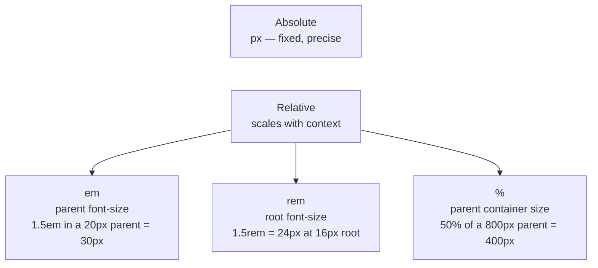

# M06 Typography & Color


**Topics covered:** Color formats (named · hex · rgb · rgba · hsl) · `color` · `background-color` · `font-family` · Google Fonts · `font-size` · `font-weight` · `font-style` · `line-height` · `letter-spacing` · `text-transform` · `text-decoration` · `text-align` · CSS units (`px` · `em` · `rem` · `%`)

---

## The Why?

You can now write HTML structure and target elements with CSS selectors. But a page with correct selectors and no design still looks like an unformatted document. The gap between a plain HTML page and a polished, professional design is bridged almost entirely by two things: **typography** and **color**.

Typography controls the hierarchy and readability of your text — why a headline looks more important than a caption, why a pull quote draws the eye, why a label feels different from body copy. Color establishes mood, directs attention, and communicates brand identity within seconds of a user arriving on a page.

These are not aesthetic extras — they are the core mechanics behind every button, heading, paragraph, and label you will ever build.

By the end of this module you will be able to:
- Express colors using named values, hex codes, rgb/rgba, and hsl
- Apply every fundamental typography property to text
- Load and use Google Fonts on any page
- Choose the right CSS unit (`px`, `em`, `rem`, `%`) for the job

---

## Core Concepts

### Color Values

CSS supports four main ways to express a color. All are interchangeable — use whichever is clearest for the situation.

**Named colors** — 140+ keywords:

```css
color: crimson;
background-color: lightyellow;
```

Simple but limited. Useful for quick prototypes and well-known colors (`white`, `black`, `transparent`).

---

**Hex codes** — the industry standard:

```css
color: #1d4ed8;            /* full 6-digit hex */
background-color: #0f172a;
color: #fff;               /* shorthand — expands to #ffffff */
```

A `#` followed by six hex digits (0–9, A–F). Each pair represents Red, Green, Blue on a 0–255 scale. Most design tools (Figma, Adobe) export colors in hex. If the three pairs are identical (`#aabbcc`), they can be shortened to three digits (`#abc`).

---

**`rgb()` and `rgba()`** — explicit channels:

```css
color: rgb(29, 78, 216);           /* same blue as #1d4ed8 */
color: rgba(29, 78, 216, 0.6);     /* 60% opaque */
background-color: rgba(0, 0, 0, 0.4);  /* semi-transparent black overlay */
```

`rgba` adds an **alpha** (opacity) channel — `0` is fully transparent, `1` is fully opaque. Essential for overlays, muted secondary text, and subtle backgrounds.

---

**`hsl()` and `hsla()`** — intuitive for design work:

```css
color: hsl(220, 72%, 47%);         /* hue 220° = blue, 72% saturation, 47% lightness */
color: hsla(220, 72%, 47%, 0.75);  /* same with 75% opacity */
```

HSL is **Hue–Saturation–Lightness**. Want a lighter version of a color? Increase the lightness. Want a muted version? Decrease saturation. More intuitive than adjusting hex digits blindly.

---

### `color` and `background-color`

```css
h1 {
  color: #4a1a00;               /* text color */
  background-color: #f8f7f4;    /* element background */
}
```

`color` affects all text (including `<a>` link text). `background-color` paints the element's background rectangle — it extends to the edge of the element's padding, which you will learn about in M08.

---

### `font-family`

Sets the typeface. Always provide a **fallback stack** — if the first font is unavailable, the browser tries the next.

```css
/* Sans-serif stack */
body {
  font-family: 'Inter', system-ui, sans-serif;
}

/* Serif stack */
h1 {
  font-family: 'Playfair Display', Georgia, serif;
}
```

**System font stack** — uses whatever native font the operating system provides (San Francisco on macOS, Segoe UI on Windows). Fast, no download, looks native:

```css
font-family: system-ui, -apple-system, BlinkMacSystemFont, 'Segoe UI', sans-serif;
```

**Generic families** always go last as the final fallback:
- `serif` — fonts with small strokes at letter ends (Times New Roman)
- `sans-serif` — clean, no strokes (Arial, Helvetica)
- `monospace` — equal-width characters (Courier, VS Code's editor font)

---

### Google Fonts

Google Fonts provides hundreds of free web fonts loaded via a `<link>` tag. No downloads, no hosting — the font file is served from Google's CDN.

**1. Choose fonts at [fonts.google.com](https://fonts.google.com)**

**2. Add the `<link>` tags to `<head>` — before your `<style>` block:**

```html
<link rel="preconnect" href="https://fonts.googleapis.com">
<link rel="preconnect" href="https://fonts.gstatic.com" crossorigin>
<link href="https://fonts.googleapis.com/css2?family=Playfair+Display:wght@400;700&family=Lato:wght@400;700&display=swap" rel="stylesheet">
```

The `preconnect` hints let the browser open the connection to Google's servers early, reducing load time. The third link is the actual font CSS. `display=swap` means text renders immediately in a fallback font while the web font loads — preventing a flash of invisible text.

**3. Use the font name in CSS:**

```css
body      { font-family: 'Lato', sans-serif; }
h1, h2    { font-family: 'Playfair Display', serif; }
```

---

### `font-size`

```css
h1   { font-size: 3.5rem; }
h2   { font-size: 2rem; }
p    { font-size: 1rem; }     /* 16px at default root size */
small { font-size: 0.85rem; }
```

See **CSS Units** below for `rem` vs `px` vs `em`.

---

### `font-weight`

Controls text thickness. Numeric values (100–900) are more precise than keywords.

| Value | Keyword equivalent | Appearance |
|-------|--------------------|------------|
| `300` | `light` | Thin, elegant |
| `400` | `normal` | Default body weight |
| `600` | `semibold` | Slightly bold — good for labels |
| `700` | `bold` | Standard bold |
| `900` | `black` | Heavy, display use only |

```css
.label    { font-weight: 700; }
.byline   { font-weight: 300; }
```

> Numeric weights only work for fonts that actually include those variants. A font with only Regular and Bold will snap `300` to `400` and `600–900` to `700`. When loading from Google Fonts, request the specific weights you need.

---

### `font-style`

```css
blockquote { font-style: italic; }
em         { font-style: italic; }  /* browser default */
.normal    { font-style: normal; }  /* cancel italic inheritance */
```

---

### `line-height`

Controls vertical space between lines of text. One of the highest-impact typography changes — the difference between text that feels cramped and text that feels readable.

```css
p {
  line-height: 1.7;   /* unitless — 1.7× the font-size */
}
```

Unitless values like `1.5` or `1.7` are preferred over `px` values because they scale automatically with `font-size`. Standard guidelines:
- Body text: `1.5`–`1.8`
- Headings: `1.1`–`1.3` (large text needs tighter leading)
- Single-line elements (buttons, labels): `1`

---

### `letter-spacing` and `word-spacing`

```css
/* All-caps labels feel better with extra letter spacing */
.label {
  letter-spacing: 0.12em;
  text-transform: uppercase;
}

/* Loosen word spacing for a specific effect */
.tagline {
  word-spacing: 0.2em;
}
```

`letter-spacing` in `em` units scales with the font size, which is usually what you want.

---

### `text-transform`

```css
.category  { text-transform: uppercase; }
.name      { text-transform: capitalize; }   /* first letter of each word */
.code      { text-transform: lowercase; }
```

Applied in CSS, not the HTML — which means the underlying text (and what screen readers announce) stays unchanged. Prefer this over typing in ALL CAPS in HTML.

---

### `text-decoration`

```css
a           { text-decoration: none; }          /* remove default underline */
.strikeout  { text-decoration: line-through; }  /* old price, deleted text */
.emphasis   { text-decoration: underline; }
```

---

### `text-align`

```css
h1       { text-align: center; }
p        { text-align: left; }    /* default */
.caption { text-align: right; }
.article { text-align: justify; } /* stretches lines to fill width */
```

---

### CSS Units

| Unit | Relative to | When to use |
|------|------------|-------------|
| `px` | Screen pixels (fixed) | Borders, icon sizes, fine details that must not scale |
| `em` | **Parent element's** font-size | Padding/margin that should scale proportionally with its element's text |
| `rem` | **Root (`<html>`) element's** font-size (browser default: 16px) | Font sizes, consistent spacing throughout the page |
| `%` | Parent container's corresponding dimension | Widths, responsive layouts |
| `vh` / `vw` | Viewport height / width | Full-screen sections (covered in M12) |



**`rem` is the modern default for font sizes and spacing.** It avoids the compounding problem of `em` (nested `em` values multiply — a `1.5em` inside a `1.5em` inside a `1.5em` becomes enormous) while still respecting user browser preferences for accessibility.

```css
/* em compounding — dangerous in deep nesting */
.outer { font-size: 1.5em; }   /* 24px if root is 16px */
.inner { font-size: 1.5em; }   /* 36px — compounds! */

/* rem — always relative to root, predictable */
.outer { font-size: 1.5rem; }  /* 24px */
.inner { font-size: 1.5rem; }  /* still 24px — no compounding */
```

---

## Going Further

<details>
<summary>🎨 HSL — the designer's color model</summary>

HSL is often easier to reason about than hex or RGB because its three parameters map directly to how humans think about color:

- **Hue** (0–360°) — the color wheel position. 0 = red, 120 = green, 240 = blue.
- **Saturation** (0–100%) — how vivid. 0% is pure grey; 100% is full color.
- **Lightness** (0–100%) — 0% is black, 50% is the "true" color, 100% is white.

```css
:root {
  --color-brand:        hsl(217, 91%, 60%);   /* vivid blue */
  --color-brand-light:  hsl(217, 91%, 85%);   /* same hue, just lighter */
  --color-brand-muted:  hsl(217, 30%, 60%);   /* same hue, desaturated */
}
```

Changing only the third value gives you tints and shades of a color while keeping the palette coherent. This is why design systems like Tailwind's color scales (blue-100 through blue-900) use HSL internally.

</details>

<details>
<summary>🔤 Variable fonts and `@font-face`</summary>

**Variable fonts** package an entire type family (all weights and widths) into a single file. Instead of loading separate files for Regular, Bold, and Light, one variable font file covers them all — and supports smooth in-between values like `font-weight: 450`.

```css
/* Loading a variable font with @font-face */
@font-face {
  font-family: 'Inter';
  src: url('fonts/Inter-Variable.woff2') format('woff2-variations');
  font-weight: 100 900;  /* supports the full range */
}

/* Now use any weight */
h1 { font-weight: 200; }
.label { font-weight: 650; }
```

Google Fonts serves variable fonts automatically when you add `:wght@100..900` to the URL — no `@font-face` needed when using their CDN.

</details>

<details>
<summary>♿ Color contrast and accessibility (WCAG)</summary>

Low contrast between text and background makes content unreadable for people with low vision or color blindness. The **WCAG 2.1 AA standard** requires:

- **4.5:1** contrast ratio for normal text
- **3:1** for large text (18px+ bold, or 24px+ normal)

Check contrast ratios with [Coolors Contrast Checker](https://coolors.co/contrast-checker) or Chrome DevTools (hover a color in the Styles panel — it shows the contrast ratio automatically).

```css
/* ✅ Passes WCAG AA — ratio ~7:1 */
color: #1e293b;
background-color: #f8fafc;

/* ❌ Fails WCAG AA — low contrast */
color: #94a3b8;
background-color: #f1f5f9;
```

Never use pure `rgba(0,0,0,0.3)` for body text — the opacity makes it fail contrast requirements on almost any background.

</details>

<details>
<summary>🤖 Using AI to build color palettes and type scales</summary>

**Generating a palette:**
- *"Generate a CSS color palette for a luxury travel magazine. Use CSS custom properties on `:root`. Include a primary, two tints, a dark background, and a muted text color. Use HSL format."*

**Building a type scale:**
- *"Create a CSS type scale using rem units. Base size 16px. Provide sizes for xs, sm, base, lg, xl, 2xl, 3xl. Format as CSS custom properties."*

**Pairing fonts:**
- *"Suggest two Google Fonts that pair well together for a high-end editorial magazine — one serif for headings, one sans-serif for body text. Show the `<link>` tag and CSS."*

AI is excellent at generating starting-point palettes and type scales. Tweak the output to match your visual intention — use DevTools to compare live.

</details>

---

## Guided Practice

**Scenario:** You are building the article page for **Vela** — a fictional sailing and adventure travel magazine. The page needs strong typographic hierarchy, a dark masthead, pull quotes, and category labels.

See `vela_example.html` in this folder for the finished result.

---

### Step 1: Create the file and load Google Fonts

Create `vela.html` with the standard document skeleton. Set the title to `Vela Magazine`.

Add the Google Fonts link tags inside `<head>`, **before** your `<style>` block:

```html
<link rel="preconnect" href="https://fonts.googleapis.com">
<link rel="preconnect" href="https://fonts.gstatic.com" crossorigin>
<link href="https://fonts.googleapis.com/css2?family=Playfair+Display:wght@400;700&family=Lato:ital,wght@0,400;0,700;1,400&display=swap" rel="stylesheet">
```

Then add an empty `<style>` block. All CSS goes there.

---

### Step 2: Add the HTML structure

```html
<header id="masthead">
  <p class="site-label">Adventure · July 2026</p>
  <h1>Vela</h1>
  <p class="tagline">Stories from the open ocean.</p>
</header>

<nav class="main-nav">
  <a href="#">Voyages</a>
  <a href="#">Gear</a>
  <a href="#">Destinations</a>
  <a href="#">Community</a>
</nav>

<main class="content">
  <article>
    <p class="article-label">Feature</p>
    <h2>Crossing the Atlantic: 28 Days Between Wind and Water</h2>
    <p class="byline">By Serena Marchetti &middot; 12 min read</p>

    <figure class="article-image">
      
      <figcaption>Day 14. Somewhere between the Canary Islands and Barbados.</figcaption>
    </figure>

    <p>The first thing you lose is your sense of time. Within a week at sea, the familiar rhythm of hours dissolves into something older: the arc of the sun, the shift of the stars, the watch schedule that divides your crew into sleeping halves.</p>

    <blockquote class="pull-quote">"There is nothing between you and the horizon. That is not emptiness &mdash; it is space enough for every thought you have been avoiding."</blockquote>

    <p>By day four we had left the shipping lanes. The AIS display, which had shown a constellation of nearby vessels, cleared to a single blinking dot: ours.</p>

    <h3>The Crew</h3>

    <p>Four people share this 42-foot sloop. <span class="name-highlight">Serena</span> handles navigation; <span class="name-highlight">Diego</span> manages the sails with a quiet competence that borders on art; <span class="name-highlight">Yuki</span> and <span class="name-highlight">Tom&aacute;s</span> split the cooking and the overnight watches.</p>
  </article>
</main>

<footer id="site-footer">
  <p>&copy; 2026 Vela Magazine &middot; All rights reserved.</p>
</footer>
```

Open in Chrome. Unformatted content — ready for CSS.

---

### Step 3: Set up global defaults

```css
body {
  font-family: 'Lato', system-ui, sans-serif;
  background-color: #f8f7f4;
  color: #1c1c2e;
  max-width: 800px;
  margin: 0 auto;   /* 0 removes the browser's default body gap; auto centres the column */
}

h1 { margin: 0; }
h2 { margin: 0 0 0.5rem; }

p {
  margin: 0 0 1.25rem;
}
```

`max-width` + `margin: 0 auto` centres the content column on wide screens — a pattern you will use in almost every project. Setting `margin: 0` explicitly on headings prevents the browser's built-in heading margins from adding unexpected space.

---

### Step 4: Style the headings with font contrast

The key to editorial typography is **contrast between families**: a serif for display headings, a sans-serif for body and labels.

```css
h1 {
  font-family: 'Playfair Display', Georgia, serif;
  font-size: 4.5rem;
  font-weight: 700;
  line-height: 1.05;
  letter-spacing: -2px;
}

h2 {
  font-family: 'Playfair Display', Georgia, serif;
  font-size: 2rem;
  font-weight: 700;
  line-height: 1.25;
  margin-bottom: 0.5rem;
}

h3 {
  font-family: 'Lato', sans-serif;
  font-size: 0.8rem;
  font-weight: 700;
  text-transform: uppercase;
  letter-spacing: 0.15em;
  color: #b45309;
  margin: 2rem 0 0.75rem;
}
```

Notice `h3` uses `text-transform: uppercase` + `letter-spacing` — this turns a small sans-serif into a crisp section label without needing a larger font size.

---

### Step 5: Style the body text

```css
p {
  font-size: 1.05rem;
  line-height: 1.8;
  color: rgba(28, 28, 46, 0.82);
  margin-bottom: 1.25rem;
}
```

`rgba(28, 28, 46, 0.82)` — the body text colour is the same dark navy as `#1c1c2e`, but at 82% opacity, giving it a slightly softer feel than pure black without sacrificing contrast.

---

### Step 6: Style the pull quote

```css
.pull-quote {
  font-family: 'Playfair Display', serif;
  font-style: italic;
  font-size: 1.35rem;
  line-height: 1.6;
  color: #b45309;
  border-left: 4px solid #b45309;
  padding: 0.5rem 0 0.5rem 1.5rem;
  margin: 2.5rem 0;
}
```

The `border-left` + `padding-left` combination is a classic typographic device for pull quotes. The italic serif at a slightly larger size contrasts cleanly with the body text.

---

### Step 7: Style labels, metadata, and article image

```css
.site-label,
.article-label {
  font-size: 0.7rem;
  font-weight: 700;
  text-transform: uppercase;
  letter-spacing: 0.18em;
  color: #b45309;
  margin-bottom: 0.6rem;
}

.byline {
  font-size: 0.85rem;
  font-weight: 400;
  color: rgba(28, 28, 46, 0.45);
  margin-bottom: 2rem;
}

.article-image {
  margin: 0 0 2rem;
}

.article-image img {
  width: 100%;
  display: block;
}

.article-image figcaption {
  font-size: 0.8rem;
  color: rgba(28, 28, 46, 0.45);
  margin-top: 0.4rem;
}

.name-highlight {
  font-weight: 700;
  color: #4a1a00;
}
```

---

### Step 8: Style the masthead and footer

```css
#masthead {
  background-color: #4a1a00;
  color: #f0ece4;
  padding: 4rem 2rem;
  text-align: center;
  margin-bottom: 0;
}

#masthead h1 {
  color: #f0ece4;
}

#masthead .tagline {
  font-size: 1rem;
  color: rgba(240, 236, 228, 0.6);
  margin-top: 0.5rem;
}

#masthead .site-label {
  color: rgba(240, 236, 228, 0.5);
}

.main-nav {
  background-color: #4a1a00;
  padding: 0.75rem 2rem;
  margin-bottom: 3rem;
}

.main-nav a {
  color: rgba(240, 236, 228, 0.7);
  text-decoration: none;
  font-size: 0.8rem;
  font-weight: 700;
  text-transform: uppercase;
  letter-spacing: 0.12em;
  margin-right: 2rem;
}

.main-nav a:hover {
  color: #f0ece4;
}

.content {
  padding: 0 2rem 4rem;
}

#site-footer {
  background-color: #4a1a00;
  color: rgba(240, 236, 228, 0.5);
  font-size: 0.8rem;
  text-align: center;
  padding: 2rem;
}
```

Refresh. The dark masthead and footer frame the warm-white content area — a common editorial layout pattern.

---

### Step 9: Ask AI to push the design further

Paste your `vela.html` into Gemini and prompt:

> *"Here is a sailing magazine article page. Extend the existing `<style>` block to: add a decorative drop cap on the first paragraph of the article, add a subtle text shadow to the main `<h1>`, create a horizontal rule style between sections, and add a background tint effect on the pull quote. Keep all existing CSS and HTML intact — only add new rules."*

Save the result as `vela_styled.html` and compare.

---

## Checkpoints

* [ ] **Personal Portfolio Landing**  
  Build a personal landing page for a fictional designer or developer. Typography and color requirements:
  - Load **two Google Fonts** — one serif for headings, one sans-serif for body text
  - Name in `<h1>` with a large `font-size` (3rem+), a specific `font-weight`, and tight `letter-spacing`
  - A tagline in `<p>` using `font-style: italic` and `color` with `rgba` (semi-transparent)
  - At least three section headings styled with `text-transform: uppercase` and `letter-spacing`
  - Body text paragraphs with `line-height` between 1.6 and 1.8
  - Use all four color formats at least once somewhere on the page: a **named color**, a **hex code**, an **rgba value**, and an **hsl value**
  - A dark `background-color` section (header or footer) with contrasting light text — the contrast must be readable

* [ ] **Podcast Show Notes Page**  
  Build a podcast episode page for a fictional show called "Wavelength." Requirements:
  - Episode title in a large serif font (`font-family`, `font-size: 2.5rem+`, `font-weight: 700`)
  - Guest name as a styled `<h3>` with `text-transform: uppercase` and `letter-spacing`
  - A summary paragraph with good `line-height` (1.7+) and `color` using `rgba`
  - Timestamps (e.g. "00:04 — Introduction") in a distinct color and `font-weight: 600`
  - A highlighted "Key Quote" block using `border-left`, `padding-left`, `font-style: italic`, and a contrasting `color`
  - A "Topics" section using `<span>` tags styled as pill labels: `background-color` (hsl), small `font-size`, `text-transform: uppercase`, `letter-spacing`
  - A footer with `text-align: center`, small `font-size`, and muted `color`
