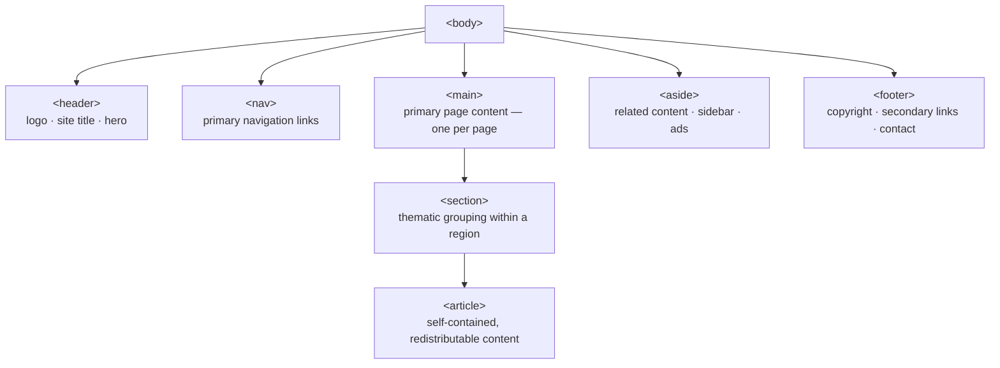

# M07 Structure & Display


**Topics covered:** Semantic HTML elements · `<div>` & `<span>` · `display: block` · `display: inline` · `display: inline-block` · `display: none` · default display values · block vs inline behaviour

---

## The Why?

You can now write content and style it. But there is a layer between raw content and visual design that you have been skipping: **structure**.

Structure is the answer to two questions:
1. *What is this region of the page for?* — Is it a navigation bar, a sidebar, a standalone article, a page footer?
2. *How should this element flow relative to the text around it?* — Does it sit on its own line or flow inline with text?

The first question is answered by **semantic HTML** — a set of purpose-built tags that replace generic `<div>` containers with meaningful labels. The second is answered by the **`display` property** — the most fundamental layout mechanism in CSS.

Every layout technique you learn in M08–M13 (box model, position, Flexbox, Grid) builds on a solid understanding of how elements flow by default. This module establishes that foundation.

By the end of this module you will be able to:
- Use semantic elements to give page regions meaningful roles
- Explain when to use `<div>` and `<span>` versus semantic elements
- Predict whether an element is block or inline by default
- Use `display` to change an element's flow behaviour

---

## Core Concepts

### Semantic HTML Elements

**Semantic** means "carrying meaning." A `<div>` is a box — it says nothing about what it contains. A `<nav>` is also a box, but it tells the browser, search engines, and screen readers: *this region is navigation*.

Using semantic elements costs nothing in terms of performance, but delivers:
- **Accessibility** — screen readers announce landmarks ("navigation region", "main content") so keyboard and AT users can jump directly to sections
- **SEO** — search engines give more weight to content inside `<article>` and `<main>` than inside `<div>`
- **Readability** — HTML that reads like the page it describes is far easier to maintain



---

#### Page-level landmarks

| Element | Purpose |
|---------|---------|
| `<header>` | Introductory content for the page or a section — logo, site title, hero image |
| `<nav>` | A set of navigation links — primary menu, breadcrumbs, pagination |
| `<main>` | The dominant content of the page. **Use only once per page.** |
| `<aside>` | Content tangentially related to the main content — sidebar, related articles, ads |
| `<footer>` | Closing content — copyright, contact info, secondary links |

```html
<body>
  <header>
    <h1>Helix</h1>
    <p>Tech news for builders.</p>
  </header>

  <nav>
    <a href="#">AI</a>
    <a href="#">Open Source</a>
    <a href="#">Design</a>
  </nav>

  <main>
    <!-- primary content here -->
  </main>

  <aside>
    <!-- trending topics, newsletter signup -->
  </aside>

  <footer>
    <p>&copy; 2026 Helix</p>
  </footer>
</body>
```

---

#### Content-level elements

| Element | Purpose |
|---------|---------|
| `<article>` | Self-contained content that makes sense on its own — a blog post, a news item, a comment, a product card. Could be syndicated independently. |
| `<section>` | A thematic grouping of content. Typically has a heading. Use when content belongs together but is not self-contained enough for `<article>`. |
| `<figure>` / `<figcaption>` | An image, diagram, or code block with a caption. Covered in M02. |
| `<time>` | A machine-readable date or time. The `datetime` attribute holds the ISO format value. |
| `<address>` | Contact information for the nearest `<article>` or `<body>` — author email, physical address. |

```html
<article>
  <h2>Rust Overtakes Go in Developer Survey</h2>
  <p>Published <time datetime="2026-07-14">July 14, 2026</time></p>
  <p>For the third consecutive year, Rust has been voted...</p>
</article>

<address>
  Contact: <a href="mailto:news@helix.io">news@helix.io</a>
</address>
```

---

#### `<article>` vs `<section>` — the key distinction

Ask yourself: **"Could this content stand alone on another page or in an RSS feed?"**
- Yes → `<article>`
- No, but it belongs with related content → `<section>`
- Neither → `<div>`

A blog post is an `<article>`. The "Recent Posts" group is a `<section>`. The wrapper that positions both side by side is a `<div>`.

---

### Generic Containers: `<div>` and `<span>`

When no semantic element fits, reach for a generic container:

- **`<div>`** — a block-level generic box. Use for layout wrappers, grouping elements for styling, or any structural need with no semantic meaning.
- **`<span>`** — an inline generic container. Use to apply styles or classes to a portion of text without affecting flow.

```html
<!-- div: wraps two columns for layout -->
<div class="page-layout">
  <main>...</main>
  <aside>...</aside>
</div>

<!-- span: highlights a word inline without breaking flow -->
<p>The article was written in <span class="lang">Rust</span>.</p>
```

> **Rule of thumb:** start with the most specific semantic element that fits. Fall back to `<div>` or `<span>` only when nothing semantic applies.

---

### The `display` Property

Every HTML element has a default `display` value. The `display` property controls how an element participates in the flow of the page.

---

#### `display: block`

Block elements:
- Always start on a **new line**, regardless of what surrounds them
- Take the **full available width** by default
- Accept `width`, `height`, `padding`, and `margin` on all four sides

```html
<p style="background-color: #dbeafe;">Block paragraph — full width</p>
<p style="background-color: #dcfce7;">Second paragraph — new line</p>
```

**Default block elements:** `<div>`, `<p>`, `<h1>–<h6>`, `<header>`, `<nav>`, `<main>`, `<section>`, `<article>`, `<aside>`, `<footer>`, `<ul>`, `<ol>`, `<li>`, `<table>`, `<blockquote>`, `<form>`, `<figure>`

---

#### `display: inline`

Inline elements:
- Flow **within the text** — no new line
- Width = content width; **cannot set `width` or `height`**
- **Top and bottom `margin`/`padding` have limited effect** on surrounding layout

```html
<p>
  The word <span style="background-color: #fef08a;">highlighted</span> stays
  in the same line. <strong>Bold</strong> and <em>italic</em> are also inline.
</p>
```

**Default inline elements:** `<span>`, `<a>`, `<strong>`, `<em>`, `<b>`, `<i>`, `<label>`, `<button>` (technically inline-block), `<code>`, `<time>`

---

#### `display: inline-block`

The best of both:
- Flows **inline** — sits next to other content, no forced new line
- Accepts **`width`, `height`, `padding`, and `margin`** on all sides

The primary use case: navigation links, tags, badges, and buttons that need padding but should sit side by side.

```css
/* Without inline-block: links flow inline but padding looks broken */
nav a {
  padding: 0.5rem 1rem;  /* top/bottom padding doesn't push neighbours */
}

/* With inline-block: padding works correctly on all sides */
nav a {
  display: inline-block;
  padding: 0.5rem 1rem;
  background-color: #f1f5f9;
  border-radius: 4px;
}
```

---

#### `display: none`

Removes the element from the page entirely — no space reserved, invisible, not accessible to screen readers.

```css
.hidden { display: none; }
```

```html
<p class="hidden">This paragraph does not exist in the layout.</p>
```

Commonly used with JavaScript to show/hide elements dynamically (a modal, a dropdown menu, a spoiler). The CSS rule sets the hidden state; JS adds or removes the class to toggle it.

> **`display: none` vs `visibility: hidden`:** `visibility: hidden` hides the element visually but still reserves its space in the layout. `display: none` removes it from the layout entirely. Both hide the element from sighted users; screen readers treat them differently.

---

### Default Display Values

| Element | Default `display` |
|---------|-------------------|
| `<div>`, `<p>`, `<h1>–<h6>` | `block` |
| `<header>`, `<main>`, `<footer>`, `<section>`, `<article>`, `<nav>`, `<aside>` | `block` |
| `<ul>`, `<ol>`, `<li>` | `block` / `list-item` |
| `<span>`, `<a>`, `<strong>`, `<em>` | `inline` |
| `` | `inline-block` (flows inline, accepts width/height) |
| `<input>`, `<button>`, `<select>` | `inline-block` |
| `<table>` | `table` (a special block variant) |

> Knowing defaults lets you predict layout behaviour without opening DevTools. Any element's default can be overridden with `display: block / inline / inline-block / flex / grid / none`.

---

## Going Further

<details>
<summary>♿ Landmark roles and screen reader navigation</summary>

Screen reader users navigate pages by jumping between **landmark regions** — the browser's semantic elements map directly to ARIA landmark roles:

| HTML element | Implicit ARIA role |
|-------------|-------------------|
| `<header>` (in `<body>`) | `banner` |
| `<nav>` | `navigation` |
| `<main>` | `main` |
| `<aside>` | `complementary` |
| `<footer>` (in `<body>`) | `contentinfo` |
| `<article>` | `article` |
| `<section>` (with heading) | `region` |

A screen reader user can pull up a "landmarks" list and jump directly to the `<main>` content, skipping the header and navigation. This only works if you used semantic elements — a page built entirely of `<div>` tags has no landmarks at all.

You can test this: open VoiceOver (macOS: Cmd+F5) or NVDA (Windows: free download) on your practice pages and see which elements are announced.

</details>

<details>
<summary>🔍 SEO and semantic structure</summary>

Search engines parse your HTML to understand what a page is about. Semantic elements provide strong signals:

- Content in `<main>` and `<article>` is weighted more heavily than content in `<div>` wrappers
- `<h1>–<h6>` hierarchy signals document outline — Google uses this to generate search snippets
- `<nav>` links are understood as site structure, not just body content
- `<time datetime="2026-07-14">` gives search engines machine-readable date data

A page with correct semantic structure (one `<main>`, proper heading hierarchy, `<article>` for content, `<nav>` for links) consistently outperforms structurally flat pages with identical content, all else equal.

</details>

<details>
<summary>👁 `display: contents` and `visibility: hidden`</summary>

**`display: contents`** — makes the element act as if it doesn't exist for layout purposes, but its children remain in the flow as if they were direct children of the parent. Useful for wrapper elements in Flexbox/Grid that you want to "see through."

```css
.transparent-wrapper {
  display: contents; /* wrapper disappears; children participate in parent grid */
}
```

**`visibility: hidden`** — hides the element visually but preserves its space in the layout. The box still occupies room.

```css
.placeholder { visibility: hidden; } /* invisible but still takes up space */
.removed     { display: none; }      /* invisible AND no space */
```

Use `visibility: hidden` when you need a layout placeholder to stay in place (e.g., a skeleton loader that keeps a column from collapsing while content loads).

</details>

<details>
<summary>🤖 Using AI to audit semantic structure</summary>

AI is excellent for reviewing semantic HTML decisions. Prompts that work well:

- *"Review this HTML page and tell me which `<div>` tags should be replaced with semantic elements. Explain your reasoning for each."*
- *"Is my use of `<article>` vs `<section>` correct here? [paste HTML]"*
- *"Add appropriate ARIA landmark roles to any elements that are missing their implicit semantics."*

For generating new structure:
- *"Generate the semantic HTML skeleton for a tech news homepage with a header, primary navigation, a main section with article cards, a trending sidebar, and a footer. No CSS — just the structure."*

Review AI output carefully: AI frequently overuses `<section>` (wrapping everything that looks like a grouping) and underuses `<article>` (even for clearly self-contained posts).

</details>

---

## Guided Practice

**Scenario:** You are building the homepage for **Helix** — a fictional developer-focused tech news site. The page needs a clear semantic structure, a horizontal navigation bar using `display: inline-block`, article cards, a sidebar, and a demonstration of `display: none`.

See `helix_example.html` in this folder for the finished result.

---

### Step 1: Create the file

In `M07StructureAndDisplay`, create `helix.html` with the standard document skeleton. Set the title to `Helix — Tech News`. Add an empty `<style>` block.

---

### Step 2: Build the semantic HTML structure

Add this full page skeleton inside `<body>`. Read through it and identify each semantic element before adding any CSS:

```html
<header id="site-header">
  <p class="site-label">Developer News</p>
  <h1>Helix</h1>
  <p class="tagline">Built by engineers. For engineers.</p>
</header>

<nav class="main-nav">
  <a href="#">AI</a>
  <a href="#">Open Source</a>
  <a href="#">Design</a>
  <a href="#">Security</a>
  <a href="#">Interviews</a>
</nav>

<div class="page-layout">

  <main>
    <section class="featured-section">
      <h2 class="section-heading">Featured</h2>

      <article class="post-card featured-card">
        <span class="category-tag">AI</span>
        <h3>The Model That Learned to Forget: Why Selective Memory Changes Everything</h3>
        <p class="byline">By Priya Nair &middot; <time datetime="2026-07-14">July 14</time> &middot; 8 min read</p>
        <p>Researchers at a small Edinburgh lab have published a technique that could resolve one of the most persistent problems in large language models.</p>
        <a href="#" class="read-link">Read article &rarr;</a>
      </article>
    </section>

    <section class="recent-section">
      <h2 class="section-heading">Recent</h2>

      <article class="post-card">
        <span class="category-tag">Open Source</span>
        <h3>Zed Editor Hits 1.0 With Multi-Agent Collaboration</h3>
        <p class="byline">By Marcus Webb &middot; <time datetime="2026-07-13">July 13</time></p>
        <p>The Rust-built code editor has officially left early access with a landmark release.</p>
        <a href="#" class="read-link">Read &rarr;</a>
      </article>

      <article class="post-card">
        <span class="category-tag">Security</span>
        <h3>Inside the CVE That Took Down Three Cloud Providers in Six Hours</h3>
        <p class="byline">By Sofia Reyes &middot; <time datetime="2026-07-12">July 12</time></p>
        <p>A supply chain vulnerability in a widely-used logging library cascaded further than anyone expected.</p>
        <a href="#" class="read-link">Read &rarr;</a>
      </article>

      <article class="post-card">
        <span class="category-tag">Design</span>
        <h3>Why Dark Mode Is Harder Than It Looks — and How to Do It Right</h3>
        <p class="byline">By Leon Park &middot; <time datetime="2026-07-11">July 11</time></p>
        <p>Most teams implement dark mode as an afterthought. Here is what systematic theming looks like in practice.</p>
        <a href="#" class="read-link">Read &rarr;</a>
      </article>
    </section>
  </main>

  <aside class="sidebar">
    <section class="sidebar-section">
      <h2 class="section-heading">Trending</h2>
      <ol class="trending-list">
        <li><a href="#">Rust 2026 Edition — what changed</a></li>
        <li><a href="#">PostgreSQL 18 performance deep-dive</a></li>
        <li><a href="#">The return of server-side rendering</a></li>
        <li><a href="#">CSS anchor positioning, explained</a></li>
        <li><a href="#">How Cloudflare rebuilt their edge runtime</a></li>
      </ol>
    </section>

    <section class="sidebar-section newsletter-section">
      <h2 class="section-heading">Newsletter</h2>
      <p>One email, every Friday. No noise.</p>
      <p class="members-badge">
        <span class="badge">12,400 readers</span>
      </p>
      <!-- display: none demo — hidden "beta" label -->
      <p class="beta-notice">Beta feature — coming soon</p>
    </section>
  </aside>

</div>

<footer id="site-footer">
  <address>
    Contact: <a href="mailto:hello@helix.io">hello@helix.io</a>
  </address>
  <p>&copy; 2026 Helix &middot; Built with care.</p>
</footer>
```

Open in Chrome. Observe: everything stacks vertically because all the semantic and `<div>` elements default to `display: block`. The `<a>` tags in the nav flow inline. The `<time>` elements sit inline within the byline text.

---

### Step 3: Add global defaults

```css
* {
  margin: 0;
  padding: 0;
  box-sizing: border-box;
}

body {
  font-family: system-ui, sans-serif;
  background-color: #f8fafc;
  color: #0f172a;
  line-height: 1.6;
}

a {
  color: inherit;
  text-decoration: none;
}
```

---

### Step 4: Style the header and footer

```css
#site-header {
  background-color: #0f172a;
  color: #f8fafc;
  padding: 3rem 2rem;
  text-align: center;
}

#site-header h1 {
  font-size: 3rem;
  font-weight: 700;
  letter-spacing: -1px;
  margin: 0.25rem 0;
}

.site-label {
  font-size: 0.7rem;
  font-weight: 700;
  text-transform: uppercase;
  letter-spacing: 0.15em;
  color: #64748b;
}

.tagline {
  color: rgba(248, 250, 252, 0.55);
  font-size: 0.95rem;
  margin-top: 0.25rem;
}

#site-footer {
  background-color: #0f172a;
  color: #475569;
  font-size: 0.85rem;
  text-align: center;
  padding: 2rem;
  margin-top: 3rem;
}

#site-footer a { color: #94a3b8; }
#site-footer address { font-style: normal; margin-bottom: 0.25rem; }
```

---

### Step 5: Style nav links with `display: inline-block`

The `<a>` tags inside `<nav>` default to `display: inline` — they flow in a line but you cannot give them padding that works properly on all sides.

```css
.main-nav {
  background-color: #1e293b;
  padding: 0 2rem;
}

/* display: inline-block — flows inline, accepts padding on all sides */
.main-nav a {
  display: inline-block;
  padding: 0.85rem 1rem;
  font-size: 0.85rem;
  font-weight: 600;
  color: #94a3b8;
  text-transform: uppercase;
  letter-spacing: 0.06em;
}

.main-nav a:hover {
  color: #f8fafc;
}
```

Try removing `display: inline-block` from `.main-nav a` — the vertical padding disappears. This demonstrates why `inline-block` matters for navigation.

---

### Step 6: Build the two-column layout

The `<main>` and `<aside>` are both `display: block` by default — they stack vertically. To place them side by side, wrap them in a `<div class="page-layout">` and use a layout technique. Until you learn Flexbox (M10), use an older but effective approach:

```css
.page-layout {
  max-width: 1100px;
  margin: 0 auto;
  padding: 2rem;
  display: flex;         /* preview of Flexbox — covered in M10 */
  gap: 2rem;
  align-items: flex-start;
}

main  { flex: 1; }
.sidebar { width: 280px; flex-shrink: 0; }
```

> The `display: flex` here is a preview. If it feels unfamiliar, accept it as "makes children sit side by side" for now — M10 covers every detail.

---

### Step 7: Style articles, section headings, and category tags

```css
.section-heading {
  font-size: 0.7rem;
  font-weight: 700;
  text-transform: uppercase;
  letter-spacing: 0.15em;
  color: #94a3b8;
  margin-bottom: 1rem;
  padding-bottom: 0.5rem;
  border-bottom: 1px solid #e2e8f0;
}

.post-card {
  padding: 1.25rem 0;
  border-bottom: 1px solid #e2e8f0;
}

.post-card h3 {
  font-size: 1.05rem;
  font-weight: 700;
  line-height: 1.4;
  margin-bottom: 0.4rem;
  color: #0f172a;
}

.post-card p {
  font-size: 0.9rem;
  color: #475569;
  margin-bottom: 0.4rem;
}

.byline { font-size: 0.8rem; color: #94a3b8; }

.read-link {
  font-size: 0.8rem;
  font-weight: 600;
  color: #2563eb;
}

/* display: inline-block — tags need padding but must not break line */
.category-tag {
  display: inline-block;
  font-size: 0.68rem;
  font-weight: 700;
  text-transform: uppercase;
  letter-spacing: 0.08em;
  background-color: #eff6ff;
  color: #1d4ed8;
  padding: 0.15rem 0.55rem;
  border-radius: 3px;
  margin-bottom: 0.5rem;
}
```

---

### Step 8: Demonstrate `display: none`

```css
/* Hide the beta notice — remove from layout entirely */
.beta-notice { display: none; }

/* Sidebar styling */
.sidebar-section {
  background-color: white;
  border: 1px solid #e2e8f0;
  border-radius: 8px;
  padding: 1.25rem;
  margin-bottom: 1.25rem;
}

.trending-list {
  padding-left: 1.2rem;
  font-size: 0.88rem;
}

.trending-list li { margin-bottom: 0.6rem; }
.trending-list a:hover { color: #2563eb; }

.newsletter-section p {
  font-size: 0.88rem;
  color: #64748b;
  margin-bottom: 0.75rem;
}

.badge {
  display: inline-block;
  background-color: #f0fdf4;
  color: #166534;
  font-size: 0.75rem;
  font-weight: 600;
  padding: 0.2rem 0.6rem;
  border-radius: 99px;
}
```

In DevTools (F12 → Elements), find `.beta-notice` and delete the `display: none` declaration. The paragraph reappears and reclaims its space. This is the exact toggle pattern JavaScript uses — adding/removing a CSS class that sets `display: none`.

---

### Step 9: Ask AI to enhance the layout

Paste your `helix.html` into Gemini and prompt:

> *"Here is a tech news homepage. Add CSS to: make the featured article card visually distinct from the regular cards (larger heading, tinted background, left accent border), add a hover lift effect on all post cards, and make the category tags display different background colors based on their text content using attribute selectors. Keep all HTML intact."*

Save as `helix_styled.html`.

---

## Checkpoints

* [ ] **Portfolio Homepage**  
  Build a personal portfolio homepage with correct semantic structure. Requirements:
  - Use all five page landmarks: `<header>`, `<nav>`, `<main>`, `<aside>`, `<footer>` — each with meaningful content (no empty placeholder text)
  - At least two `<article>` elements (project cards) inside `<section>` inside `<main>`
  - Navigation links styled with `display: inline-block` so they sit horizontally with equal padding
  - Skill badges or technology tags using `display: inline-block` with `background-color`, `border-radius`, and padding
  - At least one element hidden with `display: none` — add a comment in the HTML explaining what JavaScript action would make it visible
  - Use `<time>` for any dates and `<address>` for contact info
  - No `<div>` used where a semantic element would be more appropriate — every `<div>` must have a comment explaining why no semantic element fits

* [ ] **Event Programme Page**  
  Build a programme page for a fictional multi-day tech conference. Requirements:
  - Semantic page structure: `<header>` (event name + dates), `<nav>` (Day 1 / Day 2 / Day 3 links), `<main>`, `<footer>`
  - Each day's schedule in its own `<section>` with an appropriate `<h2>`
  - Each talk as an `<article>` containing: talk title, speaker name, `<time datetime="...">` for the start time
  - Speaker names as `<span>` elements styled with `font-weight: 700` and a distinct `color`
  - A "Sold out" badge on at least one session using `display: inline-block` styling
  - A `<section>` for venue info using `<address>` for the physical location
  - `<footer>` with contact email inside `<address>`
  - All navigation links use `display: inline-block` with padding
