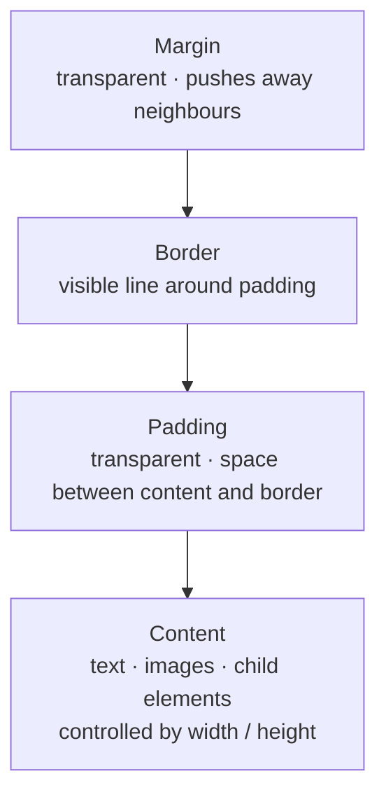

# M08 Box Model


**Topics covered:** Box model layers · `width` / `height` · `padding` · `border` · `margin` · `box-sizing` · shorthand syntax · `outline` · DevTools box model panel

---

## The Why?

Every HTML element — a paragraph, a button, an image, a `<div>` — is rendered as a rectangular box. You cannot avoid this: it is the foundational rule of the CSS layout engine.

The box model describes the four layers that make up that rectangle. Understanding these layers is not optional. Without it you will find yourself constantly fighting layouts: elements that are larger than you expect, gaps that appear from nowhere, borders that push other content off-screen. With it, you can look at any UI and instantly know which layer to adjust to achieve any spacing or sizing result you want.

The box model is the prerequisite for every layout technique that follows — Flexbox, Grid, Position all assume you can predict how much space an element occupies.

By the end of this module you will be able to:
- Name and describe all four box model layers
- Predict the actual rendered size of an element under `content-box` and `border-box` models
- Write padding, border, and margin using shorthand notation
- Read the box model panel in Chrome DevTools

---

## Core Concepts

### The Four Layers



From outside in:

| Layer | Controlled by | Characteristics |
|-------|--------------|-----------------|
| **Margin** | `margin` | Transparent. Creates space *outside* the element, pushing neighbours away. Margins between adjacent elements can *collapse* (see below). |
| **Border** | `border` | The visible edge. Has thickness, style, and colour. Adds to the element's total size under `content-box`. |
| **Padding** | `padding` | Transparent. Creates space *inside* the border, between the border and the content. Takes the element's `background-color`. |
| **Content** | `width` / `height` | The inner rectangle where text, images, and child elements sit. |

---

### `width` and `height`

```css
.card {
  width: 320px;
  height: 200px;
  min-width: 200px;   /* never shrink below this */
  max-width: 100%;    /* never exceed parent width */
}
```

Block elements default to `width: auto` (full parent width) and `height: auto` (sized by content). Set explicit values when you need a fixed or bounded size.

---

### `padding`

Adds internal space between the content and the border. Takes the background colour.

```css
/* Four individual sides */
padding-top:    16px;
padding-right:  24px;
padding-bottom: 16px;
padding-left:   24px;

/* Shorthand — clockwise from top: T R B L */
padding: 16px 24px 16px 24px;

/* Two values: vertical horizontal */
padding: 16px 24px;

/* One value: all four sides */
padding: 20px;
```

---

### `border`

```css
/* Longhand */
border-width: 2px;
border-style: solid;   /* required — without this, border is invisible */
border-color: #e2e8f0;

/* Shorthand: width style color */
border: 2px solid #e2e8f0;

/* Individual sides */
border-top: 4px solid #2563eb;
border-bottom: 1px dashed #cbd5e1;

/* Border radius — rounds the corners */
border-radius: 8px;          /* all corners */
border-radius: 50%;           /* circle (on equal width/height) */
border-radius: 4px 12px;      /* top-left/bottom-right · top-right/bottom-left */
```

Common `border-style` values: `solid`, `dashed`, `dotted`, `double`, `none`.

---

### `margin`

Adds external space, pushing neighbouring elements away.

```css
/* Same shorthand rules as padding */
margin: 24px;
margin: 16px 0;          /* 16px top/bottom, 0 left/right */
margin: 0 auto;          /* centres a block element horizontally */

/* Auto margins */
margin-left: auto;       /* push element to the right */
```

**`margin: 0 auto`** is the classic pattern for centring a fixed-width block element inside its parent — the `auto` keyword distributes remaining horizontal space equally on both sides.

---

### Margin Collapse

When two **block elements** are stacked vertically, their adjacent margins **collapse** — the gap between them is the *larger* of the two margins, not their sum.

```css
.first  { margin-bottom: 24px; }
.second { margin-top:    16px; }
/* Actual gap: 24px — not 40px */
```

Margin collapse only happens vertically (top/bottom), never horizontally. It does not happen in Flex or Grid containers.

---

### `box-sizing`

By default (`content-box`), `width` and `height` refer only to the content area. Padding and border are added *on top*, making the element wider/taller than declared.

```
content-box: total width = width + padding-left + padding-right + border-left + border-right
```

```css
.box {
  width: 300px;
  padding: 20px;
  border: 5px solid;
  /* Actual rendered width: 300 + 40 + 10 = 350px */
}
```

**`border-box`** includes padding and border *inside* the declared size — the content shrinks to accommodate them:

```css
* {
  box-sizing: border-box;
}

.box {
  width: 300px;
  padding: 20px;
  border: 5px solid;
  /* Actual rendered width: exactly 300px */
}
```

Apply `box-sizing: border-box` globally with the universal selector (`*`) at the top of every stylesheet. This is standard practice in all modern CSS.

---

### `outline`

`outline` draws a line *outside* the border — it does not affect layout (takes no space).

```css
button:focus {
  outline: 2px solid #2563eb;
  outline-offset: 4px;
}
```

Used primarily for focus indicators (keyboard navigation accessibility). Never remove `outline` from interactive elements without providing a visible alternative.

---

### DevTools Box Model Panel

Open Chrome DevTools (`F12`) → select any element in the Elements panel → scroll the Styles pane to see the **box model diagram**. It shows the computed pixel values for content, padding, border, and margin in the actual nested-rectangle visualisation.

Hover any layer in the diagram — Chrome highlights that specific layer on the page. This is the fastest way to debug unexpected spacing.

---

## Going Further

<details>
<summary>📐 The `box-sizing` history — why `content-box` is still the default</summary>

When CSS was first designed, `content-box` was the only option. Adding `border-box` semantics later would have broken existing websites, so browsers kept `content-box` as the default.

In 2010, Paul Irish popularised the `* { box-sizing: border-box }` reset in a widely-read blog post. It has been standard practice ever since. The only reason browsers ship with `content-box` as the default is backward compatibility — not because it is better.

Some modern CSS frameworks (including Bootstrap and Tailwind) set `border-box` globally as part of their normalisation CSS, so if you are working in a framework you may already have it without knowing.

</details>

<details>
<summary>↕️ Margin collapse — the full rules</summary>

Margin collapse has three scenarios:

1. **Adjacent siblings:** The larger margin wins between two stacked block elements.
2. **Parent and first/last child:** If a block parent has no border, padding, or formatting context separating it from its first child, the child's top margin "collapses through" to the parent.
3. **Empty elements:** A block element with no content, padding, or border collapses its own top and bottom margins.

**How to prevent collapse:**
- Add any `padding` or `border` to the parent
- Apply `overflow: hidden` (or any non-visible overflow) to the parent
- Use Flexbox or Grid on the parent — neither collapses margins

</details>

<details>
<summary>🔲 `aspect-ratio` — locking width-to-height ratios</summary>

`aspect-ratio` enforces a proportional relationship between an element's width and height — useful for image placeholders, video embeds, and responsive cards.

```css
.video-embed {
  width: 100%;
  aspect-ratio: 16 / 9;   /* always widescreen, regardless of container width */
}

.avatar {
  width: 64px;
  aspect-ratio: 1 / 1;    /* always a square */
  border-radius: 50%;
}
```

Before `aspect-ratio` existed, developers used the "padding-top hack" (`padding-top: 56.25%`) to approximate this — you may still encounter it in older codebases.

</details>

<details>
<summary>🤖 AI and the box model</summary>

The box model is one of the most common sources of layout bugs AI generates. Common issues to watch for in AI output:

- Missing `box-sizing: border-box` reset — element ends up wider than expected
- Using `padding` on inline elements — vertical padding does not affect line height
- Setting `margin: auto` on an element that is not a block with a defined width — has no effect
- Conflating `padding` and `margin` — using one when the other is needed (padding colours the background; margin does not)

Useful AI prompts:
- *"Why is this element 20px wider than I set its width? Here is the CSS: [paste]"*
- *"Refactor this CSS to use the border-box model and shorthand properties."*

</details>

---

## Guided Practice

**Scenario:** You are building the service cards section for **Solstice** — a fictional wellness spa. Each card needs precise padding, a styled border, radius, and spacing from its neighbours.

See `solstice_example.html` in this folder for the finished result.

---

### Step 1: Create the file

In `M08BoxModel`, create `solstice.html` with the standard document skeleton. Title: `Solstice Wellness Spa`. Add an empty `<style>` block.

---

### Step 2: Add the global reset and base styles

```css
* {
  margin: 0;
  padding: 0;
  box-sizing: border-box;
}

body {
  font-family: system-ui, sans-serif;
  background-color: #f8f5f0;
  color: #2d2d2d;
  padding: 3rem 1.5rem;
}
```

---

### Step 3: Add the HTML

```html
<header class="page-header">
  <p class="label">Wellness &amp; Recovery</p>
  <h1>Our Services</h1>
  <p class="subtitle">Each treatment is tailored to restore balance.</p>
</header>

<div class="card-grid">

  <article class="service-card">
    <div class="card-accent"></div>
    <div class="card-body">
      <h2>Deep Tissue Massage</h2>
      <p class="duration">75 min · $120</p>
      <p>Sustained pressure targeting the deepest layers of muscle tissue to release chronic tension patterns.</p>
      <a href="#" class="card-link">Book now</a>
    </div>
  </article>

  <article class="service-card featured-card">
    <div class="card-accent"></div>
    <div class="card-body">
      <h2>Himalayan Salt Stone</h2>
      <p class="duration">90 min · $155</p>
      <p>Warm salt stones melt tension while trace minerals absorb through the skin, deeply replenishing the body.</p>
      <a href="#" class="card-link">Book now</a>
    </div>
  </article>

  <article class="service-card">
    <div class="card-accent"></div>
    <div class="card-body">
      <h2>Restorative Facial</h2>
      <p class="duration">60 min · $95</p>
      <p>A gentle, science-backed treatment addressing hydration, tone, and radiance using botanical actives.</p>
      <a href="#" class="card-link">Book now</a>
    </div>
  </article>

</div>
```

---

### Step 4: Style the page header

```css
.page-header {
  text-align: center;
  margin-bottom: 3rem;
}

.label {
  font-size: 0.7rem;
  font-weight: 700;
  text-transform: uppercase;
  letter-spacing: 0.15em;
  color: #9a7d5a;
  margin-bottom: 0.5rem;
}

.page-header h1 {
  font-size: 2.5rem;
  font-weight: 300;
  letter-spacing: -0.5px;
  margin-bottom: 0.5rem;
}

.subtitle {
  color: rgba(45, 45, 45, 0.55);
  font-size: 1rem;
}
```

---

### Step 5: Style the card grid and card base

```css
.card-grid {
  display: flex;
  gap: 1.5rem;
  max-width: 1000px;
  margin: 0 auto;
}

.service-card {
  flex: 1;
  background-color: white;
  border: 1px solid #e8e0d5;
  border-radius: 12px;
  overflow: hidden;        /* clips the accent bar to the border-radius */
}
```

---

### Step 6: Add the accent bar and card body

```css
.card-accent {
  height: 4px;
  background-color: #c9a87a;
}

.card-body {
  padding: 1.75rem;        /* all four sides equal */
}

.service-card h2 {
  font-size: 1.1rem;
  font-weight: 600;
  margin-bottom: 0.3rem;
}

.duration {
  font-size: 0.82rem;
  color: #9a7d5a;
  font-weight: 600;
  margin-bottom: 0.9rem;
}

.service-card p:not(.duration) {
  font-size: 0.9rem;
  line-height: 1.7;
  color: rgba(45, 45, 45, 0.7);
  margin-bottom: 1.5rem;
}

.card-link {
  display: inline-block;
  font-size: 0.82rem;
  font-weight: 700;
  color: #9a7d5a;
  text-decoration: none;
  border-bottom: 1px solid #9a7d5a;
  padding-bottom: 2px;
}
```

---

### Step 7: Style the featured card

```css
.featured-card {
  border-color: #c9a87a;
  border-width: 2px;
}

.featured-card .card-accent {
  height: 6px;
  background-color: #9a7d5a;
}
```

Open DevTools, click on `.card-body`, and inspect the box model panel. Confirm the padding shows `1.75rem` (~28px) on all sides. Check that the border on `.featured-card` is `2px` versus `1px` on the others.

---

### Step 8: Experiment with `box-sizing`

Temporarily remove the `box-sizing: border-box` from the `*` reset. Notice how elements shift — the `.card-body` padding now adds to the card's total width. Re-add it.

Then add a wide padding to `.service-card` and observe how under `border-box` the card stays the same outer size while the content area shrinks.

---

### Step 9: Ask AI to enhance

Paste your `solstice.html` into Gemini and prompt:

> *"Here is a spa service cards page. Add CSS to: add a subtle `box-shadow` to each card that lifts slightly on hover, add a horizontal divider line inside `.card-body` between the duration and the description using a `border-top`, and style the Book Now link as a full-width pill button with padding and border-radius. Keep all existing CSS intact."*

Save as `solstice_styled.html`.

---

## Checkpoints

* [ ] **UI Button System**  
  Build a page showcasing a button system with three button types. All CSS must use `box-sizing: border-box` via `* {}`. Requirements:
  - Three buttons: Primary (filled), Secondary (outlined — `background: transparent`, `border: 2px solid`), Danger (filled, red tones)
  - Each button uses `padding` shorthand (vertical horizontal — e.g. `0.6rem 1.5rem`) for comfortable click targets
  - Buttons sit side by side with `margin-right` between them
  - All buttons have `border-radius: 6px`
  - Inspect in DevTools: confirm the primary button's total rendered width equals `width + padding-left + padding-right` (under `content-box`) vs just `width` (under `border-box`)
  - A second row showing the same three buttons at a larger size: only change `padding` and `font-size` — not the button's `width`

* [ ] **Profile Card**  
  Build a user profile card. Requirements:
  - Outer card: `max-width: 340px`, `border: 1px solid`, `border-radius: 16px`, `padding: 2rem`, centred with `margin: 2rem auto`
  - Avatar placeholder: a `<div>` styled as a circle (`width: 80px`, `height: 80px`, `border-radius: 50%`, `background-color`), centred with `margin: 0 auto 1rem`
  - A decorative top bar: a `<div>` with `height: 6px`, `background-color` accent, `border-radius: 16px 16px 0 0` (top corners only), using `margin: -2rem -2rem 1.5rem` (negative margins to bleed to card edges)
  - Name in `<h2>` with no margin-top; job title in `<p>` with lighter colour
  - A stats row (3 `<div>` items side by side): each with `padding: 0.75rem`, `border: 1px solid`, `border-radius: 8px`, and `text-align: center`
  - All box model values chosen deliberately — add a comment next to any non-obvious margin or padding explaining why
