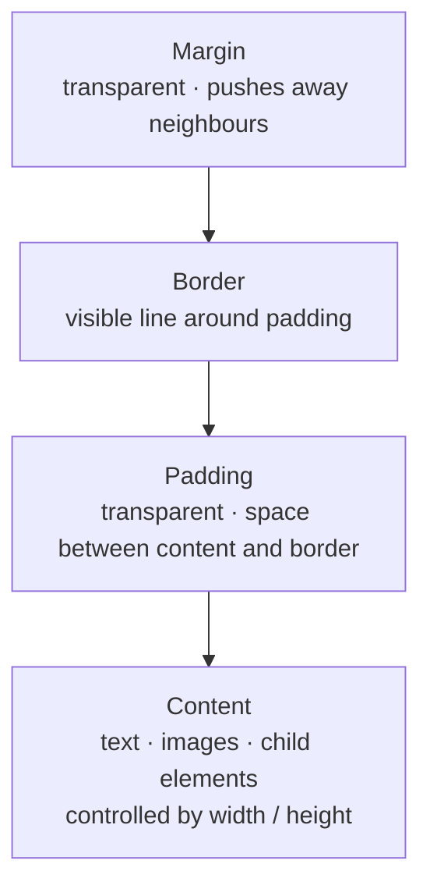

# M08 Box Model


**Topics covered:** Box model layers · `width` / `height` · `padding` · `border` · `margin` · `box-sizing` · shorthand syntax · `outline` · DevTools box model panel

---

## The Why?

Every HTML element — a paragraph, a button, an image, a `<div>` — is rendered as a rectangular box. You cannot avoid this: it is the foundational rule of the CSS layout engine.

The box model describes the four layers that make up that rectangle. Understanding these layers is not optional. Without it you will find yourself constantly fighting layouts: elements that are larger than you expect, gaps that appear from nowhere, borders that push other content off-screen. With it, you can look at any UI and instantly know which layer to adjust to achieve any spacing or sizing result you want.

The box model is the prerequisite for every layout technique that follows — Flexbox, Grid, Position all assume you can predict how much space an element occupies.

By the end of this module you will be able to:
- Name and describe all four box model layers
- Predict the actual rendered size of an element under `content-box` and `border-box` models
- Write padding, border, and margin using shorthand notation
- Read the box model panel in Chrome DevTools

---

## Core Concepts

### The Four Layers



From outside in:

| Layer | Controlled by | Characteristics |
|-------|--------------|-----------------|
| **Margin** | `margin` | Transparent. Creates space *outside* the element, pushing neighbours away. Margins between adjacent elements can *collapse* (see below). |
| **Border** | `border` | The visible edge. Has thickness, style, and colour. Adds to the element's total size under `content-box`. |
| **Padding** | `padding` | Transparent. Creates space *inside* the border, between the border and the content. Takes the element's `background-color`. |
| **Content** | `width` / `height` | The inner rectangle where text, images, and child elements sit. |

---

### `width` and `height`

```css
.card {
  width: 320px;
  height: 200px;
  min-width: 200px;   /* never shrink below this */
  max-width: 100%;    /* never exceed parent width */
}
```

Block elements default to `width: auto` (full parent width) and `height: auto` (sized by content). Set explicit values when you need a fixed or bounded size.

---

### `padding`

Adds internal space between the content and the border. Takes the background colour.

```css
/* Four individual sides */
padding-top:    16px;
padding-right:  24px;
padding-bottom: 16px;
padding-left:   24px;

/* Shorthand — clockwise from top: T R B L */
padding: 16px 24px 16px 24px;

/* Two values: vertical horizontal */
padding: 16px 24px;

/* One value: all four sides */
padding: 20px;
```

---

### `border`

```css
/* Longhand */
border-width: 2px;
border-style: solid;   /* required — without this, border is invisible */
border-color: #e2e8f0;

/* Shorthand: width style color */
border: 2px solid #e2e8f0;

/* Individual sides */
border-top: 4px solid #2563eb;
border-bottom: 1px dashed #cbd5e1;

/* Border radius — rounds the corners */
border-radius: 8px;          /* all corners */
border-radius: 50%;           /* circle (on equal width/height) */
border-radius: 4px 12px;      /* top-left/bottom-right · top-right/bottom-left */
```

Common `border-style` values: `solid`, `dashed`, `dotted`, `double`, `none`.

---

### `margin`

Adds external space, pushing neighbouring elements away.

```css
/* Same shorthand rules as padding */
margin: 24px;
margin: 16px 0;          /* 16px top/bottom, 0 left/right */
margin: 0 auto;          /* centres a block element horizontally */

/* Auto margins */
margin-left: auto;       /* push element to the right */
```

**`margin: 0 auto`** is the classic pattern for centring a fixed-width block element inside its parent — the `auto` keyword distributes remaining horizontal space equally on both sides.

---

### Margin Collapse

When two **block elements** are stacked vertically, their adjacent margins **collapse** — the gap between them is the *larger* of the two margins, not their sum.

```css
.first  { margin-bottom: 24px; }
.second { margin-top:    16px; }
/* Actual gap: 24px — not 40px */
```

Margin collapse only happens vertically (top/bottom), never horizontally. It does not happen in Flex or Grid containers.

---

### `box-sizing`

By default (`content-box`), `width` and `height` refer only to the content area. Padding and border are added *on top*, making the element wider/taller than declared.

```
content-box: total width = width + padding-left + padding-right + border-left + border-right
```

```css
.box {
  width: 300px;
  padding: 20px;
  border: 5px solid;
  /* Actual rendered width: 300 + 40 + 10 = 350px */
}
```

**`border-box`** includes padding and border *inside* the declared size — the content shrinks to accommodate them:

```css
*, *::before, *::after {
  box-sizing: border-box;
}

.box {
  width: 300px;
  padding: 20px;
  border: 5px solid;
  /* Actual rendered width: exactly 300px */
}
```

Apply `box-sizing: border-box` globally using `*, *::before, *::after` near the top of every stylesheet. The `::before` and `::after` ensure generated pseudo-elements follow the same rule. This is standard practice in all modern CSS frameworks.

---

### `outline`

`outline` draws a line *outside* the border — it does not affect layout (takes no space).

```css
button:focus {
  outline: 2px solid #2563eb;
  outline-offset: 4px;
}
```

Used primarily for focus indicators (keyboard navigation accessibility). Never remove `outline` from interactive elements without providing a visible alternative.

---

### DevTools Box Model Panel

Open Chrome DevTools (`F12`) → select any element in the Elements panel → scroll the Styles pane to see the **box model diagram**. It shows the computed pixel values for content, padding, border, and margin in the actual nested-rectangle visualisation.

Hover any layer in the diagram — Chrome highlights that specific layer on the page. This is the fastest way to debug unexpected spacing.

---

## Going Further

<details>
<summary>📐 The `box-sizing` history — why `content-box` is still the default</summary>

When CSS was first designed, `content-box` was the only option. Adding `border-box` semantics later would have broken existing websites, so browsers kept `content-box` as the default.

In 2010, Paul Irish popularised the `* { box-sizing: border-box }` reset in a widely-read blog post. It has been standard practice ever since. The only reason browsers ship with `content-box` as the default is backward compatibility — not because it is better.

Some modern CSS frameworks (including Bootstrap and Tailwind) set `border-box` globally as part of their normalisation CSS, so if you are working in a framework you may already have it without knowing.

</details>

<details>
<summary>↕️ Margin collapse — the full rules</summary>

Margin collapse has three scenarios:

1. **Adjacent siblings:** The larger margin wins between two stacked block elements.
2. **Parent and first/last child:** If a block parent has no border, padding, or formatting context separating it from its first child, the child's top margin "collapses through" to the parent.
3. **Empty elements:** A block element with no content, padding, or border collapses its own top and bottom margins.

**How to prevent collapse:**
- Add any `padding` or `border` to the parent
- Apply `overflow: hidden` (or any non-visible overflow) to the parent
- Use Flexbox or Grid on the parent — neither collapses margins

</details>

<details>
<summary>🔲 `aspect-ratio` — locking width-to-height ratios</summary>

`aspect-ratio` enforces a proportional relationship between an element's width and height — useful for image placeholders, video embeds, and responsive cards.

```css
.video-embed {
  width: 100%;
  aspect-ratio: 16 / 9;   /* always widescreen, regardless of container width */
}

.avatar {
  width: 64px;
  aspect-ratio: 1 / 1;    /* always a square */
  border-radius: 50%;
}
```

Before `aspect-ratio` existed, developers used the "padding-top hack" (`padding-top: 56.25%`) to approximate this — you may still encounter it in older codebases.

</details>

<details>
<summary>🤖 AI and the box model</summary>

The box model is one of the most common sources of layout bugs AI generates. Common issues to watch for in AI output:

- Missing `*, *::before, *::after { box-sizing: border-box }` — element ends up wider than expected
- Using `padding` on inline elements — vertical padding does not affect line height
- Setting `margin: auto` on an element that is not a block with a defined width — has no effect
- Conflating `padding` and `margin` — using one when the other is needed (padding colours the background; margin does not)

Useful AI prompts:
- *"Why is this element 20px wider than I set its width? Here is the CSS: [paste]"*
- *"Refactor this CSS to use the border-box model and shorthand properties."*

</details>

---

## Guided Practice

**Scenario:** You are building the menu page for **Verona** — a fictional Italian restaurant. The layout demonstrates every box model layer: `padding` creates breathing room inside menu items, `border` draws visible dividers and the tasting-menu callout, `border-radius` rounds containers, and `margin` spaces sections apart.

See `verona_example.html` in this folder for the finished result.

---

### Step 1: Create the file

In `M08BoxModel`, create `verona.html` with the standard document skeleton. Title: `Verona — Italian Kitchen`. Add an empty `<style>` block.

---

### Step 2: Add the box-sizing rule and base styles

```css
/* Every element's width includes its padding and border */
*, *::before, *::after {
  box-sizing: border-box;
}

body {
  font-family: system-ui, sans-serif;
  background-color: #fdf8f2;
  color: #1a0a00;
  padding: 3rem 1.5rem;
  margin: 0;
}
```

`box-sizing: border-box` on `*, *::before, *::after` means every element's `width` includes its padding and border — no arithmetic needed later. `margin: 0` on `body` removes the browser's default 8px body gap.

---

### Step 3: Add the HTML structure

```html
<header class="page-header">
  <p class="label">Ristorante &amp; Bar</p>
  <h1>Verona</h1>
  <p class="subtitle">Contemporary Italian kitchen. Open from 5 PM.</p>
</header>

<div class="menu">

  <div class="tasting-menu">
    <h2>Chef's Tasting Menu</h2>
    <p class="meta">7 courses &middot; $110 per person &middot; Seasonal, changes weekly</p>
    <ul class="tasting-courses">
      <li>Amuse-bouche &mdash; burrata, roasted tomato, basil oil</li>
      <li>Crudo &mdash; scallop, yuzu, cucumber, dill</li>
      <li>Soup &mdash; white bean, rosemary, fried sage</li>
      <li>Pasta &mdash; hand-rolled pappardelle, wild boar ragù</li>
      <li>Fish &mdash; line-caught sea bass, saffron, fennel</li>
      <li>Meat &mdash; 45-day dry-aged beef, Barolo reduction</li>
      <li>Dolce &mdash; affogato, hazelnut praline</li>
    </ul>
  </div>

  <section class="menu-section">
    <h2>Antipasti</h2>

    <div class="menu-item">
      <div>
        <div class="item-name">Bruschetta al Pomodoro</div>
        <p class="item-desc">Wood-fired bread, slow-roasted tomato, basil, aged balsamic.</p>
      </div>
      <span class="item-price">$14</span>
    </div>

    <div class="menu-item">
      <div>
        <div class="item-name">Burrata e Prosciutto</div>
        <p class="item-desc">Imported burrata, 24-month prosciutto di Parma, truffle honey, walnuts.</p>
      </div>
      <span class="item-price">$22</span>
    </div>
  </section>

  <section class="menu-section">
    <h2>Pasta</h2>

    <div class="menu-item">
      <div>
        <div class="item-name">Tagliatelle al Ragù</div>
        <p class="item-desc">Egg pasta, slow-cooked beef and pork ragù, Parmigiano, fresh basil.</p>
      </div>
      <span class="item-price">$32</span>
    </div>

    <div class="menu-item">
      <div>
        <div class="item-name">Cacio e Pepe</div>
        <p class="item-desc">Tonnarelli, Pecorino Romano, Parmigiano, hand-cracked black pepper.</p>
      </div>
      <span class="item-price">$28</span>
    </div>
  </section>

  <div class="reservation-box">
    <h2>Reserve a Table</h2>
    <p>Dinner service Tuesday – Saturday from 5 PM.<br>Tasting menu available by reservation only.</p>
    <a href="#" class="reserve-btn">Book a Table</a>
  </div>

</div>
```

Open in Chrome. Unstyled content — ready for CSS.

---

### Step 4: Style the page header

```css
.page-header {
  text-align: center;
  margin-bottom: 3.5rem;  /* margin: space OUTSIDE the element */
}

.label {
  font-size: 0.7rem;
  font-weight: 700;
  text-transform: uppercase;
  letter-spacing: 0.18em;
  color: #8b2635;
  margin-bottom: 0.4rem;
}

.page-header h1 {
  font-size: 3rem;
  font-weight: 300;
  letter-spacing: -0.5px;
  margin-bottom: 0.4rem;
}

.subtitle {
  color: rgba(26, 10, 0, 0.5);
  font-size: 1rem;
}

.menu {
  max-width: 740px;
  margin: 0 auto;
}
```

---

### Step 5: Style the tasting menu callout

This is the key box model demo — `border` + `border-radius` + `padding` together create a contained callout box:

```css
.tasting-menu {
  border: 2px solid #8b2635;     /* border: visible edge */
  border-radius: 10px;           /* rounds all four corners */
  padding: 2rem;                 /* space between border and content */
  margin-bottom: 3rem;           /* space outside the box */
  background-color: #fff9f5;
}

.tasting-menu h2 {
  font-size: 1.1rem;
  font-weight: 700;
  color: #8b2635;
  margin-bottom: 0.25rem;
}

.tasting-menu .meta {
  font-size: 0.8rem;
  color: rgba(26, 10, 0, 0.5);
  margin-bottom: 1rem;
}

.tasting-courses {
  list-style: none;
  border-top: 1px solid #ddc9b8;
  padding-top: 0.75rem;          /* padding between border-top and items */
}

.tasting-courses li {
  padding: 0.45rem 0;            /* vertical padding separates items */
  border-bottom: 1px solid #f0e4d8;
  font-size: 0.9rem;
  color: rgba(26, 10, 0, 0.8);
}

.tasting-courses li:last-child {
  border-bottom: none;
  padding-bottom: 0;
}
```

Open DevTools and click the `.tasting-menu` element. In the Styles panel, scroll to the **box model diagram** (nested rectangles). You will see the `2rem` padding, the `2px` border, and the `3rem` margin illustrated as separate coloured layers.

---

### Step 6: Style the menu sections and items

```css
.menu-section {
  margin-bottom: 3rem;           /* margin separates sections */
}

/* border-bottom as a visual divider — no border-radius needed */
.menu-section h2 {
  font-size: 0.78rem;
  font-weight: 700;
  text-transform: uppercase;
  letter-spacing: 0.2em;
  color: #8b2635;
  border-bottom: 1px solid #ddc9b8;
  padding-bottom: 0.6rem;        /* padding above the border-bottom line */
  margin-bottom: 1.25rem;
}

.menu-item {
  padding: 0.9rem 0;             /* vertical padding separates rows */
  border-bottom: 1px solid #f0e4d8;
  display: flex;
  justify-content: space-between;
  align-items: flex-start;
  gap: 1.5rem;
}

.menu-item:last-child {
  border-bottom: none;
}

.item-name {
  font-size: 1rem;
  font-weight: 600;
  color: #1a0a00;
  margin-bottom: 0.25rem;
}

.item-desc {
  font-size: 0.88rem;
  color: rgba(26, 10, 0, 0.6);
  line-height: 1.6;
}

.item-price {
  font-size: 0.95rem;
  font-weight: 700;
  color: #8b2635;
  white-space: nowrap;
  padding-top: 0.1rem;
}
```

Notice the contrast with the tasting menu: menu items use `padding: 0.9rem 0` (vertical only, no left/right), while the tasting callout uses `padding: 2rem` (all sides). Both are padding — the difference is how much and where.

---

### Step 7: Style the reservation callout

```css
.reservation-box {
  background-color: #8b2635;
  color: white;
  padding: 2rem 2.5rem;          /* padding: content far from edges */
  border-radius: 10px;
  margin-top: 3rem;
  text-align: center;
}

.reservation-box h2 {
  font-size: 1.15rem;
  font-weight: 700;
  margin-bottom: 0.5rem;
}

.reservation-box p {
  font-size: 0.9rem;
  color: rgba(255, 255, 255, 0.7);
  margin-bottom: 1.25rem;
}

.reserve-btn {
  display: inline-block;
  background-color: white;
  color: #8b2635;
  font-weight: 700;
  font-size: 0.9rem;
  padding: 0.65rem 2rem;         /* padding makes the button larger */
  border-radius: 99px;
  text-decoration: none;
}
```

Compare the two callout boxes: `.tasting-menu` uses `border` with a transparent interior, `.reservation-box` uses a filled `background-color` with no border. Both use `border-radius` and `padding` — the same box model properties produce very different visual results.

---

### Step 8: Experiment with `box-sizing`

In DevTools, find `.menu-item` and temporarily add `box-sizing: content-box` to override the global rule. Then set `width: 100%` and `padding: 2rem` — the item overflows its container because padding now adds to the declared width. Remove the override to restore `border-box` behaviour.

Then change `padding` on any `.menu-item` in DevTools and watch the box model diagram update in real time.

---

## Checkpoints

* [ ] **UI Button System**  
  Build a page showcasing a button system with three button types. All CSS must use `box-sizing: border-box` via `* {}`. Requirements:
  - Three buttons: Primary (filled), Secondary (outlined — `background: transparent`, `border: 2px solid`), Danger (filled, red tones)
  - Each button uses `padding` shorthand (vertical horizontal — e.g. `0.6rem 1.5rem`) for comfortable click targets
  - Buttons sit side by side with `margin-right` between them
  - All buttons have `border-radius: 6px`
  - Inspect in DevTools: confirm the primary button's total rendered width equals `width + padding-left + padding-right` (under `content-box`) vs just `width` (under `border-box`)
  - A second row showing the same three buttons at a larger size: only change `padding` and `font-size` — not the button's `width`

* [ ] **Profile Card**  
  Build a user profile card. Requirements:
  - Outer card: `max-width: 340px`, `border: 1px solid`, `border-radius: 16px`, `padding: 2rem`, centred with `margin: 2rem auto`
  - Avatar placeholder: a `<div>` styled as a circle (`width: 80px`, `height: 80px`, `border-radius: 50%`, `background-color`), centred with `margin: 0 auto 1rem`
  - A decorative top bar: a `<div>` with `height: 6px`, `background-color` accent, `border-radius: 16px 16px 0 0` (top corners only), using `margin: -2rem -2rem 1.5rem` (negative margins to bleed to card edges)
  - Name in `<h2>` with no margin-top; job title in `<p>` with lighter colour
  - A stats row (3 `<div>` items side by side): each with `padding: 0.75rem`, `border: 1px solid`, `border-radius: 8px`, and `text-align: center`
  - All box model values chosen deliberately — add a comment next to any non-obvious margin or padding explaining why
