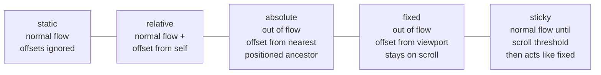

# M09 Position


**Topics covered:** `position` values · `static` · `relative` · `absolute` · `fixed` · `sticky` · offset properties · `z-index` · stacking context

---

## The Why?

Normal document flow places elements one after another — block elements stack vertically, inline elements wrap in lines. That works for prose, but real interfaces need more: a navbar that stays on screen while the page scrolls, a badge that floats over a card, a modal that sits above everything else.

The `position` property breaks an element out of normal flow and lets you place it using coordinates — relative to itself, its nearest positioned ancestor, the viewport, or the scroll boundary.

Understanding position lets you build the UI patterns that appear on almost every page: sticky headers, overlapping cards, floating action buttons, tooltips, and modal dialogs. Without it you are limited to whatever the default flow produces.

By the end of this module you will be able to:
- State what each of the five position values does and when to use it
- Use `top`, `right`, `bottom`, and `left` to place elements precisely
- Build a sticky navigation bar that locks to the top on scroll
- Use `z-index` to control which elements sit on top when they overlap

---

## Core Concepts

### The Five Values



| Value | In normal flow? | Positioned relative to | Moves on scroll? |
|-------|----------------|------------------------|-----------------|
| `static` | Yes | — (offset ignored) | Yes |
| `relative` | Yes | Its own original position | Yes |
| `absolute` | No | Nearest positioned ancestor (or `<html>`) | Yes |
| `fixed` | No | The viewport | No — stays put |
| `sticky` | Yes (until threshold) | The scroll container | Locks at threshold |

---

### Offset Properties

`top`, `right`, `bottom`, and `left` only work when `position` is anything other than `static`.

```css
.badge {
  position: absolute;
  top: -8px;      /* 8px above the ancestor's top edge */
  right: -8px;    /* 8px outside the ancestor's right edge */
}
```

Positive values move inward (toward centre); negative values move outward (beyond the edge).

---

### `position: relative`

Element stays in normal flow — its space is preserved. Offsets move the rendered box without affecting surrounding elements.

```css
.nudged {
  position: relative;
  top: 4px;    /* shifts the visible box down 4px, but the gap stays */
}
```

Its most important use: establishing a **positioning context** for absolute children.

```css
.card {
  position: relative;   /* now .badge is positioned inside .card */
}

.badge {
  position: absolute;
  top: 12px;
  right: 12px;
}
```

---

### `position: absolute`

Removed from normal flow — surrounding elements act as if it does not exist. Positioned relative to the nearest ancestor with `position` set to anything other than `static`.

```css
.tooltip {
  position: absolute;
  bottom: 100%;     /* sits directly above its container */
  left: 50%;
  transform: translateX(-50%);   /* centres it horizontally */
}
```

If no positioned ancestor exists, `absolute` elements are placed relative to the initial containing block (the `<html>` element).

---

### `position: fixed`

Stays in place as the user scrolls. Positioned relative to the viewport — `top: 0` means the top of the browser window, always.

```css
.site-nav {
  position: fixed;
  top: 0;
  left: 0;
  width: 100%;
  z-index: 100;
}
```

Since `fixed` elements are out of flow, add padding to the `<body>` equal to the navbar height so content does not hide under it.

---

### `position: sticky`

Behaves like `relative` until the user scrolls past a threshold, then "sticks" in place like `fixed`. Returns to `relative` when the parent scrolls out of view.

```css
.section-header {
  position: sticky;
  top: 0;           /* stick when it reaches the top of the viewport */
  background-color: white;
  z-index: 10;
}
```

Requires the parent to have scrollable overflow and enough height for sticking to occur.

---

### `z-index`

Controls stacking order when positioned elements overlap. Higher value = closer to the viewer.

```css
.modal-overlay { z-index: 200; }
.modal-dialog  { z-index: 201; }
.site-nav      { z-index: 100; }
.card-badge    { z-index:  10; }
```

`z-index` only works on positioned elements (anything other than `static`). It has no effect on `position: static`.

---

### Stacking Context

Each element with `position` + `z-index` (or certain other properties like `opacity < 1`, `transform`, `filter`) creates a new **stacking context** — a self-contained layer. Children of a stacking context are painted inside it and cannot escape above its parent.

```css
/* .modal has z-index: 50 — its children are all within that context */
.modal        { position: fixed; z-index: 50; }
.modal-close  { position: absolute; z-index: 9999; }
/* .modal-close still sits inside .modal's layer — not above unrelated z-index: 51 elements */
```

---

## Going Further

<details>
<summary>📐 Percentage offsets and the containing block</summary>

When you write `left: 50%`, that 50% is calculated against the **containing block** — the nearest positioned ancestor. This makes percentage offsets useful for centering:

```css
.centred {
  position: absolute;
  left: 50%;
  top: 50%;
  transform: translate(-50%, -50%);
}
```

`left: 50%` moves the element's left edge to the centre. `transform: translateX(-50%)` then shifts it back by half its own width, resulting in perfect centering — a pattern used everywhere in UI design.

</details>

<details>
<summary>📌 Sticky positioning — what breaks it</summary>

`sticky` stops working when:

1. **Parent has `overflow: hidden`** (or `scroll`/`auto`) — stickiness requires the scroll container to be an ancestor, not a clipping parent.
2. **Parent is not tall enough** — the element sticks for the duration of the parent's height. If the parent and sticky element are the same height, there is no range over which to stick.
3. **No threshold set** — you must specify at least one of `top`, `right`, `bottom`, or `left` for sticky to activate.

```css
/* Wrong — overflow clips and disables sticky */
.section { overflow: hidden; }

/* Right — remove overflow or set it on a different element */
.sticky-header { position: sticky; top: 0; }
```

</details>

<details>
<summary>🔢 `z-index` management strategies</summary>

Unmanaged `z-index` values become a maintenance problem fast ("I'll just set it to 9999"). Two common strategies:

**Layer scale** — use multiples of 10 or 100 so there is room to insert between:
```css
:root {
  --z-base:     1;
  --z-dropdown: 100;
  --z-sticky:   200;
  --z-overlay:  300;
  --z-modal:    400;
  --z-toast:    500;
}
```

**Named CSS custom properties** — readable and centralised. When a new layer is needed, add to the list rather than scattering magic numbers across files.

</details>

<details>
<summary>🤖 AI and position</summary>

Position bugs are among the most common AI-generated CSS errors:

- **Forgetting the positioned ancestor** — AI adds `position: absolute` to a child but forgets `position: relative` on the parent. The element flies to an unexpected corner.
- **Fixed height on sticky's parent** — makes sticky behave identically to absolute. AI often generates this pattern.
- **`z-index` on `position: static`** — has no effect. AI sometimes adds `z-index` without adding a `position` value.

Useful AI prompts:
- *"This element is positioned absolute but appearing in the wrong place. Which ancestor needs position: relative? Here is the HTML: [paste]"*
- *"Why is my sticky header not sticking? Here is the CSS for the header and its parent: [paste]"*

</details>

---

## Guided Practice

**Scenario:** You are building a landing page for **Crispy** — a food delivery app. The page needs a sticky navigation bar, a floating order button, and a delivery-time badge overlaying each menu card.

See `crispy_example.html` in this folder for the finished result.

---

### Step 1: Create the file

In `M09Position`, create `crispy.html`. Title: `Crispy — Food Delivery`. Add an empty `<style>` block.

---

### Step 2: Add the global reset and base

```css
* {
  margin: 0;
  padding: 0;
  box-sizing: border-box;
}

body {
  font-family: system-ui, sans-serif;
  background-color: #fafaf8;
  color: #1a1a1a;
}
```

---

### Step 3: Add the sticky navbar HTML and CSS

```html
<nav class="site-nav">
  <div class="nav-inner">
    <span class="nav-logo">Crispy</span>
    <ul class="nav-links">
      <li><a href="#">Menu</a></li>
      <li><a href="#">How it works</a></li>
      <li><a href="#">About</a></li>
    </ul>
  </div>
</nav>
```

```css
.site-nav {
  position: sticky;
  top: 0;
  background-color: white;
  border-bottom: 1px solid #e5e5e5;
  z-index: 100;
}

.nav-inner {
  max-width: 1100px;
  margin: 0 auto;
  padding: 1rem 2rem;
  display: flex;
  justify-content: space-between;
  align-items: center;
}

.nav-logo {
  font-size: 1.3rem;
  font-weight: 800;
  color: #e85d2f;
}

.nav-links {
  list-style: none;
  display: flex;
  gap: 2rem;
}

.nav-links a {
  text-decoration: none;
  color: #555;
  font-size: 0.9rem;
  font-weight: 500;
}
```

Scroll down the page — the navbar locks at the top of the viewport.

---

### Step 4: Add the hero section

```html
<section class="hero">
  <h1>Food that reaches you fast.</h1>
  <p>Hot meals from 200+ local restaurants — delivered in under 30 minutes.</p>
</section>
```

```css
.hero {
  max-width: 700px;
  margin: 5rem auto;
  padding: 0 2rem;
  text-align: center;
}

.hero h1 {
  font-size: 3rem;
  font-weight: 800;
  line-height: 1.15;
  margin-bottom: 1rem;
}

.hero p {
  font-size: 1.1rem;
  color: #666;
  line-height: 1.7;
}
```

---

### Step 5: Add the menu card grid HTML

```html
<section class="menu-section">
  <h2 class="section-title">Popular right now</h2>
  <div class="card-grid">

    <article class="menu-card">
      <div class="card-image">
        <div class="card-badge">20 min</div>
      </div>
      <div class="card-info">
        <h3>Spicy Ramen</h3>
        <p>Rich tonkotsu broth, chashu pork, soft egg.</p>
        <span class="price">$14.90</span>
      </div>
    </article>

    <article class="menu-card">
      <div class="card-image">
        <div class="card-badge">15 min</div>
      </div>
      <div class="card-info">
        <h3>Crispy Chicken Burger</h3>
        <p>Double-fried thigh, pickled slaw, sriracha mayo.</p>
        <span class="price">$12.50</span>
      </div>
    </article>

    <article class="menu-card">
      <div class="card-image">
        <div class="card-badge">25 min</div>
      </div>
      <div class="card-info">
        <h3>Margherita Pizza</h3>
        <p>San Marzano tomato, fresh mozzarella, basil.</p>
        <span class="price">$16.00</span>
      </div>
    </article>

  </div>
</section>
```

---

### Step 6: Style the cards with `position: relative` and the badge with `position: absolute`

```css
.menu-section {
  max-width: 1100px;
  margin: 0 auto 6rem;
  padding: 0 2rem;
}

.section-title {
  font-size: 1.4rem;
  font-weight: 700;
  margin-bottom: 1.5rem;
}

.card-grid {
  display: flex;
  gap: 1.5rem;
}

.menu-card {
  flex: 1;
  background-color: white;
  border: 1px solid #ebebeb;
  border-radius: 12px;
  overflow: hidden;
  position: relative;   /* context for the absolute badge */
}

.card-image {
  height: 160px;
  background-color: #ffe8dd;
  position: relative;   /* badge is positioned inside here */
}

/* position: absolute — badge overlays the image corner */
.card-badge {
  position: absolute;
  top: 12px;
  right: 12px;
  background-color: #e85d2f;
  color: white;
  font-size: 0.72rem;
  font-weight: 700;
  padding: 0.25rem 0.6rem;
  border-radius: 99px;
}

.card-info {
  padding: 1.25rem;
}

.card-info h3 {
  font-size: 1rem;
  font-weight: 700;
  margin-bottom: 0.35rem;
}

.card-info p {
  font-size: 0.85rem;
  color: #888;
  line-height: 1.5;
  margin-bottom: 0.75rem;
}

.price {
  font-size: 0.95rem;
  font-weight: 700;
  color: #e85d2f;
}
```

---

### Step 7: Add the floating order button with `position: fixed`

```html
<!-- place just before </body> -->
<button class="float-btn">Order now</button>
```

```css
/* position: fixed — stays in viewport regardless of scroll */
.float-btn {
  position: fixed;
  bottom: 2rem;
  right: 2rem;
  background-color: #e85d2f;
  color: white;
  border: none;
  border-radius: 99px;
  padding: 0.85rem 1.75rem;
  font-size: 0.95rem;
  font-weight: 700;
  cursor: pointer;
  z-index: 50;
  box-shadow: 0 4px 16px rgba(232, 93, 47, 0.35);
}
```

Scroll the page — the button stays pinned to the bottom-right corner.

---

### Step 8: Inspect in DevTools

Open DevTools (`F12`), click `.card-badge`, and observe:
- `position: absolute` under Computed styles
- `top: 12px`, `right: 12px` offset values
- Containing block is `.card-image`, not the page

Then click `.site-nav` and confirm `position: sticky` with `top: 0`.

---

### Step 9: Ask AI to enhance

Paste your `crispy.html` into Gemini and prompt:

> *"Here is a food delivery landing page. Add CSS to: show a tooltip with the text 'Add to cart' above each card's price on hover — use position: absolute on the tooltip and position: relative on the card. Also give the floating button a subtle scale-up effect on hover. Keep all existing CSS intact."*

Save as `crispy_styled.html`.

---

## Checkpoints

* [ ] **Notification Badge**  
  Build a page with a header containing a bell icon (use the unicode character `🔔` inside a `<span>`) with a notification count badge overlaying it. Requirements:
  - Outer wrapper `<div>` has `position: relative`
  - Badge `<span>` has `position: absolute`, `top: -8px`, `right: -8px`
  - Badge is a circle: `width: 20px`, `height: 20px`, `border-radius: 50%`, coloured background, white text, `font-size: 0.7rem`
  - Add two more icon+badge pairs side by side using `display: inline-block` and `margin-right`
  - Use `z-index` to verify the badge sits above the icon (inspect in DevTools)

* [ ] **Sticky Section Headers**  
  Build a long scrollable page with at least four content sections. Each section has a header that sticks to the top as you scroll through that section. Requirements:
  - Each `<section>` is at least `400px` tall
  - Each `<h2>` inside uses `position: sticky`, `top: 0`, with a background colour matching the section
  - Sections alternate between two different background colours
  - A fixed navbar sits at `z-index: 100`; sticky headers use a lower `z-index` so they slide under the navbar when scrolling
  - Add enough paragraph text that the page actually scrolls
