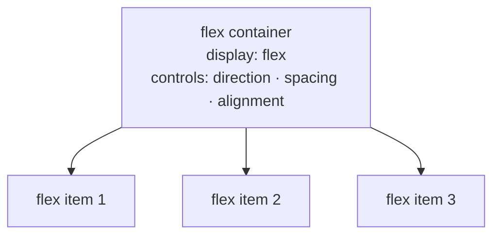

# M10 Flexbox


**Topics covered:** flex container · flex items · `flex-direction` · `justify-content` · `align-items` · `gap` · `flex-wrap` · `flex` shorthand · `align-self` · `order`

---

## The Why?

Before Flexbox, laying out a row of cards — evenly spaced, all the same height, centred vertically — required float hacks, negative margins, and `display: table` workarounds. All of them were fragile and unintuitive.

Flexbox is a one-dimensional layout system designed specifically for this problem. Turn one property on (`display: flex`) and a parent element becomes a **flex container**: its children arrange themselves in a row (or column), they can fill available space, they automatically match each other's height, and you control their distribution and alignment with plain English-like properties.

Flexbox is used on almost every real webpage — for navigation bars, card rows, centred content, and anywhere you need items to share space intelligently. It is not an advanced technique: it is the default way to build layouts in modern CSS.

By the end of this module you will be able to:
- Turn any container into a flex container and explain what changes for its children
- Distribute space along the main axis with `justify-content`
- Align items on the cross axis with `align-items` and `align-self`
- Build a wrapping card grid that reflowing items automatically
- Size flex items using the `flex` shorthand

---

## Core Concepts

### Flex Container vs Flex Items



`display: flex` applies to the **container**. The direct children automatically become **flex items** — no class needed on the children themselves.

```css
.row {
  display: flex;   /* .row is now a flex container */
}

/* All direct children of .row are flex items automatically */
```

---

### Main Axis vs Cross Axis

Flexbox operates along two axes:

| Axis | Direction (default) | Controlled by |
|------|--------------------|-|
| **Main axis** | Horizontal (left → right) | `justify-content` |
| **Cross axis** | Vertical (top → bottom) | `align-items` |

`flex-direction` sets which axis is "main":

```css
.row    { flex-direction: row; }     /* default — horizontal */
.column { flex-direction: column; }  /* vertical */
```

---

### `justify-content` — main axis distribution

```css
.container { display: flex; justify-content: flex-start; }   /* default: items at start */
.container { display: flex; justify-content: flex-end; }     /* items at end */
.container { display: flex; justify-content: center; }       /* items centred */
.container { display: flex; justify-content: space-between; }/* first/last at edges, rest evenly spaced */
.container { display: flex; justify-content: space-around; } /* equal space around each item */
.container { display: flex; justify-content: space-evenly; } /* equal space between all gaps */
```

---

### `align-items` — cross axis alignment

```css
.container { align-items: stretch; }     /* default: items fill container height */
.container { align-items: flex-start; }  /* items align to top */
.container { align-items: flex-end; }    /* items align to bottom */
.container { align-items: center; }      /* items centred vertically */
.container { align-items: baseline; }    /* items aligned by text baseline */
```

---

### `gap`

Adds space between flex items without adding margin to the outer edges.

```css
.card-row {
  display: flex;
  gap: 1.5rem;          /* equal gap between all items */
}

.card-row {
  gap: 1rem 2rem;       /* row-gap column-gap */
}
```

`gap` is simpler and safer than `margin` for spacing flex items — no need to remove margin from the first or last item.

---

### `flex-wrap`

By default, flex items shrink to fit in one line. `flex-wrap: wrap` lets them overflow onto the next line instead.

```css
.card-grid {
  display: flex;
  flex-wrap: wrap;
  gap: 1.5rem;
}

.card {
  width: 280px;   /* items wrap when the container is too narrow to fit them */
}
```

---

### The `flex` Shorthand

Controls how flex items grow, shrink, and what their base size is:

```css
flex: grow shrink basis;

.item { flex: 1; }        /* grow: 1, shrink: 1, basis: 0 — share space equally */
.item { flex: 2; }        /* gets twice as much space as flex: 1 items */
.item { flex: 0 0 200px; }/* fixed 200px, never grow or shrink */
.item { flex: 1 0 auto; } /* grow to fill, never shrink below natural size */
```

The most common pattern: `flex: 1` on all children makes them share the container equally.

---

### `align-self`

Overrides `align-items` for a single flex item:

```css
.container {
  display: flex;
  align-items: center;   /* all children centred */
}

.tall-item {
  align-self: flex-start;   /* this item aligns to the top instead */
}
```

---

### `order`

Changes visual order without changing HTML source order:

```css
.first-visually  { order: -1; }  /* appears before all order: 0 items */
.last-visually   { order:  1; }  /* appears after all order: 0 items */
```

Default `order` for all flex items is `0`.

---

## Going Further

<details>
<summary>📐 `flex-basis` vs `width`</summary>

`flex-basis` sets the item's size along the main axis *before* any growing or shrinking happens. In a row container, it behaves like `width`; in a column container, like `height`.

```css
.item {
  flex: 0 1 300px;   /* starts at 300px wide, can shrink but not grow */
}
```

When both `flex-basis` and `width` are set, `flex-basis` wins (unless `flex-basis: auto`, which defers to `width`). The practical rule: **use `flex-basis` in flex contexts** and `width` everywhere else.

</details>

<details>
<summary>↔️ Centering with Flexbox — the canonical patterns</summary>

**Centre one item in a container:**
```css
.container {
  display: flex;
  justify-content: center;
  align-items: center;
}
```

**Centre text inside a button:**
```css
button {
  display: flex;
  align-items: center;
  gap: 0.5rem;   /* space between icon and label */
}
```

**Push one item to the end of a row:**
```css
.nav { display: flex; align-items: center; }
.nav-spacer { flex: 1; }   /* pushes everything after it to the right */
```

Or: `margin-left: auto` on the item you want to push — auto margins in flex consume remaining space.

</details>

<details>
<summary>🧩 Flexbox vs Grid — choosing the right tool</summary>

Both handle layout, but they solve different problems:

| | Flexbox | Grid |
|--|---------|------|
| Dimensions | One (row **or** column) | Two (rows **and** columns) |
| Content-driven | Yes — items size based on content | No — tracks defined independently |
| Use for | Navbars, card rows, toolbars, centring | Full-page layouts, magazine grids, 2D alignment |

Rule of thumb: if you are arranging items **in a line**, use Flexbox. If you need items to align across **both rows and columns**, use Grid.

</details>

<details>
<summary>🤖 AI and Flexbox</summary>

Flexbox is one of the topics AI generates most reliably, but watch for these patterns:

- **`justify-content` and `align-items` swapped** — especially when `flex-direction: column` reverses which axis is which. AI often applies the wrong property.
- **`flex: 1` on items with an explicit width** — can cause unexpected resizing. The `flex-basis` overrides `width` in most cases.
- **No `flex-wrap`** — AI may generate a card grid that looks right at large widths but breaks items out of the container on narrow screens.

Useful AI prompts:
- *"This flex row stops distributing space evenly when I resize the window. Here is the CSS: [paste]"*
- *"Rewrite this layout to use Flexbox instead of inline-block, preserving the same visual appearance."*

</details>

---

## Guided Practice

**Scenario:** You are building the episode directory for **Wavelength** — a podcast discovery platform. The page needs a podcast card row with equal-height cards, a header with a logo and navigation pushed apart, and a featured section with a large card and a sidebar.

See `wavelength_example.html` in this folder for the finished result.

---

### Step 1: Create the file

In `M10Flexbox`, create `wavelength.html`. Title: `Wavelength — Podcast Discovery`. Add an empty `<style>` block.

---

### Step 2: Add the box-sizing rule and base styles

```css
*, *::before, *::after {
  box-sizing: border-box;
}

body {
  font-family: system-ui, sans-serif;
  background-color: #0f0f13;
  color: #e8e8f0;
  margin: 0;
}
```

---

### Step 3: Build the site header with `justify-content: space-between`

```html
<header class="site-header">
  <div class="header-inner">
    <span class="site-logo">Wavelength</span>
    <nav class="header-nav">
      <a href="#">Trending</a>
      <a href="#">Categories</a>
      <a href="#">New</a>
      <a href="#">Sign in</a>
    </nav>
  </div>
</header>
```

```css
.site-header {
  background-color: #18181f;
  border-bottom: 1px solid #2a2a35;
}

.header-inner {
  max-width: 1100px;
  margin: 0 auto;
  padding: 1.25rem 2rem;
  display: flex;
  justify-content: space-between;   /* logo left, nav right */
  align-items: center;
}

.site-logo {
  font-size: 1.2rem;
  font-weight: 800;
  color: #a78bfa;
}

.header-nav {
  display: flex;
  gap: 2rem;
}

.header-nav a {
  text-decoration: none;
  color: #94a3b8;
  font-size: 0.88rem;
  font-weight: 500;
}
```

---

### Step 4: Add the hero

```html
<section class="hero">
  <p class="hero-label">Discover · Listen · Follow</p>
  <h1>Your next favourite podcast<br>is one play away.</h1>
</section>
```

```css
.hero {
  max-width: 1100px;
  margin: 4rem auto 3rem;
  padding: 0 2rem;
}

.hero-label {
  font-size: 0.75rem;
  font-weight: 700;
  text-transform: uppercase;
  letter-spacing: 0.15em;
  color: #a78bfa;
  margin-bottom: 0.75rem;
}

.hero h1 {
  font-size: 2.6rem;
  font-weight: 800;
  line-height: 1.2;
  color: #f0f0fa;
}
```

---

### Step 5: Build the podcast card row with `flex: 1`

```html
<section class="episodes-section">
  <h2 class="section-label">Trending now</h2>
  <div class="card-row">

    <article class="podcast-card">
      <div class="card-cover cover-1"></div>
      <div class="card-meta">
        <span class="category-tag">Technology</span>
        <h3>The Algorithm</h3>
        <p>Why your feed is showing you exactly what you did not know you wanted.</p>
        <span class="ep-info">Ep. 42 · 38 min</span>
      </div>
    </article>

    <article class="podcast-card">
      <div class="card-cover cover-2"></div>
      <div class="card-meta">
        <span class="category-tag">Science</span>
        <h3>Deep Time</h3>
        <p>A geologist explains what 4.5 billion years actually means for human perspective.</p>
        <span class="ep-info">Ep. 11 · 52 min</span>
      </div>
    </article>

    <article class="podcast-card">
      <div class="card-cover cover-3"></div>
      <div class="card-meta">
        <span class="category-tag">Design</span>
        <h3>Invisible Work</h3>
        <p>The decisions behind great products that users never notice — until they are missing.</p>
        <span class="ep-info">Ep. 7 · 44 min</span>
      </div>
    </article>

    <article class="podcast-card">
      <div class="card-cover cover-4"></div>
      <div class="card-meta">
        <span class="category-tag">Business</span>
        <h3>The Cold Start</h3>
        <p>What actually happens in the first 90 days of a startup that survives year one.</p>
        <span class="ep-info">Ep. 3 · 61 min</span>
      </div>
    </article>

  </div>
</section>
```

```css
.episodes-section {
  max-width: 1100px;
  margin: 0 auto 5rem;
  padding: 0 2rem;
}

.section-label {
  font-size: 0.75rem;
  font-weight: 700;
  text-transform: uppercase;
  letter-spacing: 0.15em;
  color: #64748b;
  margin-bottom: 1.25rem;
}

/* flex container — row with equal gaps */
.card-row {
  display: flex;
  gap: 1.25rem;
}

/* flex: 1 — each card takes equal share of available width */
.podcast-card {
  flex: 1;
  background-color: #18181f;
  border: 1px solid #2a2a35;
  border-radius: 12px;
  overflow: hidden;
  display: flex;
  flex-direction: column;   /* column inside each card */
}

.card-cover {
  height: 140px;
}

.cover-1 { background-color: #2d1b4e; background-image: url('https://picsum.photos/seed/podcast-tech/560/280'); background-size: cover; background-position: center; }
.cover-2 { background-color: #0d2b3e; background-image: url('https://picsum.photos/seed/podcast-science/560/280'); background-size: cover; background-position: center; }
.cover-3 { background-color: #1a2e1a; background-image: url('https://picsum.photos/seed/podcast-design/560/280'); background-size: cover; background-position: center; }
.cover-4 { background-color: #2e1a1a; background-image: url('https://picsum.photos/seed/podcast-business/560/280'); background-size: cover; background-position: center; }

/* flex: 1 on .card-meta fills remaining height — makes all cards equal */
.card-meta {
  padding: 1.1rem;
  display: flex;
  flex-direction: column;
  flex: 1;
}

.category-tag {
  display: inline-block;
  font-size: 0.65rem;
  font-weight: 700;
  text-transform: uppercase;
  letter-spacing: 0.08em;
  color: #a78bfa;
  background-color: rgba(167, 139, 250, 0.12);
  padding: 0.2rem 0.5rem;
  border-radius: 4px;
  margin-bottom: 0.6rem;
  align-self: flex-start;
}

.card-meta h3 {
  font-size: 0.95rem;
  font-weight: 700;
  margin-bottom: 0.4rem;
  color: #f0f0fa;
}

.card-meta p {
  font-size: 0.82rem;
  color: #64748b;
  line-height: 1.55;
  flex: 1;   /* pushes ep-info to the bottom */
}

.ep-info {
  font-size: 0.75rem;
  color: #475569;
  margin-top: 0.75rem;
}
```

---

### Step 6: Add a featured row with `flex` proportions

```html
<section class="featured-section">
  <h2 class="section-label">Editor&apos;s pick</h2>
  <div class="featured-row">

    <article class="featured-main">
      <div class="featured-cover"></div>
      <div class="featured-body">
        <span class="category-tag">History</span>
        <h2>The Last Broadcast</h2>
        <p>An oral history of the radio era — told by the engineers, DJs, and listeners who lived it. Six episodes. No filler.</p>
        <span class="ep-info">6 episodes · avg 55 min</span>
      </div>
    </article>

    <aside class="featured-aside">
      <h3 class="aside-heading">Up next</h3>
      <ul class="queue-list">
        <li>The Telephone Exchange — Nostalgia Radio</li>
        <li>Signal Lost — True Stories</li>
        <li>Frequency — Music &amp; Memory</li>
        <li>Static — Inside the Industry</li>
      </ul>
    </aside>

  </div>
</section>
```

```css
.featured-section {
  max-width: 1100px;
  margin: 0 auto 5rem;
  padding: 0 2rem;
}

.featured-row {
  display: flex;
  gap: 1.5rem;
  align-items: flex-start;
}

/* flex: 3 — takes 3x more space than the aside */
.featured-main {
  flex: 3;
  background-color: #18181f;
  border: 1px solid #2a2a35;
  border-radius: 12px;
  overflow: hidden;
}

.featured-cover {
  height: 220px;
  background-color: #1e1030;
  background-image: url('https://picsum.photos/seed/podcast-history/900/440');
  background-size: cover;
  background-position: center;
}

.featured-body {
  padding: 1.5rem;
}

.featured-body h2 {
  font-size: 1.4rem;
  font-weight: 700;
  color: #f0f0fa;
  margin: 0.5rem 0 0.75rem;
}

.featured-body p {
  font-size: 0.9rem;
  color: #94a3b8;
  line-height: 1.7;
  margin-bottom: 0.75rem;
}

/* flex: 1 — takes 1/4 of the row */
.featured-aside {
  flex: 1;
  background-color: #18181f;
  border: 1px solid #2a2a35;
  border-radius: 12px;
  padding: 1.5rem;
}

.aside-heading {
  font-size: 0.75rem;
  font-weight: 700;
  text-transform: uppercase;
  letter-spacing: 0.15em;
  color: #64748b;
  margin-bottom: 1rem;
}

.queue-list {
  list-style: none;
  display: flex;
  flex-direction: column;
  gap: 0.85rem;
}

.queue-list li {
  font-size: 0.85rem;
  color: #94a3b8;
  padding-bottom: 0.85rem;
  border-bottom: 1px solid #2a2a35;
  line-height: 1.4;
}

.queue-list li:last-child {
  border-bottom: none;
  padding-bottom: 0;
}
```

---

### Step 7: Observe equal-height cards

Resize the browser window and notice the podcast cards stay the same height as each other regardless of text length — because `flex: 1` on `.card-meta` fills any remaining space. Remove `flex: 1` from `.card-meta` temporarily to see the height difference without it.

---

### Step 8: Experiment with `justify-content` values

In DevTools, select `.card-row` and live-edit `justify-content` through `flex-start`, `center`, `space-between`, and `space-evenly`. Watch how the cards redistribute. Confirm that `gap` still applies between items regardless of the value.

---

### Step 9: Ask AI to enhance

Paste your `wavelength.html` into Gemini and prompt:

> *"Here is a podcast directory page. Add CSS to: add a play button overlay centred on each .card-cover using position: absolute and Flexbox centering, show a subtle bottom border on each podcast card that turns purple on hover, and make the featured-aside display its list items as flex rows with a coloured dot on the left. Keep all existing CSS intact."*

Save as `wavelength_styled.html`.

---

## Checkpoints

* [ ] **Pricing Plans Row**  
  Build a three-column pricing page. Requirements:
  - Flex row with `gap`, all three plan cards at `flex: 1`
  - Each card: `padding`, `border`, `border-radius`, a plan name `<h2>`, a price `<p>`, and a feature list `<ul>`
  - The recommended/featured card has `border-color` and `background-color` different from the others
  - Inside each card, use `flex-direction: column` so the CTA button is always pushed to the bottom with `margin-top: auto`
  - Centred on page with `max-width` and `margin: 0 auto`
  - All cards remain equal height regardless of feature list length

* [ ] **Navigation Bar**  
  Build a navigation bar matching this layout:
  - Left: logo text
  - Centre: nav links (`<a>` tags) in a flex row with `gap`
  - Right: "Sign up" button
  - Use a single flex container with `justify-content: space-between` for the three groups
  - Use `align-items: center` so all groups are vertically centred
  - The nav links group itself is a nested flex container
  - On a second row below the main nav, add a secondary bar with category pills — `display: flex`, `gap`, `flex-wrap: wrap` so they wrap on narrow screens
