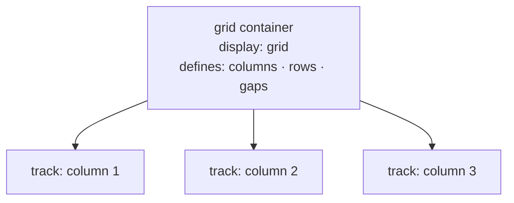

# M11 CSS Grid


**Topics covered:** grid container · tracks · `grid-template-columns` · `grid-template-rows` · `fr` unit · `gap` · `grid-column` / `grid-row` · `grid-area` · `grid-template-areas` · `repeat()` · `auto-fill` / `auto-fit` · `minmax()`

---

## The Why?

Flexbox arranges items in a single direction — a row or a column. That is perfect for navigation bars and card rows. But the moment you need items aligned across both rows *and* columns simultaneously — a magazine layout, a dashboard, a photo grid where one image spans two columns — Flexbox requires nested containers and workarounds.

CSS Grid is a two-dimensional layout system. You define named tracks (rows and columns), then place items into cells. Items can span multiple tracks. The entire layout is declared in one place — the parent — instead of being scattered across children.

Grid is what every modern layout tool (Bootstrap's grid, Tailwind's grid utilities, every CSS framework) is built on. Understanding it directly lets you build any 2D layout without fighting a framework's constraints.

By the end of this module you will be able to:
- Define a grid with `grid-template-columns` and place items in it
- Size tracks with `fr`, `px`, `%`, and `minmax()`
- Make an item span multiple columns or rows
- Build a named template area layout using `grid-template-areas`
- Create a responsive auto-filling card grid with `repeat(auto-fill, minmax())`

---

## Core Concepts

### Grid Container and Tracks



`display: grid` on the container creates a grid. Children are automatically placed into grid cells.

```css
.grid {
  display: grid;
  grid-template-columns: 200px 1fr 1fr;
  grid-template-rows: auto auto;
  gap: 1.5rem;
}
```

This creates a 3-column, 2-row grid: first column is 200px, remaining two share the rest equally.

---

### The `fr` Unit

`fr` (fraction) distributes available space proportionally after fixed sizes are allocated.

```css
grid-template-columns: 1fr 2fr 1fr;
/* column 2 gets twice the space of columns 1 and 3 */
```

```css
grid-template-columns: 250px 1fr;
/* column 1 is always 250px; column 2 fills the rest */
```

---

### `repeat()`

Shorthand for repeated track definitions:

```css
grid-template-columns: repeat(4, 1fr);          /* four equal columns */
grid-template-columns: repeat(3, 200px 1fr);    /* alternating 200px + 1fr, three times */
```

---

### `gap`

Same as in Flexbox — adds space between tracks without outer margins.

```css
.grid {
  gap: 1.5rem;          /* row-gap and column-gap both 1.5rem */
  gap: 1rem 2rem;       /* row-gap column-gap */
}
```

---

### Placing Items — `grid-column` and `grid-row`

By default, items are placed in document order, one per cell. Use `grid-column` and `grid-row` to place an item explicitly and span it across multiple tracks.

```css
.item {
  grid-column: 1 / 3;    /* from line 1 to line 3 — spans 2 columns */
  grid-row: 1 / 2;       /* row 1 only */
}

/* Shorthand with span */
.item {
  grid-column: span 2;   /* span 2 columns from wherever the item is placed */
  grid-row: span 3;
}
```

Grid lines are numbered from 1, left to right (and top to bottom). `-1` refers to the last line.

```css
.full-width {
  grid-column: 1 / -1;   /* span from first line to last — full width */
}
```

---

### Named Areas — `grid-template-areas`

Define the layout visually using named strings:

```css
.layout {
  display: grid;
  grid-template-columns: 1fr 3fr 1fr;
  grid-template-rows: auto 1fr auto;
  grid-template-areas:
    "header  header  header"
    "sidebar main    aside"
    "footer  footer  footer";
  gap: 1rem;
}

.site-header { grid-area: header; }
.sidebar     { grid-area: sidebar; }
main         { grid-area: main; }
.aside       { grid-area: aside; }
.site-footer { grid-area: footer; }
```

A `.` in the area string represents an empty cell. Each row string must have the same number of cell names.

---

### Responsive Grid — `auto-fill` and `minmax()`

```css
.card-grid {
  display: grid;
  grid-template-columns: repeat(auto-fill, minmax(240px, 1fr));
  gap: 1.5rem;
}
```

- `minmax(240px, 1fr)` — each column is at least 240px and at most 1fr
- `auto-fill` — fit as many columns as possible into the available width
- Result: the grid reflows automatically — 4 columns on wide screens, 2 on medium, 1 on narrow — with no media queries

`auto-fit` behaves the same but collapses empty tracks, causing items to stretch to fill the row when there are fewer items than columns.

---

## Going Further

<details>
<summary>📐 `grid-template-areas` vs line-based placement — when to use which</summary>

**Line-based** (`grid-column: 1 / 3`) is precise and good for single items that need to span specific cells. It requires knowing the grid's column count.

**Named areas** (`grid-template-areas`) make the whole-page layout visible at a glance and are easier to restructure. Use named areas for page-level layouts (header/sidebar/main/footer) and line-based placement for individual items within a layout zone.

In practice, most grids combine both: named areas for the overall structure, line-based `span` for photo galleries and content grids.

</details>

<details>
<summary>📏 `minmax()` and `clamp()` for fluid grids</summary>

`minmax(min, max)` accepts any length, percentage, `fr`, or `auto` value:

```css
/* Column is at least 200px, grows to fill (1fr) */
grid-template-columns: minmax(200px, 1fr);

/* Column is at least 30% but never more than 400px */
grid-template-columns: minmax(30%, 400px);
```

For typography within grid cells, `clamp()` provides similar fluid sizing:
```css
h1 { font-size: clamp(1.5rem, 4vw, 3rem); }
```

`clamp(min, preferred, max)` — grows with the viewport but never falls below `min` or exceeds `max`.

</details>

<details>
<summary>🔲 Implicit vs explicit grid</summary>

The **explicit grid** is what you define with `grid-template-columns` and `grid-template-rows`. The **implicit grid** is what the browser creates automatically when items overflow the defined tracks.

```css
.grid {
  display: grid;
  grid-template-columns: repeat(3, 1fr);
  /* Only 3 columns defined — a 4th item wraps to an implicit row */
}

/* Control implicit row height */
.grid {
  grid-auto-rows: 200px;       /* all implicit rows are 200px */
  grid-auto-rows: minmax(200px, auto);  /* at least 200px, grows with content */
}
```

</details>

<details>
<summary>🤖 AI and CSS Grid</summary>

Grid is one of the areas where AI makes the most consistent errors:

- **`grid-template-areas` with mismatched row counts** — all rows must have the same number of named cells. AI often generates malformed area strings.
- **`grid-column` vs `grid-column-start`/`end` confusion** — AI sometimes uses both, causing conflicts.
- **Forgetting `gap`** — generates grids without spacing, then tries to fix it by adding `margin` to children.
- **`auto-fill` vs `auto-fit` misuse** — different behaviour with fewer items than columns; AI rarely explains or chooses correctly.

Useful AI prompts:
- *"Why is this grid item spanning the wrong number of columns? My grid has 4 columns and I want this item to span the last two: [paste CSS]"*
- *"Convert this fixed 3-column grid to a responsive auto-fill grid that shows 3 columns on large screens and 1 on mobile."*

</details>

---

## Guided Practice

**Scenario:** You are building the portfolio page for **Aperture** — a photography studio. The page needs a 2D photo grid where some images span multiple columns, a named-area page layout, and a responsive card section.

See `aperture_example.html` in this folder for the finished result.

---

### Step 1: Create the file

In `M11CSSGrid`, create `aperture.html`. Title: `Aperture — Photography Studio`. Add an empty `<style>` block.

---

### Step 2: Add the global reset and base

```css
* {
  margin: 0;
  padding: 0;
  box-sizing: border-box;
}

body {
  font-family: system-ui, sans-serif;
  background-color: #111111;
  color: #e0e0e0;
}
```

---

### Step 3: Build the page layout with `grid-template-areas`

```html
<div class="page-layout">
  <header class="site-header">
    <span class="logo">Aperture</span>
    <nav class="main-nav">
      <a href="#">Portfolio</a>
      <a href="#">About</a>
      <a href="#">Contact</a>
    </nav>
  </header>

  <main class="main-content">
    <!-- content goes here in later steps -->
  </main>

  <footer class="site-footer">
    <p>&copy; 2026 Aperture Studio</p>
  </footer>
</div>
```

```css
.page-layout {
  display: grid;
  grid-template-areas:
    "header"
    "main"
    "footer";
  grid-template-rows: auto 1fr auto;
  min-height: 100vh;
}

.site-header { grid-area: header; }
.main-content { grid-area: main; }
.site-footer  { grid-area: footer; }
```

```css
.site-header {
  background-color: #0a0a0a;
  padding: 1.25rem 2rem;
  display: flex;
  justify-content: space-between;
  align-items: center;
  border-bottom: 1px solid #222;
}

.logo {
  font-size: 1.3rem;
  font-weight: 800;
  letter-spacing: 0.05em;
  color: #f0f0f0;
}

.main-nav { display: flex; gap: 2rem; }

.main-nav a {
  text-decoration: none;
  color: #888;
  font-size: 0.88rem;
  font-weight: 500;
}

.site-footer {
  background-color: #0a0a0a;
  padding: 1.5rem 2rem;
  text-align: center;
  font-size: 0.82rem;
  color: #555;
  border-top: 1px solid #222;
}
```

---

### Step 4: Add the photo mosaic grid

Inside `.main-content`, add:

```html
<section class="gallery-section">
  <div class="photo-grid">
    <div class="photo p1">
      <span class="photo-label">Urban · Tokyo</span>
    </div>
    <div class="photo p2">
      <span class="photo-label">Portrait · Oslo</span>
    </div>
    <div class="photo p3">
      <span class="photo-label">Landscape · Patagonia</span>
    </div>
    <div class="photo p4">
      <span class="photo-label">Architecture · Chicago</span>
    </div>
    <div class="photo p5">
      <span class="photo-label">Abstract · Studio</span>
    </div>
    <div class="photo p6">
      <span class="photo-label">Street · Havana</span>
    </div>
  </div>
</section>
```

```css
.gallery-section {
  padding: 3rem 2rem;
  max-width: 1100px;
  margin: 0 auto;
}

/* 4-column grid — items span as needed */
.photo-grid {
  display: grid;
  grid-template-columns: repeat(4, 1fr);
  grid-template-rows: repeat(3, 180px);
  gap: 0.75rem;
}

.photo {
  border-radius: 6px;
  position: relative;
  overflow: hidden;
  display: flex;
  align-items: flex-end;
}

/* Spanning items */
.p1 { grid-column: span 2; grid-row: span 2; background-color: #1e2a1e; }
.p2 { grid-column: span 2;                   background-color: #1e1e2a; }
.p3 {                                         background-color: #2a1e1e; }
.p4 {                       grid-row: span 2; background-color: #2a2a1e; }
.p5 { grid-column: span 2;                   background-color: #1e2a2a; }
.p6 {                                         background-color: #2a1e2a; }

.photo-label {
  background-color: rgba(0,0,0,0.55);
  color: rgba(255,255,255,0.8);
  font-size: 0.72rem;
  font-weight: 600;
  padding: 0.4rem 0.75rem;
  letter-spacing: 0.06em;
  text-transform: uppercase;
}
```

---

### Step 5: Add the responsive card section

```html
<section class="series-section">
  <h2 class="section-heading">Recent series</h2>
  <div class="series-grid">
    <article class="series-card">
      <div class="series-thumb t1"></div>
      <div class="series-body">
        <h3>Into the Grid</h3>
        <p>18 photographs exploring urban geometry from New York to São Paulo.</p>
      </div>
    </article>
    <article class="series-card">
      <div class="series-thumb t2"></div>
      <div class="series-body">
        <h3>Slow Light</h3>
        <p>Long-exposure landscapes shot at dusk across Nordic coastlines.</p>
      </div>
    </article>
    <article class="series-card">
      <div class="series-thumb t3"></div>
      <div class="series-body">
        <h3>Found Colour</h3>
        <p>Colour field photography from markets, walls, and forgotten places.</p>
      </div>
    </article>
    <article class="series-card">
      <div class="series-thumb t4"></div>
      <div class="series-body">
        <h3>Still Life</h3>
        <p>Object-based studio work exploring texture, shadow, and repetition.</p>
      </div>
    </article>
  </div>
</section>
```

```css
.series-section {
  padding: 0 2rem 4rem;
  max-width: 1100px;
  margin: 0 auto;
}

.section-heading {
  font-size: 0.75rem;
  font-weight: 700;
  text-transform: uppercase;
  letter-spacing: 0.15em;
  color: #555;
  margin-bottom: 1.25rem;
}

/* auto-fill: reflows columns automatically as viewport narrows */
.series-grid {
  display: grid;
  grid-template-columns: repeat(auto-fill, minmax(230px, 1fr));
  gap: 1.25rem;
}

.series-card {
  background-color: #1a1a1a;
  border: 1px solid #222;
  border-radius: 10px;
  overflow: hidden;
}

.series-thumb {
  height: 150px;
}

.t1 { background-color: #1c2a1c; }
.t2 { background-color: #1c1c2a; }
.t3 { background-color: #2a1c1c; }
.t4 { background-color: #1c2a2a; }

.series-body {
  padding: 1rem;
}

.series-body h3 {
  font-size: 0.95rem;
  font-weight: 700;
  color: #e0e0e0;
  margin-bottom: 0.4rem;
}

.series-body p {
  font-size: 0.82rem;
  color: #666;
  line-height: 1.55;
}
```

---

### Step 6: Observe spanning items

Resize the browser and notice `.p1` always spans 2 columns and 2 rows — the grid automatically fills remaining cells with `.p2`, `.p3` etc. Open DevTools, click the `.photo-grid`, and enable the CSS Grid overlay (the grid icon next to `display: grid` in the Styles panel). The overlay shows column lines, row lines, and cell boundaries.

---

### Step 7: Observe auto-fill reflow

Narrow the browser window until the `.series-grid` reflows from 4 columns → 3 → 2 → 1. No media queries needed — `minmax(230px, 1fr)` does the work.

---

### Step 8: Experiment with `grid-template-areas`

Add a second layout variant using named areas. In the `.page-layout`, switch `grid-template-areas` to a two-column layout:

```css
grid-template-columns: 220px 1fr;
grid-template-areas:
  "header  header"
  "sidebar main"
  "footer  footer";
```

Add `.sidebar { grid-area: sidebar; background-color: #0a0a0a; padding: 2rem; }` and a `<aside class="sidebar">` in the HTML. Observe how the entire page layout shifts with two CSS rule changes.

---

### Step 9: Ask AI to enhance

Paste your `aperture.html` into Gemini and prompt:

> *"Here is a photography portfolio page. Add CSS to: add a dark semi-transparent overlay to each .photo that reveals a full-opacity version of the photo-label text on hover, add a thin coloured top border to each series-card that changes colour per card using :nth-child selectors, and add a smooth fade-in transition to the series cards using opacity and a CSS animation. Keep all existing CSS intact."*

Save as `aperture_styled.html`.

---

## Checkpoints

* [ ] **Dashboard Layout**  
  Build a dashboard page using `grid-template-areas`. Requirements:
  - Page grid: `header` (full width) · `sidebar` (fixed ~240px) + `main` (fills rest) · `footer` (full width)
  - Use `grid-template-areas`, `grid-template-columns`, and `grid-template-rows: auto 1fr auto`
  - Inside `main`, create a stats row: 4 equal-width stat cards using `repeat(4, 1fr)`
  - Below the stats row, add a content grid: two columns, first is `2fr`, second is `1fr`
  - All gaps use the `gap` shorthand
  - Sidebar and main area share distinct background colours

* [ ] **Magazine Photo Grid**  
  Build a photo grid with 6 items on a 3-column base. Requirements:
  - First item (`grid-column: 1 / -1`, `grid-row: span 2`) is a hero that spans the full width
  - Items 2 and 3 sit side by side in the second row
  - Item 4 spans 2 columns; items 5 and 6 fill the rest
  - Each item is a `<div>` with a distinct background colour and a label in the bottom-left corner using `position: absolute`
  - Open the CSS Grid overlay in DevTools and confirm all column and row lines match the intended layout
