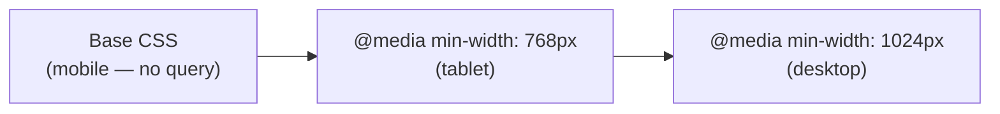

# M12 Responsive Design


**Topics covered:** viewport meta tag · media queries · mobile-first approach · `vw` / `vh` · `rem` vs `px` · fluid images · `clamp()` · responsive navigation · common breakpoints

---

## The Why?

In 2010, smartphones accounted for roughly 5% of web traffic. Today they account for over 60%. A page that only works on a desktop is broken for most users.

Responsive design is the practice of writing CSS that adapts to different screen sizes — not by building separate mobile and desktop sites, but by writing rules that flex and reflow with the available space.

The tools are few and learnable: one HTML tag (`<meta name="viewport">`), one CSS rule pattern (`@media`), and a handful of flexible units. What changes is the *approach* — thinking about layout as a continuous range of widths rather than a single fixed canvas.

By the end of this module you will be able to:
- Write media queries that apply CSS at specific viewport widths
- Follow the mobile-first approach — building for small screens first, then expanding
- Use `vw`, `vh`, and `clamp()` for fluid sizing
- Build a layout that works from 320px to 1400px without horizontal scrolling

---

## Core Concepts

### The Viewport Meta Tag

Without this tag, mobile browsers render pages at desktop width and scale them down — making text tiny and content cramped.

```html
<meta name="viewport" content="width=device-width, initial-scale=1.0">
```

This tells the browser: render this page at the actual device width. Every HTML file in this course already includes it.

---

### Media Queries

```css
/* Applies when the viewport is at least 768px wide */
@media (min-width: 768px) {
  .card-grid {
    grid-template-columns: repeat(2, 1fr);
  }
}

/* Applies when the viewport is at most 600px wide */
@media (max-width: 600px) {
  .hero h1 {
    font-size: 1.8rem;
  }
}
```

Media queries do not override each other — they add specificity at specific breakpoints. Multiple queries can be active at once.

---

### Mobile-First

**Mobile-first** means the default CSS (no media query) targets small screens. Larger screens are handled with `min-width` queries that add or override styles as the viewport grows.



```css
/* Mobile: single column — default, no media query needed */
.card-grid {
  display: grid;
  grid-template-columns: 1fr;
  gap: 1rem;
}

/* Tablet: two columns */
@media (min-width: 768px) {
  .card-grid {
    grid-template-columns: repeat(2, 1fr);
  }
}

/* Desktop: three columns */
@media (min-width: 1024px) {
  .card-grid {
    grid-template-columns: repeat(3, 1fr);
  }
}
```

Mobile-first is preferred over desktop-first because it forces you to decide what content matters most (small screens first), and `min-width` queries add rules incrementally rather than overriding them.

---

### Common Breakpoints

There are no universal breakpoints — design around your content, not around specific devices. These are widely used reference points:

| Name | Width | Typical target |
|------|-------|----------------|
| Small | `480px` | Large phones (landscape) |
| Medium | `768px` | Tablets, small laptops |
| Large | `1024px` | Laptops, desktops |
| Extra large | `1280px` | Wide desktops |

---

### Viewport Units

```css
/* vw: percentage of the viewport width */
.hero { width: 80vw; }          /* 80% of the window width */
.full-width { width: 100vw; }   /* exactly the window width */

/* vh: percentage of the viewport height */
.hero { min-height: 100vh; }    /* at least the full window height */
.half-screen { height: 50vh; }

/* vmin / vmax */
.circle { width: 20vmin; height: 20vmin; }  /* based on the smaller dimension */
```

---

### Fluid Images

Images are fixed-width by default — they overflow their containers on small screens. One rule fixes this globally:

```css
img {
  max-width: 100%;
  height: auto;     /* preserve aspect ratio */
}
```

Add this to your reset. It ensures images never exceed their container's width.

---

### `clamp()` for Fluid Typography

```css
h1 {
  font-size: clamp(1.5rem, 4vw, 3rem);
}
```

`clamp(minimum, preferred, maximum)`:
- `1.5rem` — never smaller than this (on narrow screens)
- `4vw` — grows with the viewport width
- `3rem` — never larger than this (on wide screens)

The result is a headline that scales smoothly without media queries.

---

### Responsive Navigation Pattern

A common pattern: horizontal nav on wide screens, hidden nav (toggled with JS) on mobile. Without JavaScript, use a `<details>`/`<summary>` approach or simply stack the nav links:

```css
/* Mobile: stacked links */
.nav-links {
  display: flex;
  flex-direction: column;
  gap: 0.5rem;
}

/* Desktop: horizontal links */
@media (min-width: 768px) {
  .nav-links {
    flex-direction: row;
    gap: 2rem;
  }
}
```

---

## Going Further

<details>
<summary>📱 Device-agnostic breakpoints — content-driven design</summary>

The "mobile/tablet/desktop" mental model is outdated — devices range from 320px phones to 2560px wide-screen monitors, and the same device can be used in portrait or landscape.

A better approach: start with the smallest layout, widen a blank browser window, and add a breakpoint wherever the layout *breaks* — content becomes too narrow, lines get too long, or the grid collapses awkwardly. This produces content-driven breakpoints that work regardless of which device renders them.

Rule of thumb for line length: 45–75 characters per line is readable. If your `max-width` forces lines shorter or longer than this, adjust.

</details>

<details>
<summary>📐 `em` vs `rem` for breakpoints</summary>

Media query widths can use `px`, `em`, or `rem`. `em`-based breakpoints (not `rem`) are recommended for accessibility: when a user increases the browser's base font size, `em` breakpoints trigger sooner, keeping the layout appropriate for the larger text.

```css
/* px — ignores user's font size preference */
@media (min-width: 768px) { ... }

/* em — responds to user's base font size */
@media (min-width: 48em) { ... }   /* 48 × 16px default = 768px */
```

For this course, `px` breakpoints are fine. In production, `em` is more accessible.

</details>

<details>
<summary>🖼️ Responsive images — `srcset` and `sizes`</summary>

`max-width: 100%` prevents overflow, but the browser still downloads the full-size image even on a small screen. For real projects, use `srcset` to provide multiple resolutions:

```html

```

`sizes` tells the browser how wide the image will be rendered at each breakpoint, allowing it to download the most appropriate resolution. This is not required for this course but is essential for production sites.

</details>

<details>
<summary>🤖 AI and responsive design</summary>

Responsive CSS is one of AI's stronger areas, but watch for:

- **Missing viewport meta tag** — AI often generates responsive CSS but forgets the HTML meta tag. Without it, the CSS has no effect on mobile.
- **Desktop-first media queries** — AI frequently uses `max-width` queries, making mobile the override rather than the default. Ask specifically for "mobile-first using min-width".
- **Hardcoded `px` font sizes** — AI rarely uses `clamp()` unprompted. Add it to your prompt explicitly.

Useful AI prompts:
- *"Rewrite this layout to be mobile-first. Use min-width breakpoints at 768px and 1024px. Start with a single-column layout for small screens."*
- *"Replace all fixed font-size values with clamp() equivalents that scale between these two sizes."*

</details>

---

## Guided Practice

**Scenario:** You are building the homepage for **Nomad** — a travel agency. The page must work from 320px phones to 1400px desktops: single-column on mobile, two columns on tablet, three on desktop.

See `nomad_example.html` in this folder for the finished result.

---

### Step 1: Create the file

In `M12ResponsiveDesign`, create `nomad.html`. Title: `Nomad — Travel Agency`. Add an empty `<style>` block with the viewport meta tag already in the `<head>`.

---

### Step 2: Add the global reset and mobile-first base

```css
* {
  margin: 0;
  padding: 0;
  box-sizing: border-box;
}

img {
  max-width: 100%;
  height: auto;
}

body {
  font-family: system-ui, sans-serif;
  background-color: #f8f8f5;
  color: #1a1a1a;
  line-height: 1.6;
}
```

---

### Step 3: Add the navigation (mobile-first, stacks on small screens)

```html
<header class="site-header">
  <div class="header-inner">
    <span class="site-logo">Nomad</span>
    <nav class="site-nav">
      <a href="#">Destinations</a>
      <a href="#">Trips</a>
      <a href="#">About</a>
      <a href="#" class="nav-cta">Get in touch</a>
    </nav>
  </div>
</header>
```

```css
.site-header {
  background-color: white;
  border-bottom: 1px solid #e5e5e5;
  position: sticky;
  top: 0;
  z-index: 100;
}

.header-inner {
  max-width: 1200px;
  margin: 0 auto;
  padding: 1rem 1.5rem;
  display: flex;
  flex-direction: column;   /* mobile: stack logo + nav */
  gap: 0.75rem;
}

.site-logo {
  font-size: 1.3rem;
  font-weight: 800;
  color: #1a3a2a;
}

/* Mobile: nav links wrap in a row */
.site-nav {
  display: flex;
  flex-wrap: wrap;
  gap: 0.5rem 1.25rem;
}

.site-nav a {
  text-decoration: none;
  color: #555;
  font-size: 0.88rem;
  font-weight: 500;
}

.nav-cta {
  color: #1a3a2a !important;
  font-weight: 700 !important;
}

/* Tablet: header becomes a row */
@media (min-width: 768px) {
  .header-inner {
    flex-direction: row;
    align-items: center;
    justify-content: space-between;
  }
}
```

---

### Step 4: Add the hero with `clamp()` typography

```html
<section class="hero">
  <p class="hero-label">Curated · Small Group · Sustainable</p>
  <h1>Travel farther.<br>Tread lightly.</h1>
  <p class="hero-sub">Handcrafted itineraries for curious travellers. From the Atlas Mountains to the Mekong Delta.</p>
</section>
```

```css
.hero {
  max-width: 1200px;
  margin: 0 auto;
  padding: 4rem 1.5rem;
}

.hero-label {
  font-size: 0.72rem;
  font-weight: 700;
  text-transform: uppercase;
  letter-spacing: 0.15em;
  color: #4a7a5a;
  margin-bottom: 1rem;
}

/* clamp(): scales smoothly from 2rem (mobile) to 3.5rem (desktop) */
.hero h1 {
  font-size: clamp(2rem, 5vw, 3.5rem);
  font-weight: 800;
  line-height: 1.1;
  color: #1a3a2a;
  margin-bottom: 1rem;
}

.hero-sub {
  font-size: clamp(1rem, 2vw, 1.15rem);
  color: #666;
  max-width: 560px;
}
```

---

### Step 5: Add destination cards with mobile-first grid

```html
<section class="destinations">
  <h2 class="section-title">Where do you want to go?</h2>
  <div class="card-grid">

    <article class="dest-card">
      <div class="card-img img-1"></div>
      <div class="card-body">
        <h3>Morocco</h3>
        <p>Medinas, mountains, and desert silence.</p>
        <span class="duration">12 days</span>
      </div>
    </article>

    <article class="dest-card">
      <div class="card-img img-2"></div>
      <div class="card-body">
        <h3>Vietnam</h3>
        <p>Street food, ancient towns, and karst peaks.</p>
        <span class="duration">14 days</span>
      </div>
    </article>

    <article class="dest-card">
      <div class="card-img img-3"></div>
      <div class="card-body">
        <h3>Iceland</h3>
        <p>Geysers, glaciers, and the midnight sun.</p>
        <span class="duration">10 days</span>
      </div>
    </article>

    <article class="dest-card">
      <div class="card-img img-4"></div>
      <div class="card-body">
        <h3>Peru</h3>
        <p>Inca trails, cloud forests, and lost cities.</p>
        <span class="duration">15 days</span>
      </div>
    </article>

    <article class="dest-card">
      <div class="card-img img-5"></div>
      <div class="card-body">
        <h3>Japan</h3>
        <p>Cherry blossoms, ryokans, and mountain shrines.</p>
        <span class="duration">13 days</span>
      </div>
    </article>

    <article class="dest-card">
      <div class="card-img img-6"></div>
      <div class="card-body">
        <h3>Kenya</h3>
        <p>Safari, savanna, and the Great Rift Valley.</p>
        <span class="duration">11 days</span>
      </div>
    </article>

  </div>
</section>
```

```css
.destinations {
  max-width: 1200px;
  margin: 0 auto;
  padding: 2rem 1.5rem 5rem;
}

.section-title {
  font-size: clamp(1.3rem, 3vw, 1.8rem);
  font-weight: 700;
  color: #1a3a2a;
  margin-bottom: 2rem;
}

/* Mobile: single column — default, no query needed */
.card-grid {
  display: grid;
  grid-template-columns: 1fr;
  gap: 1.25rem;
}

/* Tablet: two columns */
@media (min-width: 768px) {
  .card-grid {
    grid-template-columns: repeat(2, 1fr);
  }
}

/* Desktop: three columns */
@media (min-width: 1024px) {
  .card-grid {
    grid-template-columns: repeat(3, 1fr);
  }
}

.dest-card {
  background-color: white;
  border-radius: 12px;
  overflow: hidden;
  border: 1px solid #e8e8e0;
}

.card-img {
  height: 200px;
}

.img-1 { background-color: #c4a882; }
.img-2 { background-color: #82aec4; }
.img-3 { background-color: #a0b8c8; }
.img-4 { background-color: #b8a082; }
.img-5 { background-color: #c8a0b0; }
.img-6 { background-color: #a8c4a0; }

.card-body {
  padding: 1.25rem;
}

.card-body h3 {
  font-size: 1rem;
  font-weight: 700;
  color: #1a3a2a;
  margin-bottom: 0.35rem;
}

.card-body p {
  font-size: 0.85rem;
  color: #777;
  line-height: 1.5;
  margin-bottom: 0.75rem;
}

.duration {
  font-size: 0.78rem;
  font-weight: 700;
  color: #4a7a5a;
  text-transform: uppercase;
  letter-spacing: 0.08em;
}
```

---

### Step 6: Resize and verify breakpoints

Open the page in Chrome, then open DevTools (`F12`) → click the **Toggle device toolbar** icon (or `Ctrl+Shift+M`). Drag the width handle and watch:
- Below 768px: single column
- 768px–1023px: two columns
- 1024px and above: three columns

Also observe the `clamp()` headline scaling smoothly as you drag.

---

### Step 7: Add a responsive two-column section

```html
<section class="about-section">
  <div class="about-inner">
    <div class="about-text">
      <h2>Travel that means something.</h2>
      <p>Every Nomad itinerary is designed with local guides, low group sizes, and a commitment to leaving places better than we find them.</p>
      <p>We work directly with communities — not tour aggregators — so your trip supports the people who make the destination worth visiting.</p>
    </div>
    <div class="about-visual"></div>
  </div>
</section>
```

```css
.about-section {
  background-color: #1a3a2a;
  color: #e8efe8;
  padding: 5rem 1.5rem;
}

.about-inner {
  max-width: 1200px;
  margin: 0 auto;
  display: grid;
  grid-template-columns: 1fr;   /* mobile: stacked */
  gap: 2.5rem;
}

/* Tablet+: side by side */
@media (min-width: 768px) {
  .about-inner {
    grid-template-columns: 1fr 1fr;
    align-items: center;
  }
}

.about-text h2 {
  font-size: clamp(1.5rem, 3vw, 2.2rem);
  font-weight: 700;
  margin-bottom: 1.25rem;
  line-height: 1.2;
}

.about-text p {
  font-size: 0.95rem;
  color: rgba(232, 239, 232, 0.75);
  line-height: 1.75;
  margin-bottom: 1rem;
}

.about-visual {
  height: 260px;
  background-color: #2a5a3a;
  border-radius: 12px;
}
```

---

### Step 8: Test at multiple widths

In the DevTools device toolbar, test at:
- 375px (iPhone SE)
- 768px (iPad)
- 1280px (desktop)

Confirm no horizontal scrolling at any width, and that all three layout breakpoints trigger correctly.

---

### Step 9: Ask AI to enhance

Paste your `nomad.html` into Gemini and prompt:

> *"Here is a travel agency homepage. Add CSS to: add a hero background image placeholder using a gradient that goes from dark green to lighter green, add a media query at 1200px that increases the hero padding and font sizes slightly, and add a subtle hover effect on the destination cards (slight upward translate and shadow). Keep all existing CSS intact and maintain the mobile-first approach."*

Save as `nomad_styled.html`.

---

## Checkpoints

* [ ] **Mobile-First Blog Layout**  
  Build a blog layout that is fully responsive from 320px to 1280px. Requirements:
  - Mobile: single-column, heading `font-size` via `clamp()` from `1.6rem` to `2.5rem`
  - Tablet (768px+): two-column article grid
  - Desktop (1024px+): three-column article grid with a sticky sidebar
  - Navigation: stacked on mobile, horizontal row on tablet+
  - At least one element uses `vh` units (e.g., a hero section that is `80vh` tall)
  - No horizontal scrolling at any width from 320px to 1400px

* [ ] **Responsive Pricing Page**  
  Build a pricing page that reflows across breakpoints. Requirements:
  - Mobile: three pricing cards stacked vertically in a single column
  - Tablet (600px+): three cards in a row with `flex-wrap: wrap`
  - The recommended card is visually elevated (different border colour, slightly larger padding) at all widths
  - A feature comparison table below the cards: full table on desktop, only two columns visible on mobile using `overflow-x: auto` on a wrapper `<div>`
  - All font sizes use either `rem` or `clamp()`
