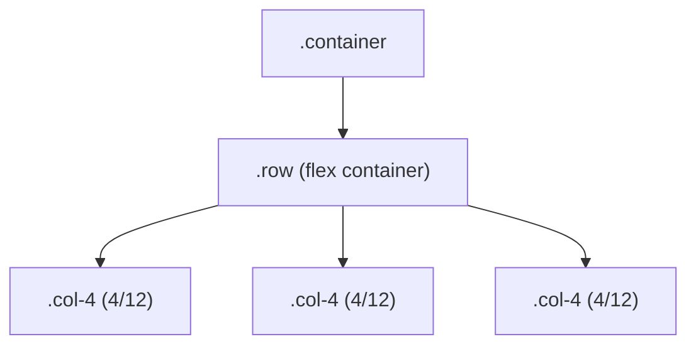

# M14 Bootstrap Basics


**Topics covered:** Bootstrap 5 CDN setup · container system · 12-column grid · responsive breakpoints · spacing utilities · colour utilities · display utilities · typography utilities

---

## The Why?

Writing CSS from scratch for every project is time-consuming and inconsistent. Most UI patterns — a responsive grid, a centred container, a colour-coded button — are the same across projects. Bootstrap provides a library of pre-built CSS classes for exactly these patterns.

Bootstrap is the most widely deployed CSS framework in the world. Understanding it means you can read and contribute to the majority of existing web projects without learning a bespoke system from scratch.

More importantly, understanding Bootstrap well means you understand *why* it works — because it is built on the same Flexbox, Grid, and spacing concepts you already learned. Bootstrap does not replace CSS knowledge; it applies it at scale.

By the end of this module you will be able to:
- Add Bootstrap to any HTML file via CDN
- Build a responsive layout using Bootstrap's 12-column grid
- Use spacing, colour, and display utility classes
- Override Bootstrap defaults with your own CSS

---

## Core Concepts

### CDN Setup

Add these two tags to every HTML file that uses Bootstrap. The `<link>` goes in `<head>`; the `<script>` goes just before `</body>`.

```html
<head>
  <!-- Bootstrap CSS -->
  <link
    href="https://cdn.jsdelivr.net/npm/bootstrap@5.3.3/dist/css/bootstrap.min.css"
    rel="stylesheet"
  >
</head>
<body>
  <!-- content here -->

  <!-- Bootstrap JS (required for interactive components) -->
  <script
    src="https://cdn.jsdelivr.net/npm/bootstrap@5.3.3/dist/js/bootstrap.bundle.min.js"
  ></script>
</body>
```

No installation, no npm, no build step. Bootstrap loads from a CDN and is immediately available.

---

### The Container

Bootstrap's `.container` centres content and constrains its width at each breakpoint. It also adds horizontal padding so content does not touch the screen edges.

```html
<div class="container">
  <!-- max-width varies by breakpoint: 576px, 720px, 960px, 1140px, 1320px -->
</div>

<div class="container-fluid">
  <!-- full width at all breakpoints — still has horizontal padding -->
</div>
```

---

### The 12-Column Grid

Bootstrap's grid is built on Flexbox. Every row is `.row` — a flex container. Columns are `.col-*` — flex items.



```html
<div class="container">
  <div class="row">
    <div class="col-4">One third</div>
    <div class="col-4">One third</div>
    <div class="col-4">One third</div>
  </div>
</div>
```

Column numbers must add up to 12 (or less). `.col` (no number) makes columns equal-width.

---

### Responsive Breakpoints

Append a breakpoint abbreviation to control when a column size activates:

| Class | Breakpoint | Min-width |
|-------|-----------|-----------|
| `.col-` | All screens | — |
| `.col-sm-` | Small | 576px |
| `.col-md-` | Medium | 768px |
| `.col-lg-` | Large | 992px |
| `.col-xl-` | Extra large | 1200px |
| `.col-xxl-` | Extra extra large | 1400px |

```html
<!-- Full width on mobile, half on tablet+, one-third on desktop+ -->
<div class="col-12 col-md-6 col-lg-4">...</div>
```

On screens narrower than the specified breakpoint, columns stack vertically (each becomes full-width `col-12`).

---

### Spacing Utilities

Bootstrap generates spacing classes based on a scale from 0–5 (and `auto`):

```
{property}{sides}-{size}

property: m (margin), p (padding)
sides: t (top), b (bottom), s (start/left), e (end/right), x (left+right), y (top+bottom), blank (all)
size: 0, 1, 2, 3, 4, 5, auto
```

| Class | Value |
|-------|-------|
| `m-0` | `margin: 0` |
| `mt-3` | `margin-top: 1rem` |
| `px-4` | `padding-left: 1.5rem; padding-right: 1.5rem` |
| `py-2` | `padding-top: 0.5rem; padding-bottom: 0.5rem` |
| `mb-5` | `margin-bottom: 3rem` |
| `mx-auto` | `margin-left: auto; margin-right: auto` |

Responsive spacing: `mt-md-5` applies `margin-top: 3rem` only on medium+ screens.

---

### Colour Utilities

Bootstrap provides semantic colour names applied to backgrounds, text, and borders:

```html
<!-- Background colours -->
<div class="bg-primary">Blue</div>
<div class="bg-secondary">Grey</div>
<div class="bg-success">Green</div>
<div class="bg-danger">Red</div>
<div class="bg-warning">Yellow</div>
<div class="bg-info">Cyan</div>
<div class="bg-light">Light grey</div>
<div class="bg-dark">Dark</div>

<!-- Text colours -->
<p class="text-primary">Blue text</p>
<p class="text-muted">Muted grey</p>
<p class="text-danger">Red text</p>
```

---

### Display Utilities

```html
<div class="d-none">Hidden on all screens</div>
<div class="d-block">Block on all screens</div>
<div class="d-flex">Flex container</div>
<div class="d-none d-md-block">Hidden on mobile, block on tablet+</div>
```

Combine with flex utilities:

```html
<div class="d-flex justify-content-between align-items-center">
  <span>Left</span>
  <span>Right</span>
</div>
```

---

### Typography Utilities

```html
<h1 class="display-1">Very large heading</h1>
<h2 class="display-4">Large heading</h2>
<p class="lead">Larger introductory text</p>
<p class="text-center">Centred text</p>
<p class="text-uppercase fw-bold">Bold uppercase</p>
<small class="text-muted">Muted small text</small>
```

---

## Going Further

<details>
<summary>⚙️ Bootstrap's CSS custom properties and theming</summary>

Bootstrap 5 uses CSS custom properties (variables) for colours, spacing, and fonts. You can override them without touching Bootstrap's source:

```css
:root {
  --bs-primary: #2563eb;        /* override the primary blue */
  --bs-border-radius: 12px;     /* change all default border radii */
  --bs-font-sans-serif: 'Inter', system-ui, sans-serif;
}
```

Changes to these variables cascade to all Bootstrap components that use them — buttons, badges, alerts, etc. This is the recommended way to theme Bootstrap without using Sass.

</details>

<details>
<summary>🎯 When to override Bootstrap vs use a custom class</summary>

**Override** Bootstrap when you want a global change that applies everywhere (e.g., change the primary colour).

**Add a custom class** when you need a one-off change that should not affect other instances (e.g., `.hero-title` with a different font size than Bootstrap's `display-1`).

**Avoid inline styles** — they have the highest specificity and are hard to maintain.

Rule of thumb: Bootstrap utility classes for spacing and colour; custom classes for structural layout and brand-specific styles; CSS custom properties for global theme overrides.

</details>

<details>
<summary>📦 Bootstrap's normalisation — what it sets globally</summary>

Bootstrap includes a modified version of Normalize.css that:
- Sets `box-sizing: border-box` on all elements
- Removes margins from headings, paragraphs, and lists
- Sets `font-family`, `font-size: 16px`, and `line-height: 1.5` on `<body>`
- Makes images `max-width: 100%` by default

This means many of the resets you have written manually in earlier modules are already included when you use Bootstrap.

</details>

<details>
<summary>🤖 AI and Bootstrap</summary>

Bootstrap is well-represented in AI training data, making it one of the more reliable areas for generation. Watch for:

- **Bootstrap 4 vs Bootstrap 5 classes** — AI often mixes versions. BS4 used `ml-`/`mr-` for margins; BS5 uses `ms-`/`me-` (start/end). Always specify Bootstrap 5.
- **Outdated CDN links** — check the Bootstrap docs for the current version number; AI's training data may reference older versions.
- **Unnecessary custom CSS for things Bootstrap already handles** — AI often generates custom padding when `py-4` would work. Review generated code for redundancy.

Useful AI prompts:
- *"Build this layout using Bootstrap 5 grid classes only — no custom CSS for the grid. Use col-12 col-md-6 col-lg-4 for the cards."*
- *"Rewrite this custom CSS navigation bar to use Bootstrap 5 utility classes (d-flex, justify-content-between, align-items-center, gap-3)."*

</details>

---

## Guided Practice

**Scenario:** You are building the landing page for **Summit** — an outdoor gear brand. The page uses Bootstrap's container, responsive grid, and utility classes throughout, with minimal custom CSS.

See `summit_example.html` in this folder for the finished result.

---

### Step 1: Create the file

In `M14Bootstrap`, create `summit.html`. Title: `Summit — Outdoor Gear`. Link Bootstrap 5 CSS in `<head>` and Bootstrap 5 JS just before `</body>`.

---

### Step 2: Add the hero section with container and utilities

```html
<section class="bg-dark text-white py-5">
  <div class="container py-4">
    <div class="row align-items-center">
      <div class="col-12 col-md-7">
        <p class="text-uppercase fw-bold mb-2" style="color: #6eaa70; font-size: 0.75rem; letter-spacing: 0.15em;">
          Gear built for real terrain
        </p>
        <h1 class="display-4 fw-bold mb-3">Climb higher.<br>Go further.</h1>
        <p class="lead text-white-50 mb-4">
          Equipment for mountaineers, trail runners, and everyone who treats the outdoors as a destination, not a backdrop.
        </p>
        <div class="d-flex gap-3 flex-wrap">
          <a href="#" class="btn btn-success btn-lg px-4">Shop gear</a>
          <a href="#" class="btn btn-outline-light btn-lg px-4">Our story</a>
        </div>
      </div>
      <div class="col-12 col-md-5 mt-4 mt-md-0">
        <div class="bg-secondary rounded-3" style="height: 280px;"></div>
      </div>
    </div>
  </div>
</section>
```

---

### Step 3: Add a feature highlights row

```html
<section class="py-5 bg-light">
  <div class="container">
    <div class="row g-4 text-center">
      <div class="col-12 col-md-4">
        <div class="p-4">
          <div class="fs-1 mb-3">🏔️</div>
          <h3 class="fw-bold mb-2">Built for altitude</h3>
          <p class="text-muted">Tested above 4,000m. Every seam, buckle, and layer engineered for cold and wind.</p>
        </div>
      </div>
      <div class="col-12 col-md-4">
        <div class="p-4">
          <div class="fs-1 mb-3">⚖️</div>
          <h3 class="fw-bold mb-2">Gram-conscious design</h3>
          <p class="text-muted">We obsess over weight so you carry less without losing capability.</p>
        </div>
      </div>
      <div class="col-12 col-md-4">
        <div class="p-4">
          <div class="fs-1 mb-3">♻️</div>
          <h3 class="fw-bold mb-2">Sustainable materials</h3>
          <p class="text-muted">Recycled fabrics, bluesign-certified dyes, and a repair-not-replace warranty.</p>
        </div>
      </div>
    </div>
  </div>
</section>
```

---

### Step 4: Add a product card grid

```html
<section class="py-5">
  <div class="container">
    <h2 class="fw-bold mb-4">New arrivals</h2>
    <div class="row g-4">

      <div class="col-12 col-sm-6 col-lg-3">
        <div class="card h-100 border-0 shadow-sm">
          <div class="bg-secondary" style="height: 180px;"></div>
          <div class="card-body">
            <span class="badge bg-success mb-2">New</span>
            <h5 class="card-title fw-bold">Ridgeline Shell</h5>
            <p class="card-text text-muted small">3-layer waterproof jacket. Packable. 420g.</p>
            <p class="fw-bold mt-2">$289</p>
          </div>
        </div>
      </div>

      <div class="col-12 col-sm-6 col-lg-3">
        <div class="card h-100 border-0 shadow-sm">
          <div class="bg-secondary" style="height: 180px;"></div>
          <div class="card-body">
            <span class="badge bg-warning text-dark mb-2">Sale</span>
            <h5 class="card-title fw-bold">Summit 28L Pack</h5>
            <p class="card-text text-muted small">Daypack with hydration sleeve and helmet carry.</p>
            <p class="fw-bold mt-2">$149 <small class="text-muted text-decoration-line-through">$189</small></p>
          </div>
        </div>
      </div>

      <div class="col-12 col-sm-6 col-lg-3">
        <div class="card h-100 border-0 shadow-sm">
          <div class="bg-secondary" style="height: 180px;"></div>
          <div class="card-body">
            <h5 class="card-title fw-bold">Alpenglow Beanie</h5>
            <p class="card-text text-muted small">Merino wool, mid-weight. One size.</p>
            <p class="fw-bold mt-2">$55</p>
          </div>
        </div>
      </div>

      <div class="col-12 col-sm-6 col-lg-3">
        <div class="card h-100 border-0 shadow-sm">
          <div class="bg-secondary" style="height: 180px;"></div>
          <div class="card-body">
            <span class="badge bg-danger mb-2">Low stock</span>
            <h5 class="card-title fw-bold">Trailblazer Trekking Poles</h5>
            <p class="card-text text-muted small">Carbon fibre, foldable, 170g each.</p>
            <p class="fw-bold mt-2">$195</p>
          </div>
        </div>
      </div>

    </div>
  </div>
</section>
```

---

### Step 5: Add a stats bar

```html
<section class="bg-dark text-white py-4">
  <div class="container">
    <div class="row text-center g-4">
      <div class="col-6 col-md-3">
        <p class="display-5 fw-bold mb-0">14</p>
        <p class="text-white-50 small">Years in the field</p>
      </div>
      <div class="col-6 col-md-3">
        <p class="display-5 fw-bold mb-0">38k</p>
        <p class="text-white-50 small">Expeditions equipped</p>
      </div>
      <div class="col-6 col-md-3">
        <p class="display-5 fw-bold mb-0">62</p>
        <p class="text-white-50 small">Countries reached</p>
      </div>
      <div class="col-6 col-md-3">
        <p class="display-5 fw-bold mb-0">100%</p>
        <p class="text-white-50 small">Recycled packaging</p>
      </div>
    </div>
  </div>
</section>
```

---

### Step 6: Add the footer

```html
<footer class="bg-dark text-white-50 py-4">
  <div class="container">
    <div class="row">
      <div class="col-12 col-md-6">
        <p class="fw-bold text-white mb-1">Summit</p>
        <p class="small">Outdoor gear built for serious terrain.</p>
      </div>
      <div class="col-12 col-md-6 text-md-end mt-3 mt-md-0">
        <p class="small">&copy; 2026 Summit Outdoor Co. · <a href="#" class="text-white-50">Privacy</a></p>
      </div>
    </div>
  </div>
</footer>
```

---

### Step 7: Inspect the grid in DevTools

Open DevTools (`F12`), click any `.row`, and observe that Bootstrap applies `display: flex` and negative margins. Click a `.col-12` child and confirm `flex` properties in Computed styles. Resize the browser — watch the column classes switch the layout at the defined breakpoints.

---

### Step 8: Override Bootstrap with custom CSS

Add a `<style>` block in `<head>` *after* the Bootstrap CDN link. Override the primary button colour:

```css
.btn-success {
  background-color: #2a5a3a;
  border-color: #2a5a3a;
}

.btn-success:hover {
  background-color: #1e4a2e;
  border-color: #1e4a2e;
}
```

Confirm your custom rule overrides Bootstrap's default green without touching the CDN file.

---

## Checkpoints

* [ ] **Bootstrap Grid Layouts**  
  Build a single HTML file demonstrating three different Bootstrap grid layouts, each in its own `<section>`:
  - Layout 1: holy grail (full-width header, `col-2` sidebar + `col-8` main + `col-2` sidebar, full-width footer) using responsive classes so it stacks on mobile
  - Layout 2: 4-column card row on desktop, 2-column on tablet, 1-column on mobile using `col-12 col-md-6 col-xl-3`
  - Layout 3: asymmetric 2-column row — `col-12 col-md-4` for a sidebar with stats, `col-12 col-md-8` for a main content area
  - Each section has a visible heading using Bootstrap typography utilities
  - No custom layout CSS — use only Bootstrap classes

* [ ] **Utility Class Audit**  
  Take the `summit.html` file and perform a utility audit:
  - Identify every Bootstrap utility class used (list them in an HTML comment at the top of the file)
  - Replace the three inline `style=""` attributes (height values) with appropriate Bootstrap or custom classes
  - Add `g-4` gap to all `.row` elements that are missing it
  - Ensure all text is readable on its background (check `text-white-50` on the footer links — is it accessible?)
  - Add a responsive margin above the product section using `mt-4 mt-md-5`
