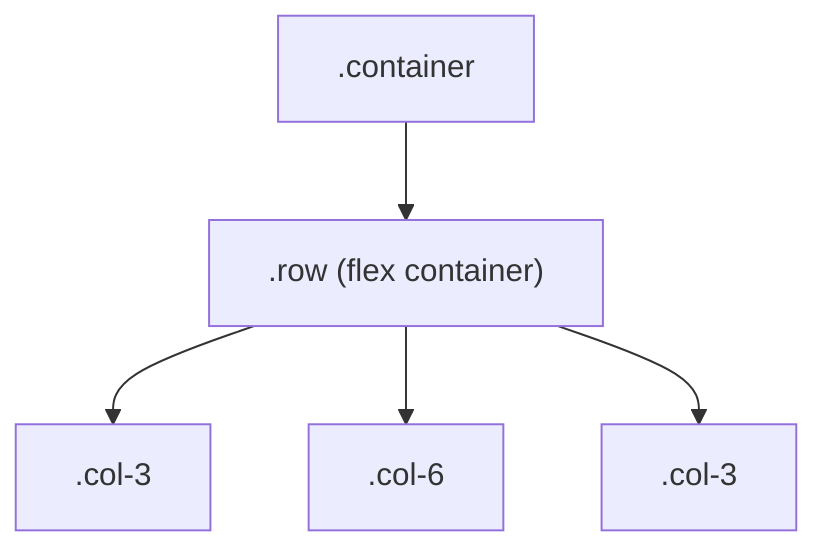

# M15 Bootstrap Layout & Customisation


**Topics covered:** containers · the 12-column grid · gutters · responsive breakpoints · column alignment · `offset` · `order` · nested grids · overriding Bootstrap · CSS variables (`--bs-*`) · colour modes (light/dark)

---

## The Why?

M14 showed you Bootstrap's quick wins — link the stylesheet, add a class, get a styled button or card. That is the surface. The two things that make Bootstrap genuinely powerful are deeper:

1. **A responsive layout engine.** The 12-column grid lets you describe how a page should rearrange itself across phone, tablet, and desktop *without writing a single media query*. You learned to write `@media` rules by hand in M12; Bootstrap turns those breakpoints into class names like `col-md-6`.

2. **A customisation system.** Bootstrap is built entirely on CSS custom properties (`--bs-*`). By overriding a few of them you can re-theme an entire site — brand colour, corner radius, even a full light/dark mode — without touching Bootstrap's file or learning Sass.

Master these two and you can ship a branded, fully responsive site in an afternoon. This is what people actually reach for Bootstrap to do.

By the end of this module you will be able to:
- Lay out a responsive page with containers, rows, and columns
- Control spacing, alignment, offset, order, and nesting in the grid
- Make a layout rearrange across breakpoints with no media queries of your own
- Re-theme Bootstrap by overriding CSS variables
- Switch components between light and dark with `data-bs-theme`

---

## Core Concepts

### Containers

Every Bootstrap layout starts in a **container** — it centres your content and sets a sensible max-width with side padding.

```html
<div class="container">       <!-- centred, capped max-width per breakpoint -->
<div class="container-fluid"> <!-- always full width -->
<div class="container-lg">    <!-- full width until the lg breakpoint, then capped -->
```

Use `.container` for most pages, `.container-fluid` for full-bleed dashboards.

---

### The 12-Column Grid

Inside a container, layout happens on a **12-column grid**. A `.row` is a flex row; its `.col` children divide the 12 columns.



```html
<div class="container">
  <div class="row">
    <div class="col-3">Sidebar (3/12)</div>
    <div class="col-6">Main (6/12)</div>
    <div class="col-3">Aside (3/12)</div>
  </div>
</div>
```

The numbers add up to 12. Two shortcuts:

```html
<!-- Equal-width: omit the number, columns split evenly -->
<div class="row">
  <div class="col">Half</div>
  <div class="col">Half</div>
</div>

<!-- Mix fixed + auto: col-4 takes a third, .col fills the rest -->
<div class="row">
  <div class="col-4">Fixed third</div>
  <div class="col">Whatever is left</div>
</div>
```

This grid is the same Flexbox you learned in M10, pre-built into classes.

---

### Gutters

The space between columns is the **gutter**, controlled by `g-*` on the row (0–5 scale):

```html
<div class="row g-4">   <!-- gutter on both axes -->
<div class="row gx-2">  <!-- horizontal gutter only -->
<div class="row gy-5">  <!-- vertical gutter only (useful when columns wrap) -->
<div class="row g-0">   <!-- no gutter — columns touch -->
```

Use `gy-*` when columns stack on small screens so they get vertical space too.

---

### Responsive Breakpoints

This is the heart of Bootstrap. Insert a **breakpoint** into the class to say "this width applies from this screen size up." Below that size, columns fall back to full width and stack.

| Class infix | Applies from | Width |
|-------------|--------------|-------|
| `col-` | all screens | — |
| `col-sm-` | ≥ 576px | small |
| `col-md-` | ≥ 768px | medium |
| `col-lg-` | ≥ 992px | large |
| `col-xl-` | ≥ 1200px | extra large |
| `col-xxl-` | ≥ 1400px | xx large |

Stack multiple breakpoints on one element to change the layout at each size:

```html
<!-- 1 per row on phones, 2 on tablet, 3 on desktop -->
<div class="col-12 col-md-6 col-lg-4">...</div>
```

No `@media` query needed — the classes *are* the breakpoints. Compare this to the hand-written media queries in `summit_layout_plain_example.html`.

---

### Alignment, Offset, Order, Nesting

Once columns are placed, fine-tune them:

**Align** — `justify-content-*` (horizontal) and `align-items-*` (vertical) on the row:

```html
<div class="row justify-content-center">...</div>   <!-- columns centred in the row -->
<div class="row align-items-center">...</div>       <!-- columns centred vertically -->
```

**Offset** — push a column to the right by N columns:

```html
<div class="row">
  <div class="col-md-8 offset-md-2">Centred 8/12 block</div>
</div>
```

**Order** — change visual order without moving the HTML (responsive too):

```html
<div class="col order-2">Shows second</div>
<div class="col order-1">Shows first</div>
```

**Nesting** — a column can contain its own `.row` to subdivide its space:

```html
<div class="col-6">
  <div class="row">
    <div class="col-6">Nested</div>
    <div class="col-6">Nested</div>
  </div>
</div>
```

---

### Overriding Bootstrap with Your Own CSS

Bootstrap's defaults are a starting point, not a cage. Because your stylesheet loads **after** Bootstrap's `<link>`, a rule of equal specificity wins:

```html
<head>
  <link href="…/bootstrap.min.css" rel="stylesheet">
  <style>
    /* loaded after Bootstrap → this wins */
    .card { border-radius: 1rem; }
  </style>
</head>
```

Order matters: put your `<style>` (or your own stylesheet) *after* the Bootstrap link, never before.

---

### Customising with CSS Variables (`--bs-*`)

Bootstrap 5 is built on CSS custom properties. Override them — usually in `:root` — and the change cascades to every component that uses them, no Sass required:

```css
:root {
  --bs-primary: #2a5a3a;        /* brand green everywhere "primary" is used */
  --bs-primary-rgb: 42, 90, 58; /* the rgb version some utilities need */
  --bs-border-radius: 0.75rem;  /* rounder corners on all components */
  --bs-body-font-family: 'Inter', system-ui, sans-serif;
}
```

Many components also expose their own component-scoped variables you can set on the class itself:

```css
.btn-primary {
  --bs-btn-bg: #2a5a3a;
  --bs-btn-hover-bg: #1e4a2e;
}
```

This is the recommended way to make Bootstrap not look like default Bootstrap.

---

### Colour Modes — Light & Dark

Bootstrap 5.3's flagship feature: built-in **light/dark modes**, driven by one attribute. Set `data-bs-theme` on `<html>` for the whole page, or on any element for just that subtree:

```html
<!-- Whole page dark -->
<html data-bs-theme="dark">

<!-- Just one card dark, on an otherwise light page -->
<div class="card" data-bs-theme="dark">…</div>
```

Bootstrap swaps in a complete dark palette automatically — no second set of colours to write (contrast that with the hand-written `.dark-panel` in the plain example). Switching the whole page on a button click needs one line of JavaScript (`document.documentElement.setAttribute('data-bs-theme', 'dark')`); see the [colour modes docs](https://getbootstrap.com/docs/5.3/customize/color-modes/).

---

## Going Further

<details>
<summary>🎨 Component-level variable overrides</summary>

Beyond the global `--bs-*` variables, most components expose their own scoped variables. Override them on the component class for surgical changes:

```css
.card {
  --bs-card-border-radius: 1rem;
  --bs-card-cap-bg: #f1f5f9;     /* card header background */
}
.alert {
  --bs-alert-border-radius: 0.5rem;
}
```

Inspect a component in DevTools to discover which `--bs-*-…` variables it reads.

</details>

<details>
<summary>📐 `.row-cols-*` — equal columns without counting</summary>

Instead of putting a breakpoint class on every column, set the count once on the row:

```html
<div class="row row-cols-1 row-cols-md-3 g-4">
  <div class="col">…</div>
  <div class="col">…</div>
  <div class="col">…</div>
</div>
```

This says "1 column per row on phones, 3 from medium up" — handy for card grids where every card is identical.

</details>

<details>
<summary>⚙️ Sass and a custom build</summary>

Everything in this module overrides Bootstrap at *runtime* with CSS variables — no tooling. Larger projects often customise at *build* time with Sass, editing Bootstrap's source variables and compiling only the parts they use (a smaller file). That needs a build step and is beyond this course; the [customise docs](https://getbootstrap.com/docs/5.3/customize/sass/) cover it when you are ready.

</details>

<details>
<summary>🤖 AI and Bootstrap layout</summary>

Common issues when generating Bootstrap layouts:

- **Columns that do not total 12** — AI sometimes emits `col-5 + col-8` in one row, causing an unexpected wrap. Check the maths.
- **Missing `.row` wrapper** — `.col-*` must be a direct child of `.row`, which must be inside a container. AI sometimes skips a level.
- **Mixing Bootstrap 4 grid (`col-xs-`) with 5** — `col-xs-*` does not exist in BS5; the all-screens class is just `col-*`.

Useful prompts:
- *"Build a responsive Bootstrap 5 grid: sidebar + main + aside, stacking on mobile, 3/6/3 on large screens. No custom CSS, no media queries."*
- *"Re-theme this page to a green brand and rounder corners by overriding Bootstrap CSS variables only."*

</details>

---

## Guided Practice

**Scenario:** You are building **Summit Basecamp** — an expedition planning dashboard: a header, a three-column layout (trip list · main panel · gear checklist), a centred conditions panel, and a dark "trip notes" panel. It rearranges from one column on phones to three on desktop.

**First, open `summit_layout_plain_example.html` in this folder and read it.** It is this exact dashboard built by hand: CSS Grid with `grid-template-columns` redefined inside two `@media` breakpoints, plus a whole second colour palette written out for the dark panel. Note the effort the layout and theme take.

Now you will rebuild it with Bootstrap — grid classes instead of media queries, `data-bs-theme` instead of a second palette. The finished result is `summit_layout_example.html`.

---

### Step 1: Create the file, link Bootstrap, and theme it

In `M15BootstrapLayoutAndCustomisation`, create `summit_layout.html`. Title it `Summit Basecamp — Dashboard`. Link the Bootstrap CSS in `<head>` and the JS bundle before `</body>` (the 5.3.8 quick-start tags from M14).

Then add a `<style>` block **after** the Bootstrap link to re-theme the page with CSS variables:

```css
:root {
  --bs-primary: #2a5a3a;
  --bs-primary-rgb: 42, 90, 58;
  --bs-border-radius: 0.75rem;
  --bs-border-radius-lg: 0.75rem;
}
.btn-primary {
  --bs-btn-bg: #2a5a3a;
  --bs-btn-border-color: #2a5a3a;
  --bs-btn-hover-bg: #1e4a2e;
  --bs-btn-hover-border-color: #1e4a2e;
}
.bg-primary { background-color: #2a5a3a !important; }
.text-primary { color: #2a5a3a !important; }
```

Give `<body>` the class `bg-body-tertiary` for a soft grey backdrop.

---

### Step 2: Add the header with flex utilities

```html
<div class="container py-4">
  <header class="d-flex justify-content-between align-items-center border-bottom pb-3 mb-4">
    <div>
      <div class="fw-bold fs-5 text-primary">Summit Basecamp</div>
      <div class="text-secondary small">Expedition planning dashboard</div>
    </div>
    <div class="text-secondary small">Logged in as Kira</div>
  </header>
```

---

### Step 3: Build the responsive three-column grid

`col-12` makes each panel full-width (stacked) on phones; `col-lg-3 / col-lg-6 / col-lg-3` splits them 3/6/3 from the large breakpoint up. This single line of classes replaces both `@media` blocks in the plain file.

```html
  <div class="row g-4">

    <div class="col-12 col-lg-3">
      <div class="card h-100 border-0 shadow-sm">
        <div class="card-body">
          <div class="text-uppercase fw-bold text-secondary small mb-3" style="letter-spacing:.08em;">Trips</div>
          <div class="list-group list-group-flush">
            <button class="list-group-item list-group-item-action active border-0 rounded">Mont Blanc</button>
            <button class="list-group-item list-group-item-action border-0">Torres del Paine</button>
            <button class="list-group-item list-group-item-action border-0">Annapurna Circuit</button>
            <button class="list-group-item list-group-item-action border-0">Kungsleden</button>
          </div>
        </div>
      </div>
    </div>

    <div class="col-12 col-lg-6">
      <div class="card h-100 border-0 shadow-sm">
        <div class="card-body">
          <div class="text-uppercase fw-bold text-secondary small mb-2" style="letter-spacing:.08em;">Next expedition</div>
          <h2 class="h4 fw-bold mb-1">Mont Blanc — North Face</h2>
          <p class="text-secondary small mb-3">Departs 14 July · 4 days · 2 climbers</p>

          <!-- Step 4 (nested row) goes here -->

          <a href="#" class="btn btn-primary mt-3">View itinerary</a>
        </div>
      </div>
    </div>

    <div class="col-12 col-lg-3">
      <div class="card h-100 border-0 shadow-sm">
        <div class="card-body">
          <div class="text-uppercase fw-bold text-secondary small mb-3" style="letter-spacing:.08em;">Gear checklist</div>
          <ul class="list-unstyled small mb-0">
            <li class="py-2 border-bottom">Crampons &amp; ice axe</li>
            <li class="py-2 border-bottom">40L summit pack</li>
            <li class="py-2 border-bottom">Down jacket</li>
            <li class="py-2 border-bottom">Glacier rope</li>
            <li class="py-2">Navigation + GPS</li>
          </ul>
        </div>
      </div>
    </div>

  </div>
```

---

### Step 4: Add a nested grid of stats

Inside the main panel (where the comment marks it), add a `.row` *within* the column — a nested grid for three stat boxes:

```html
<div class="row g-3">
  <div class="col-12 col-sm-4">
    <div class="border rounded text-center p-3">
      <div class="fs-3 fw-bold">38<span class="fs-6">km</span></div>
      <div class="text-secondary small">Distance</div>
    </div>
  </div>
  <div class="col-12 col-sm-4">
    <div class="border rounded text-center p-3">
      <div class="fs-3 fw-bold">2.4<span class="fs-6">km</span></div>
      <div class="text-secondary small">Elevation</div>
    </div>
  </div>
  <div class="col-12 col-sm-4">
    <div class="border rounded text-center p-3">
      <div class="fs-3 fw-bold">4</div>
      <div class="text-secondary small">Days</div>
    </div>
  </div>
</div>
```

---

### Step 5: Add an offset conditions panel

`offset-md-2` pushes the 8-wide column two columns to the right, centring it:

```html
<div class="row mt-4">
  <div class="col-12 col-md-8 offset-md-2">
    <div class="card border-0 shadow-sm">
      <div class="card-body">
        <div class="text-uppercase fw-bold text-secondary small mb-2" style="letter-spacing:.08em;">Conditions</div>
        <h3 class="h5 fw-bold">Weather window looks good</h3>
        <p class="text-secondary mb-0">Clear skies forecast 13–16 July, light winds above 3,000m. Book the refuge now.</p>
      </div>
    </div>
  </div>
</div>
```

---

### Step 6: Add a dark panel with `data-bs-theme`

One attribute flips this card to Bootstrap's dark palette — no hand-written colours:

```html
<div class="row mt-4">
  <div class="col-12 col-md-8 offset-md-2">
    <div class="card border-0 shadow-sm" data-bs-theme="dark">
      <div class="card-body">
        <div class="text-uppercase fw-bold text-secondary small mb-2" style="letter-spacing:.08em;">Trip notes (dark panel)</div>
        <h3 class="h5 fw-bold">Same content, dark surface</h3>
        <p class="text-secondary mb-0">
          This card carries <code>data-bs-theme="dark"</code>. Bootstrap swaps in its dark
          palette automatically — one attribute, no second set of colour rules.
        </p>
      </div>
    </div>
  </div>
</div>
```

Close the `.container` `<div>`.

---

### Step 7: Resize and compare

Drag the browser width from narrow to wide and watch the three panels go from stacked to side-by-side at the `lg` breakpoint — with no media query in your code. Then open `summit_layout_plain_example.html` next to it: same dashboard, but built from two `@media` blocks and a duplicated colour palette. Find each plain rule and the Bootstrap class or attribute that replaced it.

Try changing `--bs-primary` in your `<style>` to a different colour and refresh — the brand updates everywhere at once.

---

## Checkpoints

* [ ] **Responsive Dashboard Layout**
  Build a page (Bootstrap linked, no `@media` queries of your own) with:
  - A `.container` wrapping everything
  - A header row using flex utilities (brand left, an action right)
  - A main `.row` with three columns that are full-width on mobile and `3 / 6 / 3` on `lg+`
  - At least one **nested** `.row` inside a column
  - One panel placed with an `offset-*` so it sits centred
  - `g-*` gutters on every row
  - All panels equal height (`h-100` on cards)

* [ ] **Re-theme & Dark Mode**
  Take the dashboard above and customise it with CSS only via variables:
  - Override `--bs-primary` (and `--bs-primary-rgb`) to a brand colour of your choice
  - Override `--bs-border-radius` to change all corner rounding
  - Add a section or card with `data-bs-theme="dark"` and confirm it renders dark on the otherwise-light page
  - In an HTML comment, note which `--bs-*` variables you changed and what each affected
