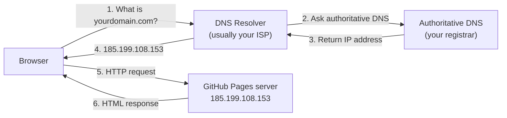

# M16 Deployment


**Topics covered:** GitHub Pages · repository setup · `index.html` requirement · deploying from a branch · custom domains · DNS basics · production checklist

---

## The Why?

A website that only runs on your computer is not a website — it is a file. Deployment is the step that turns your local HTML and CSS into something with a real URL that anyone in the world can visit.

GitHub Pages is the simplest free hosting option for static sites (HTML, CSS, and JavaScript without a server). It integrates directly with the Git repository you have been using throughout this course. Deploying your project is four steps: push your code to GitHub, enable Pages in the repository settings, wait 60 seconds, and open your URL.

Understanding deployment also means understanding what "static" hosting means and what it cannot do — so you know when you have outgrown it and need something more.

By the end of this module you will be able to:
- Deploy a static HTML/CSS site to GitHub Pages
- Understand what `index.html` must be named and why
- Set a custom domain for your project
- Know the basics of how DNS works

---

## Core Concepts

### What GitHub Pages Does

GitHub Pages takes any HTML, CSS, and JavaScript files in a public GitHub repository and serves them at:

```
https://<username>.github.io/<repository-name>/
```

It is a **static** host — it serves files exactly as they are. It cannot run server-side code (Python, Node.js, PHP), process form submissions, or connect to a database. For this course, that is not a limitation — every file you have built is static.

---

### The `index.html` Requirement

When a browser visits a URL without a filename (e.g., `https://you.github.io/my-site/`), the server looks for `index.html` in that directory. If it exists, it is served automatically. If it does not exist, the server returns a 404.

**Your main page must be named `index.html`.**

This applies to the root of your project and to any subdirectory that should have its own default page.

---

### Deploying to GitHub Pages

**Step 1 — Create a repository on GitHub**

1. Go to [github.com](https://github.com) and sign in
2. Click **New repository**
3. Name it (e.g., `my-portfolio`)
4. Set it to **Public** (required for free GitHub Pages)
5. Click **Create repository**

**Step 2 — Push your project**

If you have not set up Git locally:
```bash
git init
git add .
git commit -m "Initial commit"
git branch -M main
git remote add origin https://github.com/YOUR_USERNAME/YOUR_REPO.git
git push -u origin main
```

If you already have a Git repo (as in this course):
```bash
git remote add origin https://github.com/YOUR_USERNAME/YOUR_REPO.git
git push -u origin main
```

**Step 3 — Enable GitHub Pages**

1. Go to your repository on GitHub
2. Click **Settings** → **Pages** (in the left sidebar)
3. Under **Source**, select **Deploy from a branch**
4. Select branch: `main`, folder: `/ (root)`
5. Click **Save**

**Step 4 — Visit your URL**

After 30–60 seconds, your site is live at:
```
https://YOUR_USERNAME.github.io/YOUR_REPO/
```

GitHub sends an email when the first deployment completes.

---

### Updating Your Site

Every `git push` to the `main` branch triggers a new deployment automatically. There is no separate deploy step after setup.

```bash
# Edit your files, then:
git add .
git commit -m "Update hero section"
git push
# Site updates in ~30 seconds
```

---

### Custom Domains

GitHub Pages supports custom domains — instead of `username.github.io/repo`, your site can be at `yourdomain.com`.

**Step 1 — Buy a domain**

Purchase a domain from a registrar (e.g., Namecheap, Cloudflare, Google Domains).

**Step 2 — Add a CNAME file**

In your repository root, create a file named `CNAME` (no extension) containing only your domain:

```
yourdomain.com
```

Or add it through GitHub Settings → Pages → Custom domain.

**Step 3 — Configure DNS**

In your domain registrar's DNS settings, add:

For an **apex domain** (`yourdomain.com`):
```
Type: A
Name: @
Values:
  185.199.108.153
  185.199.109.153
  185.199.110.153
  185.199.111.153
```

For a **subdomain** (`www.yourdomain.com`):
```
Type: CNAME
Name: www
Value: YOUR_USERNAME.github.io
```

DNS changes propagate in minutes to hours. GitHub Pages also provides a free HTTPS certificate once the custom domain is connected.

---

### How DNS Works (Overview)

When someone types `yourdomain.com` in a browser:



1. Browser asks a DNS resolver for the IP address of `yourdomain.com`
2. The resolver asks your domain's authoritative DNS server (your registrar)
3. Your registrar returns the A record IP address you configured
4. The resolver passes it back to the browser
5. The browser sends an HTTP request to that IP
6. GitHub's server finds your repository and serves `index.html`

**TTL (Time to Live)** — DNS records are cached for a period set in the record (often 3600 seconds / 1 hour). Changes take up to TTL seconds to propagate globally.

---

## Going Further

<details>
<summary>🌐 GitHub Pages vs other static hosts</summary>

GitHub Pages is the simplest option but has limits:
- Repository must be **public** (free plan) or use GitHub Pro/Team
- No server-side processing
- 1GB repository size limit, 100GB monthly bandwidth

Alternatives worth knowing:

| Host | Free tier | Notes |
|------|-----------|-------|
| **Netlify** | Yes | Drag-and-drop deploy, form handling, serverless functions |
| **Vercel** | Yes | Fast CDN, easy GitHub integration, great for JS frameworks |
| **Cloudflare Pages** | Yes | Extremely fast CDN, CI/CD from GitHub |
| **GitHub Pages** | Yes (public repos) | Simplest setup, integrated with this course's workflow |

For pure HTML/CSS projects, any of these work identically. Netlify's drag-and-drop is the fastest option for a one-off deploy.

</details>

<details>
<summary>🔒 HTTPS — why it matters and how Pages handles it</summary>

HTTPS encrypts traffic between the server and the browser. Without it:
- Browsers show a "Not secure" warning
- Search engines rank HTTPS sites higher
- Modern browser features (geolocation, service workers, camera access) are disabled

GitHub Pages provides free HTTPS automatically for `github.io` URLs and for custom domains (via Let's Encrypt, after DNS is configured). You do not need to do anything — check the **Enforce HTTPS** checkbox in Settings → Pages.

</details>

<details>
<summary>📁 Project structure for deployment</summary>

A well-structured project for deployment:

```
my-portfolio/
├── index.html          ← must be named this — the entry point
├── about.html
├── projects.html
├── css/
│   └── styles.css      ← if you extracted CSS to a file
├── images/
│   ├── hero.jpg
│   └── avatar.png
└── CNAME               ← only if using a custom domain
```

Relative paths (`../images/hero.jpg`, `./css/styles.css`) work correctly on GitHub Pages. Never use absolute paths starting with `/` unless you know your repo is at the root of the domain.

</details>

<details>
<summary>🤖 AI and deployment</summary>

Deployment is one area where AI is genuinely useful for troubleshooting, but verify anything it suggests with the current documentation:

- **404 on custom domain** — AI can walk through DNS A record configuration, but registrar UIs change. Cross-reference with your registrar's documentation.
- **Broken relative paths** — If your site works locally but images or CSS are missing on Pages, AI can help diagnose path issues: ask it to review your `<link>` and `` src values against your directory structure.
- **CNAME file conflicts** — AI correctly identifies that having a CNAME in the repo and setting a custom domain in GitHub Settings can conflict; ask it to clarify the canonical setup.

Useful AI prompt:
- *"My GitHub Pages site is live but images are not loading. My repo is at github.com/user/site and my images folder is /images. Here is my img src: [paste]. What is wrong?"*

</details>

---

## Guided Practice

This module has no example HTML file — the practice is deploying your own project.

---

### Step 1: Choose your project

Pick the page you are most proud of from this course — your M15 Summit page, an M08 Solstice cards page, or anything you have built. Alternatively, build a simple personal portfolio for this exercise.

---

### Step 2: Ensure the entry file is named `index.html`

Rename your main HTML file to `index.html` if it is not already. This is required for GitHub Pages to serve it at the root URL.

If your project references other files (CSS, images), verify all paths are relative and working locally before deploying.

---

### Step 3: Create a GitHub repository

1. Go to [github.com](https://github.com) → **New repository**
2. Name it descriptively (e.g., `summit-outdoor`, `my-portfolio`)
3. Set visibility to **Public**
4. Do **not** add a README or .gitignore — your project already has its own files
5. Click **Create repository**

---

### Step 4: Push your project

Copy the commands GitHub shows on the "Quick setup" page. In your project folder:

```bash
git init
git add .
git commit -m "Initial deploy"
git branch -M main
git remote add origin https://github.com/YOUR_USERNAME/YOUR_REPO.git
git push -u origin main
```

---

### Step 5: Enable GitHub Pages

1. In your repository → **Settings** → **Pages**
2. Source: **Deploy from a branch**
3. Branch: `main`, Folder: `/ (root)`
4. Click **Save**

---

### Step 6: Visit your live URL

After 30–60 seconds, open:
```
https://YOUR_USERNAME.github.io/YOUR_REPO/
```

Share this URL — it is your first real website on the internet.

---

### Step 7: Make a change and redeploy

Edit something in `index.html` — change a heading, update a colour. Then:

```bash
git add index.html
git commit -m "Update heading text"
git push
```

Wait ~30 seconds and refresh your GitHub Pages URL. The change is live.

---

### Step 8: (Optional) Add a custom domain

If you own or purchase a domain, follow the DNS steps in Core Concepts above. Add a `CNAME` file containing your domain name, commit and push it, then configure your registrar's DNS settings.

---

### Step 9: Ask AI to enhance

Share your GitHub Pages URL with Gemini and prompt:

> *"Here is my live website: [your URL]. Review the HTML and CSS visible on the page and give me three specific improvements I should make before sharing this as part of a portfolio. Focus on: correct use of semantic HTML, any obvious accessibility issues, and one visual improvement to the design."*

---

## Checkpoints

* [ ] **Live Deployment**  
  Deploy a project to GitHub Pages. Requirements:
  - The repository is public on GitHub
  - `index.html` exists at the root
  - The live URL (`https://username.github.io/repo/`) opens correctly in a browser with no 404
  - All images, CSS, and links work on the live URL (not just locally)
  - GitHub Pages **Enforce HTTPS** is enabled in Settings → Pages
  - Share the URL as proof of completion

* [ ] **Production Checklist**  
  Before calling a site production-ready, verify all of the following on your deployed page:
  - [ ] `<title>` is set and descriptive (not "Untitled Document")
  - [ ] `<meta name="viewport">` is present
  - [ ] `<meta name="description">` is present with a 1–2 sentence site description
  - [ ] All `` tags have `alt` attributes
  - [ ] All internal links resolve (no 404s) — click every link
  - [ ] No JavaScript console errors (open DevTools → Console)
  - [ ] Site is readable at 375px width (mobile) with no horizontal scrolling
  - [ ] `color-contrast` checker passes for body text (use [WebAIM Contrast Checker](https://webaim.org/resources/contrastchecker/))
  - [ ] Page loads in under 3 seconds on a simulated slow 3G connection (DevTools → Network → throttle to "Slow 3G")
