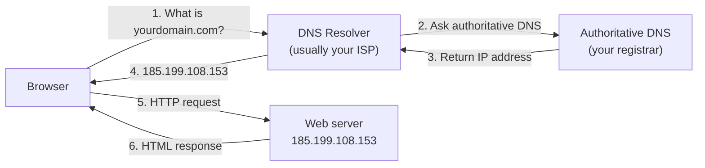

# M16 Deployment


**Topics covered:** web servers · services & protocols (HTTP/HTTPS) · ports · IP addresses · domain names · DNS basics · URL anatomy · GitHub Pages · `index.html` requirement · troubleshooting · Git basics (commit, branch, push) · production checklist

---

## The Why?

A website that only runs on your computer is not a website — it is a file. Deployment is the step that turns your local HTML and CSS into something with a real URL that anyone in the world can visit.

Before deploying, it helps to understand what a website physically *is*: a computer that stays on, running a program — a **web server** — that hands your HTML files to anyone who asks for them over **HTTP/HTTPS**. Once you see that, the rest follows naturally: the **IP address** is how other machines reach that computer, the **domain name** is its human-friendly label, the **port** identifies the service, and a **URL** strings them all together. With that picture in mind, GitHub Pages — the simplest free hosting option for static sites — stops being magic: it is simply GitHub running that always-on server computer *for you*.

Deployment runs on **Git**, the version-control tool that GitHub is built around. You only need a handful of Git ideas (repository, commit, branch, push) to deploy and update a site, and this module closes with exactly that.

By the end of this module you will be able to:
- Explain what a web server is and what HTTP/HTTPS do
- Explain what an IP address, a domain name, and a port are
- Describe how DNS turns a domain name into an IP address
- Break a URL into protocol, domain, port, and path
- Deploy a static HTML/CSS site to GitHub Pages
- Diagnose the most common deployment problems (404s, broken images, stale pages)
- Use basic Git operations: commit, push, and create a branch

---

## Core Concepts

### Servers and Services — What a Website Really Is

Strip away the mystery: a website is **one computer, switched on and connected to the internet, running a program that hands out files to anyone who asks**. That program is called a **web server**, and "hosting a website" means exactly this — keep the computer on, keep the program answering.

Three terms describe how that conversation works:

- A **service** is a program on a computer that waits for requests and answers them. A web server is one kind of service; an email server or a database server is another. One computer can run many services at once.
- Each service speaks a **protocol** — an agreed-upon language for requests and answers. Websites use **HTTP** (HyperText Transfer Protocol): the browser asks *"give me `index.html`"*, the server replies with the file's contents. **HTTPS** is the same conversation, encrypted so nobody in between can read or tamper with it. Modern sites should always use HTTPS.
- Because one computer can run many services, each service listens on a **port** — a number (0–65535) that identifies *which service* a request is for. Think of the computer's address as a building and the port as the room number.

Well-known ports you will encounter:

| Port | Service |
|------|---------|
| 80 | HTTP — unencrypted web traffic |
| 443 | HTTPS — encrypted web traffic |
| 22 | SSH — secure remote login (Git uses this too) |

Browsers hide the default ports (`https` → 443, `http` → 80), but they are always there:

```
https://example.com      ← really https://example.com:443
http://example.com       ← really http://example.com:80
http://localhost:63342   ← WebStorm's built-in preview server uses a custom port
```

**You have already run a web server.** When WebStorm previews your HTML file, the URL looks like `http://localhost:63342/...` — that is a small web server inside WebStorm, serving your files over HTTP on port 63342 of your own machine (`localhost`). The only difference between that and a "real" website: a real one runs on a computer that is always on and reachable from the outside. The next two sections explain how the outside world finds such a computer.

---

### IP Addresses — Every Machine Has a Number

Every device connected to the internet — your laptop, your phone, GitHub's servers — has an **IP address**: a unique number that other machines use to reach it. The common format (IPv4) is four numbers from 0–255 separated by dots:

```
185.199.108.153   ← one of GitHub Pages' servers
142.250.196.110   ← one of Google's servers
127.0.0.1         ← special address: "this computer" (localhost)
```

When your browser loads a page, it is always sending a request to an IP address — even if you typed a name like `google.com`. Try it: paste `185.199.108.153` into your browser's address bar. You reach a GitHub server directly, no name involved.

Because IPv4 only allows about 4.3 billion addresses (not enough for every device on Earth), a newer format called **IPv6** exists with vastly more — you may see addresses like `2606:50c0:8000::153`. For this course, IPv4 is all you need to recognise.

---

### Domain Names — Names for Numbers

Nobody wants to memorise `142.250.196.110`. A **domain name** is a human-readable name that maps to an IP address:

```
google.com          →  142.250.196.110
github.com          →  140.82.112.3
username.github.io  →  185.199.108.153
```

Domain names are read right-to-left, from most general to most specific:

```
 www  .  example  .  com
 ───     ───────     ───
subdomain   name     top-level domain (TLD)
```

- **TLD** — `.com`, `.org`, `.io`, `.tw` — the broadest category
- **Domain name** — the part you register and pay for (`example.com`)
- **Subdomain** — a free prefix the domain owner can create (`www`, `blog`, `shop`)

This is why your GitHub Pages URL looks the way it does: GitHub owns `github.io`, and gives every user a free subdomain — `YOUR_USERNAME.github.io`.

**DNS (Domain Name System)** is the global directory that performs the name → IP lookup. When someone types `yourdomain.com` in a browser:



1. Browser asks a DNS resolver for the IP address of `yourdomain.com`
2. The resolver asks the domain's authoritative DNS server (the registrar)
3. The registrar returns the configured IP address
4. The resolver passes it back to the browser
5. The browser sends an HTTP request to that IP
6. The server responds with HTML

---

### Putting It Together — Anatomy of a URL

A **URL** (Uniform Resource Locator) packs everything from the previous sections — protocol, domain, port — into one string. Take it apart:

```
https://www.example.com:443/images/hero.jpg
└─┬─┘   └──────┬───────┘└┬─┘└───────┬──────┘
scheme     domain name   port      path
(protocol)
```

| Part | Example | What it tells the browser |
|------|---------|---------------------------|
| **Scheme / protocol** | `https` | *How* to talk to the server — the service protocol. `https` means encrypted web traffic; `http` means unencrypted. Other schemes exist for other services (`ftp`, `mailto`, `ssh`) |
| **Domain name** | `www.example.com` | *Which machine* to talk to — DNS resolves this to an IP address |
| **Port** | `443` | *Which service* on that machine — almost always omitted, because each protocol has a default (`https` → 443, `http` → 80) |
| **Path** | `/images/hero.jpg` | *Which file* (or page) to ask that service for. If empty or ending in `/`, the server looks for `index.html` |

So when the browser loads `https://www.example.com/images/hero.jpg`, the full sequence is:

1. **Protocol** `https` chosen — browser knows to encrypt, and that the default port is 443
2. **DNS** resolves `www.example.com` to an IP address, e.g. `93.184.216.34`
3. Browser connects to `93.184.216.34` on **port** 443
4. Browser requests the **path** `/images/hero.jpg`; the server sends the file back

Now read your future GitHub Pages URL with the same eyes:

```
https://username.github.io/my-portfolio/
└─┬─┘   └────────┬───────┘ └─────┬─────┘
HTTPS on    your free          path → folder's
port 443    subdomain          index.html
            (DNS → GitHub's IP)
```

Every piece of the URL is one of the concepts you just learned — nothing in a web address is mysterious anymore.

---

### What GitHub Pages Does

Recall the first section: hosting a website means keeping a computer on, running a web server, reachable from the internet. You *could* do all of that yourself — buy a machine, keep it running 24/7, configure the server software, register a domain, set up HTTPS. **GitHub Pages does this entire chore for you, for free.**

It takes any HTML, CSS, and JavaScript files in a public GitHub repository and serves them at:

```
https://<username>.github.io/<repository-name>/
```

Every concept from the previous sections maps to something GitHub provides: GitHub runs the always-on server computers (with IP addresses like `185.199.108.153`), points the `github.io` domain at them via DNS, runs the web-server service speaking HTTPS on port 443, and gives every user a free subdomain. All you provide is the files.

It is a **static** host — it serves files exactly as they are. It cannot run server-side code (Python, Node.js, PHP), process form submissions, or connect to a database. For this course, that is not a limitation — every file you have built is static.

---

### The `index.html` Requirement

When a browser visits a URL without a filename (e.g., `https://you.github.io/my-site/`), the server looks for `index.html` in that directory. If it exists, it is served automatically. If it does not exist, the server returns a 404.

**Your main page must be named `index.html`.**

This applies to the root of your project and to any subdirectory that should have its own default page.

---

### The Deployment Pipeline

Deploying to GitHub Pages is four stages — the detailed clicks are in Guided Practice below; here is the shape of the whole thing:

```
1. Create repository on GitHub        (the cloud copy is born first)
2. Clone it with WebStorm             (your computer gets a linked local copy)
3. Add files → commit → push          (your pages travel up to GitHub)
4. Enable Pages in repo Settings      (GitHub starts serving them — done once)
```

After stage 4, your site is live at `https://YOUR_USERNAME.github.io/YOUR_REPO/` within about a minute, and **every future push to `main` redeploys automatically**. There is no separate "deploy" button — updating your live site is simply: edit → commit → push, wait ~30 seconds, refresh.

This course recommends the **GitHub-first** order (create on GitHub, then clone) because the clone automatically links your local folder to the repository — no manual Git setup commands needed.

---

### When It Doesn't Work — Common Problems

Almost everyone hits one of these on their first deployment. Check them in order:

**Symptom: 404 page at your URL**
- Pages not enabled yet, or still building — check **Settings → Pages** for the "Your site is live" banner, and the repository's **Actions** tab for a running build
- You only waited 10 seconds — first deployment takes up to a minute
- No `index.html` at the repository root, or it is misspelled (`Index.html`, `index.htm`)

**Symptom: page loads but images or CSS are missing**
- **Case sensitivity.** GitHub Pages servers run Linux, where `photo.JPG` and `photo.jpg` are *different files*. On Windows they look identical locally, then break online. Make file names and the paths in your HTML match exactly, and prefer all-lowercase names
- Absolute paths. `src="/images/photo.jpg"` points at the domain root, *above* your repository folder. Use relative paths: `src="images/photo.jpg"`
- The file was never committed — check the repository on github.com; if you cannot see the image there, the server cannot either

**Symptom: you pushed a change but the site shows the old version**
- The deploy is still running — check the **Actions** tab
- Browser cache — force-refresh with **Ctrl+F5** (Cmd+Shift+R on Mac)

DevTools is your friend for the second symptom: open **DevTools → Network**, refresh, and look for red rows — they show exactly which file the server could not find, and the URL it tried.

---

### Git Essentials — Just Enough to Operate

You have now used Git through WebStorm without thinking about it much. Here is the minimal mental model — four ideas cover everything you did:

**Repository (repo)** — a folder whose entire history Git tracks. The copy on GitHub is the **remote**; the copy on your computer is the **local** repository. Cloning created the local copy and linked the two.

**Commit** — a saved snapshot of your files at one moment, with a message describing what changed. Commits are the units of history: you can look back at any commit, compare them, or restore one. In WebStorm, open the **Git** tool window (Alt+9) and click the **Log** tab to see every commit ever made — each one is a point you can return to.

```bash
git add .                          # stage: choose which changes go in the snapshot
git commit -m "Add hero section"   # commit: save the snapshot with a message
```

Good commit messages are short and describe the change: `"Fix broken image path"`, not `"update"` or `"asdf"`.

**Push and pull** — commits are local until you **push** them to the remote. **Pull** does the reverse: it downloads commits from the remote that you do not have yet (useful when you edit on two computers, or directly on github.com).

```bash
git push    # upload your local commits to GitHub
git pull    # download new commits from GitHub
```

This is why deployment works the way it does: GitHub Pages republishes your site whenever new commits arrive on `main` — and pushing is how they arrive.

**Branch** — a parallel line of commits. Your repository starts with one branch named `main`. A branch lets you experiment without touching `main`: create a branch, commit freely on it, and **merge** it back into `main` only when you are happy.

```bash
git branch redesign      # create a branch named "redesign"
git switch redesign      # start working on it
# ...edit, commit, edit, commit...
git switch main          # go back to main
git merge redesign       # bring the redesign commits into main
```

In WebStorm, the current branch is shown in the bottom-right corner — click it to create or switch branches. For a solo static site you can live on `main` alone, but branches become essential the moment you collaborate or want to try risky changes safely.

That is genuinely all you need: **clone once, then repeat commit → push**, with branches when you want a safe sandbox.

---

## Going Further

<details>
<summary>🌍 Custom domains — your own yourdomain.com</summary>

GitHub Pages supports custom domains — instead of `username.github.io/repo`, your site can be at `yourdomain.com`.

**Step 1 — Buy a domain**

Purchase a domain from a registrar (e.g., Namecheap, Cloudflare, Google Domains).

**Step 2 — Add a CNAME file**

In your repository root, create a file named `CNAME` (no extension) containing only your domain:

```
yourdomain.com
```

Or add it through GitHub Settings → Pages → Custom domain.

**Step 3 — Configure DNS**

In your domain registrar's DNS settings, add records pointing your domain at GitHub's servers — this is exactly the name → IP mapping from the DNS section:

For an **apex domain** (`yourdomain.com`):
```
Type: A
Name: @
Values:
  185.199.108.153
  185.199.109.153
  185.199.110.153
  185.199.111.153
```

For a **subdomain** (`www.yourdomain.com`):
```
Type: CNAME
Name: www
Value: YOUR_USERNAME.github.io
```

DNS changes are not instant: every record has a **TTL (Time to Live)** — a cache duration, often 3600 seconds — so changes can take minutes to hours to propagate globally. GitHub Pages provides a free HTTPS certificate automatically once the custom domain is connected.

</details>

<details>
<summary>🌐 GitHub Pages vs other static hosts</summary>

GitHub Pages is the simplest option but has limits:
- Repository must be **public** (free plan) or use GitHub Pro/Team
- No server-side processing
- 1GB repository size limit, 100GB monthly bandwidth

Alternatives worth knowing:

| Host | Free tier | Notes |
|------|-----------|-------|
| **Netlify** | Yes | Drag-and-drop deploy, form handling, serverless functions |
| **Vercel** | Yes | Fast CDN, easy GitHub integration, great for JS frameworks |
| **Cloudflare Pages** | Yes | Extremely fast CDN, CI/CD from GitHub |
| **GitHub Pages** | Yes (public repos) | Simplest setup, integrated with this course's workflow |

For pure HTML/CSS projects, any of these work identically. Netlify's drag-and-drop is the fastest option for a one-off deploy.

</details>

<details>
<summary>🔒 HTTPS — why it matters and how Pages handles it</summary>

HTTPS encrypts traffic between the server and the browser (on port 443 instead of HTTP's port 80). Without it:
- Browsers show a "Not secure" warning
- Search engines rank HTTPS sites higher
- Modern browser features (geolocation, service workers, camera access) are disabled

GitHub Pages provides free HTTPS automatically for `github.io` URLs and for custom domains (via Let's Encrypt, after DNS is configured). You do not need to do anything — check the **Enforce HTTPS** checkbox in Settings → Pages.

</details>

<details>
<summary>📁 Project structure for deployment</summary>

A well-structured project for deployment:

```
my-portfolio/
├── index.html          ← must be named this — the entry point
├── about.html
├── projects.html
├── css/
│   └── styles.css      ← if you extracted CSS to a file
├── images/
│   ├── hero.jpg
│   └── avatar.png
└── CNAME               ← only if using a custom domain
```

Relative paths (`../images/hero.jpg`, `./css/styles.css`) work correctly on GitHub Pages. Never use absolute paths starting with `/` unless you know your repo is at the root of the domain.

</details>

---

## Guided Practice

This module has no example HTML file — the practice is deploying your own project. The workflow is **GitHub first**: create the repository in the cloud, then clone it down with WebStorm.

---

### Step 1: Create the repository on GitHub

1. Go to [github.com](https://github.com) → **New repository**
2. Name it descriptively (e.g., `summit-outdoor`, `my-portfolio`)
3. Set visibility to **Public** (required for free GitHub Pages)
4. Check **Add a README file** — this gives the repository an initial commit so it is not empty
5. Click **Create repository**

---

### Step 2: Clone the repository with WebStorm

1. On your new repository's page, click the green **Code** button and copy the **HTTPS** URL
2. Open WebStorm → **File → New → Project from Version Control** (or **Get from VCS** on the welcome screen)
3. Paste the URL, pick a directory (e.g., inside `WebstormProjects`), click **Clone**
4. If WebStorm asks you to log in to GitHub, follow the prompts — this only happens once

You now have a local folder that is linked to GitHub. Notice the branch name `main` in WebStorm's bottom-right corner.

---

### Step 3: Add your project files

Pick the page you are most proud of from this course — your M15 Summit page, an M08 Solstice cards page, or anything you have built — and copy it into the cloned folder.

- Rename the main HTML file to `index.html` — required for GitHub Pages to serve it at the root URL
- If the project references other files (CSS, images), copy them too and verify all paths are relative and working locally
- Prefer all-lowercase file names — GitHub's servers treat `Photo.jpg` and `photo.jpg` as different files

---

### Step 4: Commit and push

1. In WebStorm: **Git → Commit** (Ctrl+K / Cmd+K)
2. Tick the files to include, write a message: `Add portfolio page`
3. Click the arrow on the Commit button → **Commit and Push** (Ctrl+Shift+K / Cmd+Shift+K)
4. Refresh your repository page on github.com — your files are there

You just performed the two core Git operations: **commit** (snapshot locally) and **push** (upload to the remote).

---

### Step 5: Enable GitHub Pages

1. In your repository → **Settings** → **Pages**
2. Source: **Deploy from a branch**
3. Branch: `main`, Folder: `/ (root)`
4. Click **Save**

---

### Step 6: Visit your live URL

After 30–60 seconds, open:
```
https://YOUR_USERNAME.github.io/YOUR_REPO/
```

Share this URL — it is your first real website on the internet. For fun, recall what is happening underneath: DNS resolves `YOUR_USERNAME.github.io` to a GitHub IP address, your browser connects to it on port 443, and the server returns your `index.html`.

If you see a 404 or broken images instead, work through **When It Doesn't Work** in Core Concepts above — the answer is almost certainly there.

---

### Step 7: Make a change and redeploy

Edit something in `index.html` — change a heading, update a colour. Then commit and push again from WebStorm (Ctrl+K → Commit and Push).

Wait ~30 seconds and refresh your GitHub Pages URL (Ctrl+F5 if it looks unchanged). The change is live. This is your workflow from now on: **edit → commit → push**.

---

### Step 8: Try a branch

1. Click the branch name (`main`) in WebStorm's bottom-right corner → **New Branch** → name it `experiment`
2. Make a bold change — a different background colour, a new section
3. Commit it (no need to push)
4. Switch back to `main` via the same branch menu — watch your change disappear; it lives only on `experiment`
5. If you like the change, merge it: from `main`, open the branch menu → `experiment` → **Merge 'experiment' into 'main'**, then push

This is the safety net branches give you: experiments never endanger the published site until you merge.

---

## Checkpoints

* [ ] **Web Address Fundamentals**  
  Without looking at the module, explain in your own words:
  - What a web server is, and what HTTP/HTTPS are
  - What an IP address is, and what `127.0.0.1` refers to
  - What DNS does when you type `github.com` into a browser
  - Why `https://example.com` and `https://example.com:443` are the same address

* [ ] **Live Deployment**  
  Deploy a project to GitHub Pages using the GitHub-first workflow (create on GitHub → clone with WebStorm). Requirements:
  - The repository is public on GitHub
  - `index.html` exists at the root
  - The live URL (`https://username.github.io/repo/`) opens correctly in a browser with no 404
  - All images, CSS, and links work on the live URL (not just locally)
  - GitHub Pages **Enforce HTTPS** is enabled in Settings → Pages
  - The repository has at least three commits with meaningful messages
  - Share the URL as proof of completion

* [ ] **Git Basics**  
  Demonstrate the core Git loop:
  - Make a change, commit it with a descriptive message, and push it — confirm the live site updates
  - Create a branch, commit a change on it, switch back to `main`, and merge the branch
  - Open the Git Log in WebStorm and point to the commits you just made

* [ ] **Production Checklist**  
  Before calling a site production-ready, verify all of the following on your deployed page:
  - [ ] `<title>` is set and descriptive (not "Untitled Document")
  - [ ] `<meta name="viewport">` is present
  - [ ] `<meta name="description">` is present with a 1–2 sentence site description
  - [ ] All `` tags have `alt` attributes
  - [ ] All internal links resolve (no 404s) — click every link
  - [ ] No JavaScript console errors (open DevTools → Console)
  - [ ] Site is readable at 375px width (mobile) with no horizontal scrolling
  - [ ] `color-contrast` checker passes for body text (use [WebAIM Contrast Checker](https://webaim.org/resources/contrastchecker/))
  - [ ] Page loads in under 3 seconds on a simulated slow 3G connection (DevTools → Network → throttle to "Slow 3G")
